# Color Preset

__ColorPreset__ is an enum that represent all built-in palettes.				

You can use it to set  the __Palette__ property of RadColorPaletteView or __HeaderPalette__/__StandardPalette__/__MainPalette__ properties of the __RadColorSelector__.
				

```C#
    public enum ColorPreset
    {
        None,
        Default,
        Standard,
        Grayscale,
        Web216,
        ReallyWebSafe,
        // MS word named presets below
        Office,
        Apex,
        Aspect,
        Civic,
        Concourse,
        Equity,
        Flow,
        Foundry,
        Median,
        Metro,
        Module,
        Opulent,
        Oriel,
        Origin,
        Paper,
        Solstice,
        Technic,
        Trek,
        Urban,
        Verve
    }
```


```XAML
	<telerik:RadColorPaletteView Palette="Office" />
	<telerik:RadColorSelector MainPalette="Office" />
```


```C#
	RadColorPaletteView colorPaletteView = new RadColorPaletteView();
	colorPaletteView.Palette = ColorPreset.Office;
	RadColorSelector colorSelector = new RadColorSelector();
	colorSelector.MainPalette = ColorPreset.Office;
```
```VB.NET
		Dim colorPaletteView As New RadColorPaletteView()
		colorPaletteView.Palette = ColorPreset.Office
		Dim colorSelector As New RadColorSelector()
		colorSelector.MainPalette = ColorPreset.Office
```

## Predefined Palettes Preview

This section describes all predefined palettes (ColorPresets) provided in the __RadColorPicker__ suite

* __Default__
	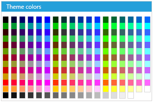
	
* __Standard__
	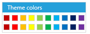
	
* __Grayscale__
	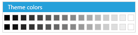
	
* __Web216__
	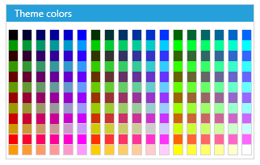
	
* __ReallyWebSafe__
	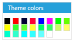
	
* __Office__
	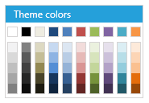
	
* __Apex__
	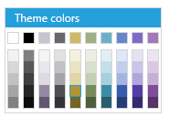
	
* __Aspect__
	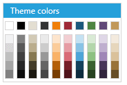
	
* __Civic__
	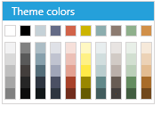
	
* __Concourse__
	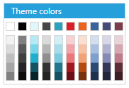
	
* __Equity__
	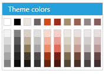
	
* __Flow__
	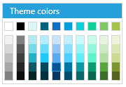
	
* __Foundry__
	
	
* __Median__
	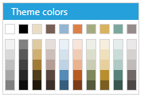
	
* __Metro__
	
	
* __Module__
	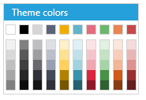
	
* __Opulent__
	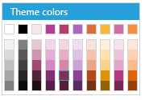
	
* __Oriel__
	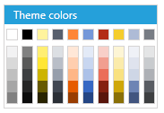
	
* __Origin__
	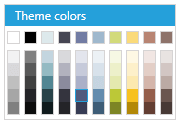
	
* __Paper__
	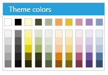
	
* __Solstice__
	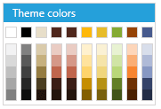
	
* __Technique__
	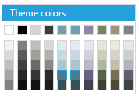
	
* __Trek__
	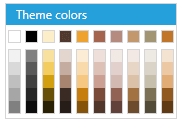
	
* __Urban__
	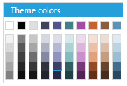
	
* __Verve__
	