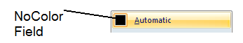
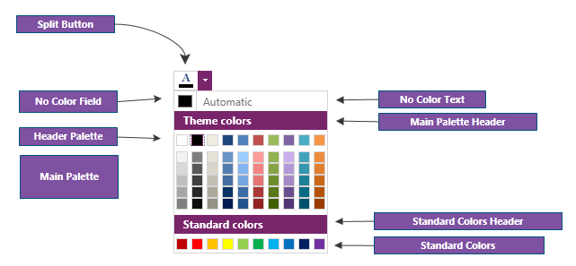

# Appearance

You can customize the appearance of a RadColorSelector by choosing which of the parts to be visible.
				

##### 1. You can set the __NoColorVisibility__ property to __Visibility.Visible__ to view the __NoColorField__, otherwise you should set it to false:						

<snippet id='radcolorpicker-features-radcolorselector-colorselector-appearance-block_1-xaml' />

<snippet id='radcolorpicker-features-radcolorselector-colorselector-appearance-block_2-cs' />

<snippet id='radcolorpicker-features-radcolorselector-colorselector-appearance-block_2-vb' />

##### 2. You can use __StandardPaletteVisibility__ and __HeaderPaletteVisibility__ in order to set the visibility of the corresponding palettes:						

* __StandardPaletteVisibility__

	<snippet id='radcolorpicker-features-radcolorselector-colorselector-appearance-block_3-xaml' />

	<snippet id='radcolorpicker-features-radcolorselector-colorselector-appearance-block_4-cs' />

	<snippet id='radcolorpicker-features-radcolorselector-colorselector-appearance-block_4-vb' />

* __HeaderPaletteVisibility__

	<snippet id='radcolorpicker-features-radcolorselector-colorselector-appearance-block_5-xaml' />

	
	<snippet id='radcolorpicker-features-radcolorselector-colorselector-appearance-block_6-cs' />

	<snippet id='radcolorpicker-features-radcolorselector-colorselector-appearance-block_6-vb' />

		

##### 3. You can set different text for __StandardPalette__ header text , __MainPalette__ header text and __NoColorText__.

* StandardPaletteHeaderText
	
	<snippet id='radcolorpicker-features-radcolorselector-colorselector-appearance-block_7-xaml' />

	
	<snippet id='radcolorpicker-features-radcolorselector-colorselector-appearance-block_8-cs' />

	<snippet id='radcolorpicker-features-radcolorselector-colorselector-appearance-block_8-vb' />

	
* MainPaletteHeaderText
	
	<snippet id='radcolorpicker-features-radcolorselector-colorselector-appearance-block_9-xaml' />

	
	<snippet id='radcolorpicker-features-radcolorselector-colorselector-appearance-block_10-cs' />

	<snippet id='radcolorpicker-features-radcolorselector-colorselector-appearance-block_10-vb' />

* NoColorText
	
	<snippet id='radcolorpicker-features-radcolorselector-colorselector-appearance-block_11-xaml' />

	
	<snippet id='radcolorpicker-features-radcolorselector-colorselector-appearance-block_12-cs' />

	<snippet id='radcolorpicker-features-radcolorselector-colorselector-appearance-block_12-vb' />
