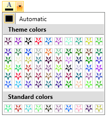

# Populate ColorPicker with Business Data

This article will show you how to use the __RadColorPicker__ in MVVM scenarios. Also, we will show you which properties to bind and how to create a custom View and ViewModel.	  

The final result will look like this:

## Prepare the MainViewModel	  

For the purpose of this example we will create a __ColorModel__ class and three __ObservableCollections__ of ColorModel which will be named as follows: *StandardPaletteColors*, *MainPaletteColors* and *HeaderPaletteColors*. The __ColorModel__ class will expose a *CustomColor* property of type __Color__.		

#### __C#__
{{region radcolorpicker-howto-binding-object_1}}
	public class ColorModel : ViewModelBase
	{
		public ColorModel()
		{
	
		}
	
		private Color customColor;
		public Color CustomColor
		{
			get { return this.customColor; }
			set
			{
				if (this.customColor != value)
				{
					this.customColor = value;
					this.OnPropertyChanged("CustomColor");
				}
			}
		}
	}
{{endregion}}

#### __VB.NET__
{{region radcolorpicker-howto-binding-object_2}}
		Public Class ColorModel
			Inherits ViewModelBase
	
			Public Sub New()
			End Sub
	
			Private customColor As Color
			Public Property CustomColor() As Color
				Get
					Return Me.customColor
				End Get
				Set(value As Color)
					If Me.customColor <> value Then
						Me.customColor = value
						Me.OnPropertyChanged("CustomColor")
					End If
				End Set
			End Property
		End Class
{{endregion}}

Next we will define the __MainViewModel__ which will wrap and fill the collections of ColorModel objects.		

#### __C#__
{{region radcolorpicker-howto-binding-object_3}}
	public class MainViewModel : ViewModelBase
	{
		private ObservableCollection<ColorModel> mainPaletteColors;
		private ObservableCollection<ColorModel> headerPaletteColors;
		private ObservableCollection<ColorModel> standardPaletteColors;
    }
{{endregion}}

#### __VB.NET__
{{region radcolorpicker-howto-binding-object_4}}
	Public Class MainViewModel
		Inherits ViewModelBase
		Private m_mainPaletteColors As ObservableCollection(Of ColorModel)
		Private m_headerPaletteColors As ObservableCollection(Of ColorModel)
		Private m_standardPaletteColors As ObservableCollection(Of ColorModel)
	End Class
{{endregion}}

Then we can set this model as __DataContext__ of the __RadColorPicker__. Go in your code behind file and add the following code after the __InitializeComponent();__

#### __C#__
{{region radcolorpicker-howto-binding-object_5}}
	this.DataContext = new MainViewModel();
{{endregion}}

#### __VB.NET__
{{region radcolorpicker-howto-binding-object_6}}
	Me.DataContext = New MainViewModel()
{{endregion}}

After this is done we can prepare the View of our application.		

## Prepare the View	  

We will use customized __Path__ to visualize the different colors. In order to do this we will define a custom __DataTemplate__ as the __PaletteItemsTemplate__ property of the __RadColorPicker__. Also, we will bind our collections (defined in the MainViewModel) to each of the following properties of the control: __HeaderPaletteItemsSource__, __MainPaletteItemsSource__ and __StandardPaletteItemsSource__.		

>important Please note that in MVVM scenarios you have to set the __RadColorPicker.ColorPropertyPath__. This is a path to a value on the __MainViewModel__ that serves as the visual representation of the __RadColorPaletteViewItem.Color__. You can assume that the __ColorPropertyPath__ mimics the behavior of the __ItemsControl.DisplayMemberPath__.		  

These steps can be implemented with the following code:		

#### __XAML__
{{region radcolorpicker-howto-binding-object_0}}
    <Grid>
        <Grid.Resources>
            <DataTemplate x:Key="PaletteItemsTemplate">
                <Path Data="M8,6 C8.5522861,6 9.000001,6.4477153 9.000001,7 C9.000001,7.5522847
                      8.5522861,8 8.000001,8 C7.4477162,8 7.000001,7.5522847 7.000001,7
                      C7.000001,6.4477153 7.4477162,6 8.000001,6 z M3,0 L8,4 C6.3431458,4
                      5,5.3431458 5,7 C5,8.6568546 6.3431458,10 8,10 C9.6568546,10 11,8.6568546
                      11,7 C11,5.3431458 9.6568546,4 8,4 L13,0 L11,6 L16,10 L10,10 L8,16 L6,10
                      L0,10 L5,6 z ">
                    <Path.Fill>
                        <SolidColorBrush Color="{Binding CustomColor}" />
                    </Path.Fill>
                </Path>
            </DataTemplate>
        </Grid.Resources>
        <telerik:RadColorPicker ColorPropertyPath="CustomColor"
                                HeaderPaletteItemsSource="{Binding HeaderPaletteColors}"
                                MainPaletteItemsSource="{Binding MainPaletteColors}"
                                PaletteItemsTemplate="{StaticResource PaletteItemsTemplate}"
                                StandardPaletteItemsSource="{Binding StandartPaletteColors}" />
    </Grid>
{{endregion}}

>Please note that this article doesn't demonstrate how to customize the __ToolTip__ of the colors. If you need to implement such a scenario, please refer to [this article]().		  

The final result should be similar to the following one:

## See Also
 * [Customize the PaletteViewItem's ToolTip]()