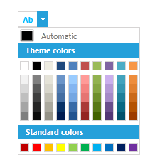

# Set Custom Content

This article shows how to set custom content in the SplitButton of the ColorPicker.

## Setting custom Content

In some scenarios you may need to change the default "A" - like picture in the RadColorPicker. In order to set custom image or text in this field , you need to use the __ContentTemplate__ property of the RadColorPicker. 

#### XAML	
    <telerik:RadColorPicker x:Name="colorPicker" SelectedColor="DeepSkyBlue" IsDropDownOpen="True">	
        <telerik:RadColorPicker.ContentTemplate>
            <DataTemplate>
                <TextBlock Text="Ab">
                    <TextBlock.Foreground>
                        <SolidColorBrush Color="{Binding ElementName=colorPicker, Path=SelectedColor}"/>
                    </TextBlock.Foreground>
                </TextBlock>			
            </DataTemplate>
        </telerik:RadColorPicker.ContentTemplate>
    </telerik:RadColorPicker>

Below you can see the result of the given code:  

