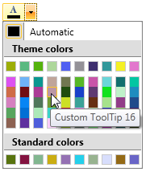

# Customize the PaletteViewItem's ToolTip

This article will show you a way to customize the ToolTip of the PaletteView items.

>important Keep in mind that this approach is available in data binding scenarios, only.			  

For the purpose of this article we will use:			

* a custom class __ColorModel__ that exposes two properties of type Color and string				

	```C#
		public class ColorModel : ViewModelBase
		{
			private Color currColor;
			public Color CustomColor
			{
				get { return this.currColor; }
				set
				{
					if (this.currColor != value)
					{
						this.currColor = value;
						this.OnPropertyChanged("CustomColor");
					}
				}
			}
		
			public string ToolTipString { get; set; }
		}
	```
	```VB.NET
		Public Class ColorModel
			Inherits ViewModelBase
			Private currColor As Color
			Public Property CustomColor() As Color
				Get
					Return Me.currColor
				End Get
				Set(value As Color)
					If Me.currColor <> value Then
						Me.currColor = value
						Me.OnPropertyChanged("CustomColor")
					End If
				End Set
			End Property

			Public Property ToolTipString() As String
				Get
					Return m_ToolTipString
				End Get
				Set(value As String)
					m_ToolTipString = Value
				End Set
			End Property
			Private m_ToolTipString As String
		End Class
	```

* three different collections of ColorModel which will be used for the [HeaderPalette](), [MainPalette]() and [StandardPalette]()

* a ViewModel that wraps these collections and creates some sample data				

	```C#
		public class MainViewModel : ViewModelBase
		{
			private ObservableCollection<ColorModel> mainPaletteColors;
			private ObservableCollection<ColorModel> headerPaletteColors;
			private ObservableCollection<ColorModel> standardPaletteColors;
		}
	```
	```VB.NET
		Public Class MainViewModel
			Inherits ViewModelBase
			Private m_mainPaletteColors As ObservableCollection(Of ColorModel)
			Private m_headerPaletteColors As ObservableCollection(Of ColorModel)
			Private m_standardPaletteColors As ObservableCollection(Of ColorModel)
	```

Then you have to set the MainViewModel as __DataContext__ of the RadColorPicker control. In order to set the customized string as a tool tip you can use the __PaletteItemsTemplate__ property to set a customized DataTemplate. In this template you can use the __ToolTipService__ and bind the __ToolTip__ property to your customized string.			

```XAML
	<Grid>
	<Grid.Resources>
		<DataTemplate x:Key="PaletteTemplate">
			<Rectangle ToolTipService.ToolTip="{Binding ToolTipString}">
				<Rectangle.Fill>
					<SolidColorBrush Color="{Binding CustomColor}" />
				</Rectangle.Fill>
			</Rectangle>
		</DataTemplate>
	</Grid.Resources>
	<telerik:RadColorPicker HeaderPaletteItemsSource="{Binding HeaderPaletteColors}"
							ColorPropertyPath="CustomColor"
							MainPaletteItemsSource="{Binding MainPaletteColors}"
							PaletteItemsTemplate="{StaticResource PaletteTemplate}"
							StandardPaletteItemsSource="{Binding StandartPaletteColors}" />
	</Grid>
```

The result will be similar to the picture below:

