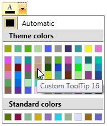

# Customize the PaletteViewItem's ToolTip

This article will show you a way to customize the ToolTip of the PaletteView items.

>important Keep in mind that this approach is available in data binding scenarios, only.			  

For the purpose of this article we will use:			

* a custom class __ColorModel__ that exposes two properties of type Color and string				

	<snippet id='radcolorpicker-howto-radcolorpicked-custom-tooltip-block_1-cs' />

	<snippet id='radcolorpicker-howto-radcolorpicked-custom-tooltip-block_1-vb' />

* three different collections of ColorModel which will be used for the [HeaderPalette](), [MainPalette]() and [StandardPalette]()

* a ViewModel that wraps these collections and creates some sample data				

	<snippet id='radcolorpicker-howto-radcolorpicked-custom-tooltip-block_2-cs' />

	<snippet id='radcolorpicker-howto-radcolorpicked-custom-tooltip-block_2-vb' />

Then you have to set the MainViewModel as __DataContext__ of the RadColorPicker control. In order to set the customized string as a tool tip you can use the __PaletteItemsTemplate__ property to set a customized DataTemplate. In this template you can use the __ToolTipService__ and bind the __ToolTip__ property to your customized string.			

<snippet id='radcolorpicker-howto-radcolorpicked-custom-tooltip-block_3-xaml' />

The result will be similar to the picture below:

