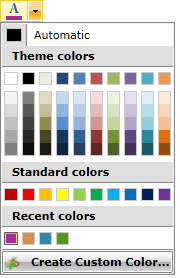
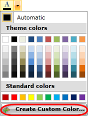
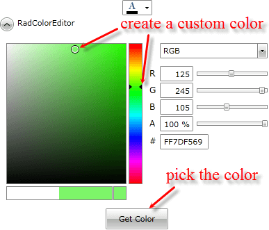
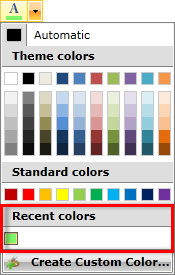

# Use IsRecentColorsActive property

This article will show you how to use the __IsRecentColorsActive__ property of the __RadColorPicker__ control.

The final result should look like this

## 

For the purpose of this article we will use the __AdditionalContent__ property of the __RadColorPicker__ control to add a customized button at the bottom of the drop down content. This can be implemented by the following code:
		

#### __XAML__

{{region radcolorpicker-howto-use-isrecentcolorsactive_0}}
			<telerik:RadColorPicker x:Name="xColorPicker" IsRecentColorsActive="True">
				<telerik:RadColorPicker.AdditionalContent>
					<telerik:RadButton Click="RadButton_Click">
						<StackPanel Orientation="Horizontal">
							<Image Width="16"
							       Height="16"
							       Margin="0 0 10 0"
							       Source="palette-add.png" />
							<TextBlock Text="Create Custom Color..." />
						</StackPanel>
					</telerik:RadButton>
				</telerik:RadColorPicker.AdditionalContent>
			</telerik:RadColorPicker>
	{{endregion}}

>The __RecentColors__ palette is visible when the __IsRecentColorsActive__ property of the __RadColorPicker__ control is set to __True__ and the selected color does not exist in __MainPalette__, __HeaderPalette__ or __StandartPalette__.
		  

In the button's Click event handler we display a __RadExpander__ control which hosts a __RadColorEditor__. This layout will be used to customize colors:
		

#### __XAML__

{{region radcolorpicker-howto-use-isrecentcolorsactive_1}}
	<StackPanel>
			<telerik:RadColorPicker x:Name="xColorPicker" IsRecentColorsActive="True">
				<telerik:RadColorPicker.AdditionalContent>
					<telerik:RadButton Click="RadButton_Click">
						<StackPanel Orientation="Horizontal">
							<Image Width="16"
							       Height="16"
							       Margin="0 0 10 0"
							       Source="palette-add.png" />
							<TextBlock Text="Create Custom Color..." />
						</StackPanel>
					</telerik:RadButton>
				</telerik:RadColorPicker.AdditionalContent>
			</telerik:RadColorPicker>
	
			<telerik:RadExpander x:Name="xExpander"
			                     Width="400"
			                     Header="RadColorEditor"
			                     Opacity="0">
				<StackPanel>
					<telerik:RadColorEditor x:Name="xColorEditor"
					                        Width="400"
					                        Height="250"
					                        HorizontalAlignment="Center" />
					<telerik:RadButton Width="90"
					                   Height="30"
					                   Click="OK_RadButton_Click"
					                   Content="Get Color" />
				</StackPanel>
			</telerik:RadExpander>
		</StackPanel>
	{{endregion}}

#### __C#__

{{region radcolorpicker-howto-use-isrecentcolorsactive_2}}
	
		private void RadButton_Click(object sender, RoutedEventArgs e)
		{
			this.xColorPicker.IsDropDownOpen = false;
			this.xExpander.Opacity = 1;
			this.xExpander.IsExpanded = true;
		}
	{{endregion}}

#### __VB__

{{region radcolorpicker-howto-use-isrecentcolorsactive_3}}
		Dim timer As DispatcherTime
		Private Sub RadButton_Click(sender As Object, e As RoutedEventArgs)
			Me.xColorPicker.IsDropDownOpen = False
			Me.xExpander.Visibility = System.Windows.Visibility.Visible
			timer = New DispatcherTimer()
			timer.Interval = New TimeSpan(0, 0, 0, 0, 20)
			timer.Tick += New EventHandler(timer_Tick)
			timer.Start()
		End Sub
	
		Private Sub timer_Tick(sender As Object, e As EventArgs)
			Me.xExpander.IsExpanded = Not (Me.xExpander.IsExpanded)
			timer.[Stop]()
		End Sub
	#End Region
	
	#Region "radcolorpicker-howto-use-isrecentcolorsactive_5"
		Private Sub OK_RadButton_Click(sender As Object, e As RoutedEventArgs)
			Me.xColorPicker.SelectedColor = Me.xColorEditor.SelectedColor
			timer.Start()
			Me.xColorPicker.IsDropDownOpen = True
			Me.xExpander.Visibility = System.Windows.Visibility.Collapsed
		End Sub
	#End Region
	
	#Region "radcolorpicker-appearance_4"
		Dim colorPicker As New RadColorPicker()
	colorPicker.HeaderPaletteVisibility = Visibility.Visible
		' colorPicker.HeaderPaletteVizibility = Visibility.Collapsed;
	#End Region
	
	#Region "radcolorpicker-appearance_6"
		Dim colorPicker As New RadColorPicker()
	colorPicker.StandardPaletteHeaderText = "StandardPaletteHeader"
	#End Region
	
	#Region "radcolorpicker-appearance_8"
		Dim colorPicker As New RadColorPicker()
	colorPicker.MainPaletteHeaderText = "MainPaletteHeader"
	#End Region
	
	#Region "radcolorpicker-appearance_10"
		Dim colorPicker As New RadColorPicker()
	colorPicker.NoColorText = "No color Text"
	#End Region
	
	End Class

Finaly in the confirmation's button Click event handler we implement the selection logic of the customized color.
		

#### __C#__

{{region radcolorpicker-howto-use-isrecentcolorsactive_4}}
	private void OK_RadButton_Click(object sender, RoutedEventArgs e)
	{
		this.xColorPicker.SelectedColor = this.xColorEditor.SelectedColor;
		this.xExpander.IsExpanded = false;
		this.xExpander.Opacity = 0;
		this.xColorPicker.IsDropDownOpen = true;
	}
	{{endregion}}

#### __VB__

{{region radcolorpicker-howto-use-isrecentcolorsactive_5}}
		Private Sub OK_RadButton_Click(sender As Object, e As RoutedEventArgs)
			Me.xColorPicker.SelectedColor = Me.xColorEditor.SelectedColor
			timer.Start()
			Me.xColorPicker.IsDropDownOpen = True
			Me.xExpander.Visibility = System.Windows.Visibility.Collapsed
		End Sub
	#End Region
	
	#Region "radcolorpicker-appearance_4"
		Dim colorPicker As New RadColorPicker()
	colorPicker.HeaderPaletteVisibility = Visibility.Visible
		' colorPicker.HeaderPaletteVizibility = Visibility.Collapsed;
	#End Region
	
	#Region "radcolorpicker-appearance_6"
		Dim colorPicker As New RadColorPicker()
	colorPicker.StandardPaletteHeaderText = "StandardPaletteHeader"
	#End Region
	
	#Region "radcolorpicker-appearance_8"
		Dim colorPicker As New RadColorPicker()
	colorPicker.MainPaletteHeaderText = "MainPaletteHeader"
	#End Region
	
	#Region "radcolorpicker-appearance_10"
		Dim colorPicker As New RadColorPicker()
	colorPicker.NoColorText = "No color Text"
	#End Region
	
	End Class

## 

Now we are able to run the project and select a custom color following these steps:
		

1. Click the "Create Custom Color" button.
			

1. Create a customized color using the thumbs and pick it.
			

1. Your custom color will be added to the __RecentColors__ palette.
			

# See Also
