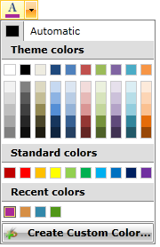
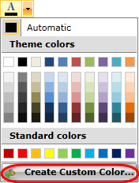
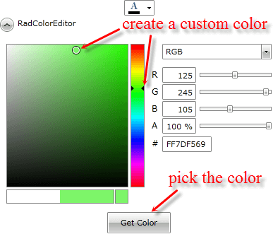
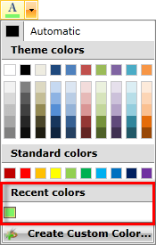

# Use IsRecentColorsActive property

This article will show you how to use the __IsRecentColorsActive__ property of the __RadColorPicker__ control.

The final result should look like this

For the purpose of this article we will use the __AdditionalContent__ property of the __RadColorPicker__ control to add a customized button at the bottom of the drop down content. This can be implemented by the following code:		

<snippet id='radcolorpicker-howto-use-isrecentcolorsactive-block_1-xaml' />

>The __RecentColors__ palette is visible when the __IsRecentColorsActive__ property of the __RadColorPicker__ control is set to __True__ and the selected color does not exist in __MainPalette__, __HeaderPalette__ or __StandartPalette__.		  

In the button's Click event handler we display a __RadExpander__ control which hosts a __RadColorEditor__. This layout will be used to customize colors:		

<snippet id='radcolorpicker-howto-use-isrecentcolorsactive-block_2-xaml' />

<snippet id='radcolorpicker-howto-use-isrecentcolorsactive-block_3-cs' />

<snippet id='radcolorpicker-howto-use-isrecentcolorsactive-block_3-vb' />

Finally in the confirmation's button Click event handler we implement the selection logic of the customized color.	

<snippet id='radcolorpicker-howto-use-isrecentcolorsactive-block_4-cs' />

<snippet id='radcolorpicker-howto-use-isrecentcolorsactive-block_4-vb' />

Now we are able to run the project and select a custom color following these steps:		

1. Click the "Create Custom Color" button.  
	

2. Create a customized color using the thumbs and pick it.  
	

3. Your custom color will be added to the __RecentColors__ palette.  
	