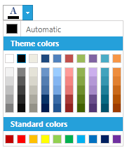

# Overview



Thank you for choosing Telerik __RadColorPicker!__



__RadColorPicker__ for SilverlightWPF  is a lightweight UI component that allows users to select colors from predefined Color Presets or from bound lists of custom colors. It can be used to easily format a Control's text or background.