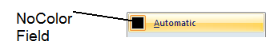
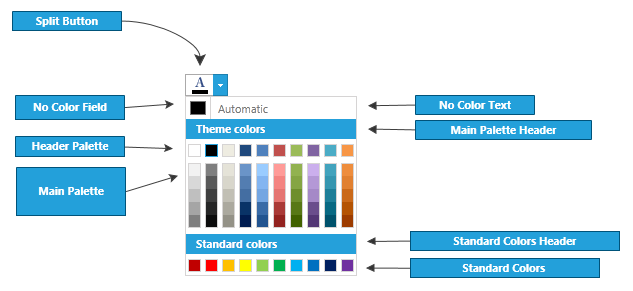

# Appearance

You can customize the appearance of a __RadColorPicker__ by choosing which of the parts to be visible.        

__1. You can set the NoColorVisibility property to Visibility.Visible to view the NoColorField, otherwise you should set it to false__            

#### __XAML__
{{region radcolorpicker-appearance_1}}
	<telerik:RadColorPicker NoColorVisibility="Visible" />
{{endregion}}

#### __C#__
{{region radcolorpicker-appearance_0}}
	RadColorPicker colorPicker = new RadColorPicker();
	colorPicker.NoColorVisibility = Visibility.Visible;
	// colorPicker.NoColorVisibility= Visibility.Collapsed;
{{endregion}}

#### __VB.NET__
{{region radcolorpicker-appearance_0}}
	Dim colorPicker As New RadColorPicker()
	colorPicker.NoColorVisibility = Visibility.Visible
	' colorPicker.NoColorVisibility= Visibility.Collapsed; '
{{endregion}}    

__2. You can use StandardPaletteVisibility and HeaderPaletteVisibility in order to set the visibility of the corresponding palettes__            

* __StandardPaletteVisibility__

	#### __XAML__
	{{region radcolorpicker-appearance_3}}
		<telerik:RadColorPicker StandardPaletteVisibility="Visible" />
	{{endregion}}

	#### __C#__
	{{region radcolorpicker-appearance_2}}
		RadColorPicker colorPicker = new RadColorPicker();
		colorPicker.StandardPaletteVisibility = Visibility.Visible;
		 // colorPicker.StandardPaletteVisibility = Visibility.Collapsed;
	{{endregion}}

	#### __VB.NET__
	{{region radcolorpicker-appearance_2}}
		Dim colorPicker As New RadColorPicker()
		colorPicker.StandardPaletteVisibility = Visibility.Visible
		' colorPicker.StandardPaletteVisibility = Visibility.Collapsed; '
	{{endregion}}

* __HeaderPaletteVisibility__

	#### __XAML__
	{{region radcolorpicker-appearance_5}}
		<telerik:RadColorPicker HeaderPaletteVisibility="Visible" />
	{{endregion}}

	#### __C#__
	{{region radcolorpicker-appearance_4}}
		RadColorPicker colorPicker = new RadColorPicker();
		colorPicker.HeaderPaletteVisibility = Visibility.Visible;
		// colorPicker.HeaderPaletteVizibility = Visibility.Collapsed;
	{{endregion}}

	#### __VB.NET__
	{{region radcolorpicker-appearance_4}}
		Dim colorPicker As New RadColorPicker()
		colorPicker.HeaderPaletteVisibility = Visibility.Visible
		' colorPicker.HeaderPaletteVizibility = Visibility.Collapsed; '
	{{endregion}}




__3. You can set different text for StandardPalette header text, MainPalette header text and NoColorText__           

* __StandardPaletteHeaderText__

	#### __XAML__
	{{region radcolorpicker-appearance_7}}
		<telerik:RadColorPicker StandardPaletteHeaderText="StandardPalette header" />
	{{endregion}}

	#### __C#__
	{{region radcolorpicker-appearance_6}}
		RadColorPicker colorPicker = new RadColorPicker();
		colorPicker.StandardPaletteHeaderText = "StandardPaletteHeader";
	{{endregion}}

	#### __VB.NET__

	{{region radcolorpicker-appearance_6}}
		Dim colorPicker As New RadColorPicker()
		colorPicker.StandardPaletteHeaderText = "StandardPaletteHeader"
	{{endregion}}

* __MainPaletteHeaderText__

	#### __C#__
	{{region radcolorpicker-appearance_8}}
		RadColorPicker colorPicker = new RadColorPicker();
		colorPicker.MainPaletteHeaderText = "MainPaletteHeader";
	{{endregion}}

	#### __XAML__
	{{region radcolorpicker-appearance_9}}
		<telerik:RadColorPicker MainPaletteHeaderText="MainPalette header" />
	{{endregion}}

* __NoColorText__

	#### __C#__
	{{region radcolorpicker-appearance_10}}
		RadColorPicker colorPicker = new RadColorPicker();
		colorPicker.NoColorText = "No color Text";
	{{endregion}}

	#### __VB.NET__
	{{region radcolorpicker-appearance_10}}
			Dim colorPicker As New RadColorPicker()
		colorPicker.NoColorText = "No color Text"
	{{endregion}}

__4. RadColorPicker is a stylable control. You can customize the look of the RadSplitButton. In order to do this you should use SplitButtonStyle property__

* __SplitButtonStyle__ - this property should be used to control the style of the split button.

__5. The ColorSelectorStyle property gets or sets the color selector style. It is used to apply a custom Style to the RadColorSelector control. This is the element shown in the popup opened when you click on the RadColorPicker__

#### __XAML__
	{{region radcolorpicker-appearance_11}}
		<telerik:RadColorPicker>
            <telerik:RadColorPicker.ColorSelectorStyle>
                
            </telerik:RadColorPicker.ColorSelectorStyle>
        </telerik:RadColorPicker>
	{{endregion}}

