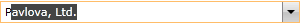
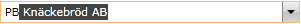
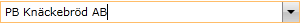

# Working with AutoComplete

## 

This topic describes the end-user's workflow for using the __AutoComplete__ feature of the __RadComboBox__.

>

In order for the user to be able to use this feature of the __RadComboBox__, its __IsEditable__ property has to be set to __True__.

The first thing to do is to click in the editable part of the __RadComboBox__.

         
      

After that begin to type and the first item that matches your input will appear in the editable area. The part that is auto-completed will be selected.

         
      

Continue typing and __RadComboBox__ will adjust the value of the mask depending on your input.

         
      

After the __RadComboBox__has____set the mask to the desired item, click somewhere in the editable area to remove the selection.

         
      

# See Also

 * [Edit Modes]()

 * [AutoComplete]()

 * [Selection]()
