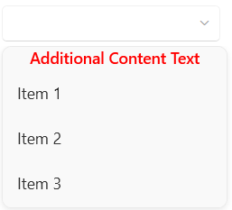
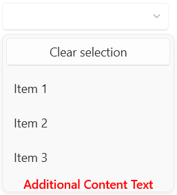

# Additional Content

The `RadComboBox` control provides the ability to define additional content that can be positioned relative to the [clear selection button]() and the drop-down items.

## AdditionalContent And AdditionalContentTemplate

To utilize this functionality, you can set the `AdditionalContent` property of RadComboBox, which is of the type of `object` and you can assign a value of any type. To further customize it, you can use the `AdditionalContentTemplate` property and specify a `DataTemplate` for it.

#### __[XAML] Setting the AdditionalContent and AdditionalContentTemplate__
{{region radcombobox-features-additional-content-0}}
    <telerik:RadComboBox AdditionalContent="Additional Content Text">
        <telerik:RadComboBox.Items>
            <telerik:RadComboBoxItem Content="Item 1"/>
            <telerik:RadComboBoxItem Content="Item 2"/>
            <telerik:RadComboBoxItem Content="Item 3"/>
        </telerik:RadComboBox.Items>
        <telerik:RadComboBox.AdditionalContentTemplate>
            <DataTemplate>
                <TextBlock Text="{Binding}" 
                FontWeight="SemiBold" 
                Foreground="Red"
                HorizontalAlignment="Center"/>
            </DataTemplate>
        </telerik:RadComboBox.AdditionalContentTemplate>
    </telerik:RadComboBox>
{{endregion}}

__RadComboBox with additional content__

## Setting the Position of the Additional Content

You can position the additional content area relevant to the clear selection button and the drop-down items. To do so, you can utilize the `AdditionalContentPosition` property. It is an enumeration of the type of `AdditionalContentPosition` and provides the following options:

* `AboveClearButton`&mdash;The additional content is displayed above the clear button of the drop-down menu of RadComboBox.
* `BelowClearButton`&mdash;The additional content is displayed below the clear button of the drop-down menu of RadComboBox. This is the default value.
* `BelowDropDownItems`&mdash;The additional content is displayed below the drop-down items of the RadComboBox.

#### __[XAML] Setting the AdditionalContentPosition__
{{region radcombobox-features-additional-content-0}}
    <telerik:RadComboBox AdditionalContent="Additional Content Text"
                         AdditionalContentPosition="BelowDropDownItems"
                         ClearSelectionButtonContent="Clear selection"
                         ClearSelectionButtonVisibility="Visible">
        <telerik:RadComboBox.Items>
            <telerik:RadComboBoxItem Content="Item 1"/>
            <telerik:RadComboBoxItem Content="Item 2"/>
            <telerik:RadComboBoxItem Content="Item 3"/>
        </telerik:RadComboBox.Items>
        <telerik:RadComboBox.AdditionalContentTemplate>
            <DataTemplate>
                <TextBlock Text="{Binding}" 
                           FontWeight="SemiBold" 
                           Foreground="Red"
                           HorizontalAlignment="Center"/>
            </DataTemplate>
        </telerik:RadComboBox.AdditionalContentTemplate>
    </telerik:RadComboBox>
{{endregion}}

__RadComboBox with additional content positioned below the drop-down items__

## See Also

 * [Clear Selection Button]()