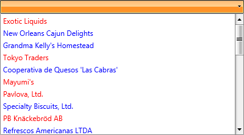

# Advanced DropDown ItemsPresenter

With the Q1 2016 release version of UI for WPF the ability to change the default __ItemsPresenter__ placed inside the drop-down portion of the control with __RadListBox__ is now available. 

You could easily change the presenter using the __DropDownItemsPresenter__ property. The property provides you the ability to choose between the following two modes:

* __DefaultItemsPresenter__ - this is the default presenter of RadComboBox.

* __RadListBox__ - the items of __RadComboBox__ are presented inside __RadListBox__.

>important When __RadListBox__ is used as __DropDownItemsPresenter__ populating RadComboBox with items declaratively is not supported out of the box.

This article will provide some detailed information about the following features of __RadComboBox__ enabled with the use of __RadListBox__ as a presenter of the items:

* [Filtering](#filtering)

* [Grouping](#grouping)

* [Multiple Selection](#multiple-selection)

* [ItemContainerStyle](#itemcontainerstyle)

* [ItemContainerStyleSelector](#itemcontainerstyleselector)

## Filtering

One of the main features of __RadComboBox__ the filtering functionality - the collection bound to the ItemsSource is filtered and reduced based on the users input. This feature is still available when the __DropDownItemsPresenter__ is set to __RadListBox__. However, please notice that filtering will only be possible if the __ItemsSource__ is bound to a collection of type __CollectionViewSource__.

The following example will demonstrate how to bind the __ItemsSource__ property of __RadComboBox__ to a __CollectionViewSource__ and enable the filtering functionality.

First, you need to create a source for the __CollectionViewSource__ collection. For that purpose a new business object named for example Agency should be created:

#### __[C#] Agency class declaration__

{{region radcombobox-features-advanced-dropdown-itemspresenter_0}}
	public class Agency
	{
		public string Name { get; set; }
		public string Phone { get; set; }
		public string Zip { get; set; }
	}
{{endregion}}

#### __[VB] Agency class declaration__

{{region radcombobox-features-advanced-dropdown-itemspresenter_0}}
	Public Class Agency
		Public Property Name() As String
		Public Property Phone() As String
		Public Property Zip() As String
	End Class
{{endregion}}

The next step is to create a class named ViewModel and inside it to initialize two collections - one of type __ObservableCollection__ that will be used as a source for the __CollectionViewSource__ and the second one the __CollectionViewSource__ itself:

#### __[C#] ViewModel declaration__

{{region radcombobox-features-advanced-dropdown-itemspresenter_1}}
	public class AgencyViewModel : ViewModelBase
	{
		private ObservableCollection<Agency> agencies;
		public CollectionViewSource CollectionAgency { get; set; }

		public ObservableCollection<Agency> Agency
		{
			get
			{
				if (agencies == null)
				{
					agencies = new ObservableCollection<Agency>();

					agencies.Add(new Agency("Exotic Liquids", "(171) 555-2222", "EC1 4SD"));
					agencies.Add(new Agency("New Orleans Cajun Delights", "(100) 555-4822", "70117"));
					agencies.Add(new Agency("Grandma Kelly's Homestead", "(313) 555-5735", "48104"));
					agencies.Add(new Agency("Tokyo Traders", "(03) 3555-5011", "100"));
					agencies.Add(new Agency("Cooperativa de Quesos 'Las Cabras'", "(98) 598 76 54", "33007"));
					agencies.Add(new Agency("Mayumi's", "(06) 431-7877", "545"));
				}

				return agencies;
			}
		}

		public AgencyViewModel()
		{
			this.CollectionAgency = new CollectionViewSource();
			this.CollectionAgency.Source = Agency;
		}
	}
{{endregion}}

#### __[VB] ViewModel declaration__

{{region radcombobox-features-advanced-dropdown-itemspresenter_1}}
	Public Class AgencyViewModel
		Inherits ViewModelBase

		Private agencies As ObservableCollection(Of Agency)
		Public Property CollectionAgency() As CollectionViewSource

		Public ReadOnly Property Agency() As ObservableCollection(Of Agency)
			Get
				If agencies Is Nothing Then
					agencies = New ObservableCollection(Of Agency)()

					agencies.Add(New Agency("Exotic Liquids", "(171) 555-2222", "EC1 4SD"))
					agencies.Add(New Agency("New Orleans Cajun Delights", "(100) 555-4822", "70117"))
					agencies.Add(New Agency("Grandma Kelly's Homestead", "(313) 555-5735", "48104"))
					agencies.Add(New Agency("Tokyo Traders", "(03) 3555-5011", "100"))
					agencies.Add(New Agency("Cooperativa de Quesos 'Las Cabras'", "(98) 598 76 54", "33007"))
					agencies.Add(New Agency("Mayumi's", "(06) 431-7877", "545"))
				End If
				Return agencies
			End Get
		End Property
		
		Public Sub New()
			Me.CollectionAgency = New CollectionViewSource()
			Me.CollectionAgency.Source = Agency
		End Sub
	End Class
{{endregion}}

Next you should bind the __Text__ property of __RadComboBox__ to a property inside the ViewModel and handle the __Filter__ event of the __CollectionViewSource__ - based on the entered __Text__ inside the input area of __RadComboBox__ the items will be filtered:

#### __[C#] Handling the Filter event__

{{region radcombobox-features-advanced-dropdown-itemspresenter_2}}
	public class AgencyViewModel : ViewModelBase
	{
		private string text ;
		
        public AgencyViewModel()
        {
            this.CollectionAgency = new CollectionViewSource();
            this.CollectionAgency.Source = Agency;

            this.CollectionAgency.Filter += CollectionAgency_Filter;
        }
		
		 public string Text
        {
            get
            {
                return this.text;
            }

            set
            {
                if (this.text != value)
                {
                    this.text = value;
                    this.OnPropertyChanged(() => this.Text);

                    this.CollectionAgency.View.Refresh();
                }
            }
        }

        void CollectionAgency_Filter(object sender, FilterEventArgs e)
        {
            var agency = e.Item as Agency;

            if(agency != null && this.Text != null)
            {
                e.Accepted = agency.Name.ToLower().Contains(this.Text.ToLower());
            }
        }
	}
{{endregion}}

#### __[VB] Handling the Filter event__

{{region radcombobox-features-advanced-dropdown-itemspresenter_2}}
	Public Class AgencyViewModel
		Inherits ViewModelBase

		Private text As String

		Public Property Text() As String
			Get
				Return Me.text
			End Get

			Set(ByVal value As String)
				If Me.text <> value Then
					Me.text = value
					Me.OnPropertyChanged(Function() Me.Text)

					Me.CollectionAgency.View.Refresh()
				End If
			End Set
		End Property

		Public Sub New()
			Me.CollectionAgency = New CollectionViewSource()
			Me.CollectionAgency.Source = Agency

			AddHandler Me.CollectionAgency.Filter, AddressOf CollectionAgency_Filter
		End Sub

		Private Sub CollectionAgency_Filter(ByVal sender As Object, ByVal e As FilterEventArgs)
			Dim agency_= TryCast(e.Item, Agency)

			If agency_ IsNot Nothing AndAlso Me.Text IsNot Nothing Then
				e.Accepted = agency_.Name.ToLower().StartsWith(Me.Text.ToLower())
			End If
		End Sub
	End Class
{{endregion}}

Finally, all you need to do is to set the __ItemsSource__ with the __CollectionViewSource__:

#### [XAML] __Setting of the ItemsSource__

{{region radcombobox-features-advanced-dropdown-itemspresenter_0}}
	<telerik:RadComboBox Width="400" x:Name="radComboBox" 
                     ItemsSource="{Binding CollectionAgency.View}" 
                     DisplayMemberPath="Name"
                     Text="{Binding Text, Mode=TwoWay}" 
                     DropDownItemsPresenter="RadListBox" 
                     IsFilteringEnabled="True" 
                     IsEditable="True"/>
{{endregion}}

>important Notice that the __IsFilteringEnabled__ property needs to be set to true or the keyboard navigation won't work as expected.

>After an item from the filtered collection gets selected the next time the drop down gets open only those items that the current filtering implementation of the CollectionViewSource allows will be visualized.

The final result is shown on the snapshot below:

>Filtering is also supported with __VirtualizingStackPanel__ which is the default Panel.

## Grouping

Another functionality that is provided out of the box when __RadListBox__ is used as a presenter is the ability to group the items. In order to achieve this the __ItemsSource__ should be bound to __CollectionViewSource__  -  this grouping feature provides a nice visualization of the items.

The following example will demonstrate how to bind the __ItemsSource__ property of __RadComboBox__ to a __CollectionViewSource__ of custom objects grouped by one of their properties. In order to make the scrolling of the grouped items be possible, you must set the __IsScrollIntoViewEnabled__ property to "False".

>important The __IsScrollIntoViewEnabled__ was introduced with SP1 Q3 2015 and determines whether the selected item will automatically be scrolled into the view. When it is set to True (this is the default value) and an item gets selected, the item is brought into view by scrolling to it. Because that behavior is not expected when grouping is used, the property needs to be set to False – thus no scrolling will be observed when an item gets selected.

The __IsScrollIntoViewEnabled__ property needs to be set through the style of the __ComboBoxListBox__:

#### __[XAML]  ComboBoxListBox Style declaration__

{{region radcombobox-features-advanced-dropdown-itemspresenter_1}}
	
{{endregion}}

and the Style should be set to the __DropDownListBoxStyle__ property of __RadComboBox__:

#### __[XAML]  DropDownListBoxStyle__

{{region radcombobox-features-advanced-dropdown-itemspresenter_2}}
	<telerik:RadComboBox x:Name="radComboBoxGrouping" DropDownListBoxStyle="{StaticResource CustomComboBoxListBoxStyle}"
						 DisplayMemberPath="Name" DropDownItemsPresenter="RadListBox" IsEditable="False">
        </telerik:RadComboBox>
{{endregion}}

The first step you need to do in order to enable grouping is to bound the ItemsSource to collection of business objects. The business object should have the following implementation:

#### __[C#]  Business object Item__

{{region radcombobox-features-advanced-dropdown-itemspresenter_3}}
	public class Item
	{
		public string Group { get; set; }
		public string Name { get; set; }
	}
{{endregion}}

#### __[VB]  Business object Item__

{{region radcombobox-features-advanced-dropdown-itemspresenter_3}}
	Public Class Item
		Public Property Group() As String
		Public Property Name() As String
	End Class
{{endregion}}

Next a ViewModel class needs to be created and inside it two collection - the one used as a source for the __CollectionViewSource__ and the other the __CollectionViewSource__ itself - should be declared:

#### __[C#]  ViewModel creation__

{{region radcombobox-features-advanced-dropdown-itemspresenter_4}}
	public ObservableCollection<Item> Collection { get; set; }

	public CollectionViewSource CollectionView { get; set; }

	public ViewModel()
	{
		this.Collection = new ObservableCollection<Item>
		{
			new Item { Group = "GroupA", Name = "Item 1" },
			new Item { Group = "GroupA", Name = "Item 2" },
			new Item { Group = "GroupA", Name = "Item 3" },
			new Item { Group = "GroupA", Name = "Item 4" },
			new Item { Group = "GroupA", Name = "Item 5" },
			new Item { Group = "GroupA", Name = "Item 6" },
			new Item { Group = "GroupB", Name = "Item 1" },
			new Item { Group = "GroupB", Name = "Item 2" },
			new Item { Group = "GroupB", Name = "Item 3" }
		};

		var view = new CollectionViewSource();
		view.GroupDescriptions.Add(new PropertyGroupDescription("Group"));
		view.Source = Collection;

		CollectionView = view;
	}
{{endregion}}

#### __[VB]  ViewModel creation__

{{region radcombobox-features-advanced-dropdown-itemspresenter_4}}
	Public Property Collection() As ObservableCollection(Of Item)

	Public Property CollectionView() As CollectionViewSource

	Public Sub New()

			Me.Collection = New ObservableCollection(Of Item) From {
				New Item With {.Group = "GroupA", .Name = "Item 1"},
				New Item With {.Group = "GroupA", .Name = "Item 2"},
				New Item With {.Group = "GroupA", .Name = "Item 3"},
				New Item With {.Group = "GroupA", .Name = "Item 4"},
				New Item With {.Group = "GroupA", .Name = "Item 5"},
				New Item With {.Group = "GroupA", .Name = "Item 6"},
				New Item With {.Group = "GroupB", .Name = "Item 1"},
				New Item With {.Group = "GroupB", .Name = "Item 2"},
				New Item With {.Group = "GroupB", .Name = "Item 3"}
			}

			Dim view = New CollectionViewSource()
			view.GroupDescriptions.Add(New PropertyGroupDescription("Group"))
			view.Source = Collection

			CollectionView = view
		End Sub
{{endregion}}

Next you should declare the ViewModel as DataContext in your XAML:

#### __[XAML]  Set the ViewModel as DataContext__

{{region radcombobox-features-advanced-dropdown-itemspresenter_3}}
	<UserControl.DataContext>
        <local:ViewModel/>
	</UserControl.DataContext>
{{endregion}}

Finally, all you need to do is to set the __ItemsSource__ property:

#### __[XAML]  Set the ItemsSource and GroupStyle__

{{region radcombobox-features-advanced-dropdown-itemspresenter_4}}
	<telerik:RadComboBox x:Name="radComboBoxGrouping" 
						 ItemsSource="{Binding CollectionView.View}" DropDownListBoxStyle="{StaticResource CustomComboBoxListBoxStyle}"
						 DisplayMemberPath="Name" DropDownItemsPresenter="RadListBox" IsEditable="False"/>
{{endregion}}

The final result is shown on the snapshot below:

>Grouping is also supported with __VirtualizingStackPanel__ which is the default Panel.

## Multiple Selection

With the official Q1 2016 release version of UI for WPF, __RadComboBox__ introduced a brand new feature which provides the ability to easily select multiple items when the current presented is __RadListBox__. 

Using the __SelectionMode__ property you could choose between the following three modes that provide different behaviours for selection of the items:

* __Single__ - only one item could be selected at a time.

* __Multiple__ - the user is enabled to select multiple items using the mouse only.

* __Extended__ - multiple items could be selected while the Shift key is pressed.

>By design when the __DropDownItemsPresenter__ of __RadComboBox__ is set to __RadListBox__ the __SelectionMode__ property is set to __Multiple__.

>important Multiple selection works only when the __IsEditable__ property is set to false.

You could set the __SelectionMode__ property through the style of the __ComboBoxListBox__:

#### __[XAML]  Setting SelectionMode to Multiple__

{{region radcombobox-features-advanced-dropdown-itemspresenter_5}}
	
{{endregion}}

#### __[XAML]  Applying DropDownListBoxStyle__

{{region radcombobox-features-advanced-dropdown-itemspresenter_6}}
	<telerik:RadComboBox x:Name="radComboBox" 
						ItemsSource="{Binding CollectionView.View}"
						DisplayMemberPath="Name" 
						DropDownListBoxStyle="{StaticResource CustomComboBoxListBoxStyle}"
						DropDownItemsPresenter="RadListBox" IsEditable="False"/>
{{endregion}}

__RadComboBox__ with multiple selection:

>You could easily change the current Margin between the selected items that are placed inside the selection box using the __SelectedItemBoxMargin__.

## ItemContainerStyle

Using the __ItemContainerStyle__ you could easily customize the items that are placed inside the drop down portion of the control and are part of the __RadListBox__ when it is used as a presenter for the items. The container created by __RadComboBox__ for each item in the collection is of type __ComboBoxListBoxItem__. The style defined for the ItemContainerStyle property should have as TargetType __ComboBoxListBoxItem__.

The following example shows you how to set the ItemContainerStyle of a RadComboBox when __RadListBox__ is used as DropDownItemsPresenter:

#### __[XAML]  Defining ItemContainerStyle__

{{region radcombobox-features-advanced-dropdown-itemspresenter_7}}
	<UserControl.Resources>
		
	</UserControl.Resources>
	...
	<telerik:RadComboBox x:Name="radComboBox" 
                        ItemsSource="{Binding Source={StaticResource DataSource}, Path=Items}" 
                        ItemContainerStyle="{StaticResource ItemContainerStyle}"
                        DisplayMemberPath="Text" 
						DropDownItemsPresenter="RadListBox"/>
{{endregion}}

The following snapshot shows the final result:

## ItemContainerStyleSelector

The __ItemContainerStyleSelector__ provides a way to easily apply styles based on some custom logic and thus to customize the items that are inside the drop down portion of the control. You could use style selector when you have more that one style defined for the same type of objects.

The next example shows how to create a custom __ItemContainerStyleSelector__ in order to change the Foreground color of the __ComboBoxListBoxItems__.

First you will need to create an __ItemContainerStyleSelector__ that inherits the StyleSelector class:

#### __[C#]  StyleSelector declaration__

{{region radcombobox-features-advanced-dropdown-itemspresenter_5}}
	public class CustomItemContainerStyleSelector : StyleSelector
	{
	
	}
{{endregion}}

#### __[VB]  StyleSelector declaration__

{{region radcombobox-features-advanced-dropdown-itemspresenter_5}}
    Public Class CustomItemContainerStyleSelector
        Inherits StyleSelector
    End Class
{{endregion}}

Next you need to define the different styles you are going to apply for the same type of objects and the SelectStyle method should be override with your own custom logic based on which a different style should be returned by the selector:

#### __[C#]  StyleSelector implementation__

{{region radcombobox-features-advanced-dropdown-itemspresenter_6}}
	public class CustomItemContainerStyleSelector : StyleSelector
	{
		public Style RedStyle { get; set; }
		public Style BlueStyle { get; set; }

		public override System.Windows.Style SelectStyle(object item, System.Windows.DependencyObject container)
		{
			var agency = item as Agency;

			if(agency.Name.Length < 20)
			{
				return this.RedStyle;
			}
			else
			{
				return this.BlueStyle;
			}
		}
	}
{{endregion}}

#### __[VB]  StyleSelector implementation__

{{region radcombobox-features-advanced-dropdown-itemspresenter_6}}
    Public Class CustomItemContainerStyleSelector
        Inherits StyleSelector

        Public Property RedStyle() As Style
        Public Property BlueStyle() As Style

        Public Overrides Function SelectStyle(ByVal item As Object, ByVal container As System.Windows.DependencyObject) As System.Windows.Style
            Dim agency = TryCast(item, Agency)

            If agency.Name.Length < 20 Then
                Return Me.RedStyle
            Else
                Return Me.BlueStyle
            End If
        End Function
    End Class
{{endregion}}

Create a StaticResource for the __CustomItemContainerStyleSelector__ and the styles:

#### __[XAML]  StaticResource for the CustomItemContainerStyleSelector__

{{region radcombobox-features-advanced-dropdown-itemspresenter_8}}
	<UserControl.Resources>
	  <local:CustomItemContainerStyleSelector x:Key="CustomItemContainerStyleSelector">
			<local:CustomItemContainerStyleSelector.RedStyle>
				
			</local:CustomItemContainerStyleSelector.RedStyle>
			<local:CustomItemContainerStyleSelector.BlueStyle>
				
			</local:CustomItemContainerStyleSelector.BlueStyle>
		</local:CustomItemContainerStyleSelector>
	</UserControl.Resources>
{{endregion}}

Finally the __ItemContainerStyleSelector__ property should be set:

#### __[XAML]  Setting ItemContainerStyleSelector__

{{region radcombobox-features-advanced-dropdown-itemspresenter_9}}
	<telerik:RadComboBox Width="400" x:Name="radComboBoxGrouping" Margin="10"
							ItemsSource="{Binding Agency}" 
							ItemContainerStyleSelector="{StaticResource CustomItemContainerStyleSelector}"
							DisplayMemberPath="Name" DropDownItemsPresenter="RadListBox" IsEditable="False">
	</telerik:RadComboBox>
{{endregion}}

The following snapshot shows the final result:

# See Also

* [Getting Started]()
 
* [Filtering]()