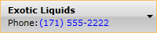

# AutoComplete

__AutoComplete__ is a feature provided by many browsers, programs and controls. It involves the program predicting a word or phrase that the user wants to type without the user actually typing it in completely. __RadComboBox__ has full autocomplete support - while you type into the input area, the combobox returns the relative match for the currently typed text.

> When the __TextSearchMode__ property of the RadComboBox is set to __Contains__, the __AutoComplete__ functionality will be disabled.

The purpose of this tutorial is to show you how to configure the autocomplete feature.

## RadComboBox Populated with a List of Strings

In the simplest scenario your data source will be a list of strings. In this case you don't need to perform any additional work to enable or configure the autocomplete.

__Create sample data__

```XAML
	<telerik:RadComboBox x:Name="radComboBox" Width="200" IsEditable="True">
	    <telerik:RadComboBoxItem Content="Alapattah" />
	    <telerik:RadComboBoxItem Content="Brickell Avenue" />
	    <telerik:RadComboBoxItem Content="Downtown Miami" />
	    <telerik:RadComboBoxItem Content="El Portal" />
	    <telerik:RadComboBoxItem Content="Cutler Ridge" />
	    <telerik:RadComboBoxItem Content="Florida City" />
	    <telerik:RadComboBoxItem Content="Homestead" />
	    <telerik:RadComboBoxItem Content="Kendall" />
	    <telerik:RadComboBoxItem Content="Leisure City" />
	    <telerik:RadComboBoxItem Content="Medley" />
	    <telerik:RadComboBoxItem Content="Pinecrest" />
	</telerik:RadComboBox>
```

Now, if you type only "down", the combo will complete your result with the first matching item.

Note that in the previous example the __IsEditable__ property is set to __True__. If your __RadComboBox__ is non-editable, you could still benefit from the autocomplete feature, but instead of autocomplete your items will be auto-selected.

## Using DisplayMemberPath

Having __RadComboBox__ populated with a list of strings is the simplest scenario. However, in most of the cases you will have a __RadComboBox__ [populated with a collection of business objects](). If your data source is more complex and your data objects are not single values but rather more complicated classes that have multiple properties, you can specify which value you want to see in the Selection Box of the control. To accomplish this you are required to configure the __DisplayMemberPath__ to point out to the property you want to make use of __AutoComplete__.

For example, if you set the __DisplayMemberPath__ to __Name__ as you suppose that your data object has such property, __RadComboBox__ will try to auto complete your entry with some of the matching name values. Here is an example of how to set __DisplayMemberPath__ and use __AutoComplete__ in case your data context associated with this control has a property called __Name__.

__Set DisplayMemberPath property__

```XAML
	<telerik:RadComboBox x:Name="radComboBox" ItemsSource="{Binding Source={StaticResource DataSource}, Path=Agency}" DisplayMemberPath="Name" IsEditable="True"/>
```

Note that you have also set the __IsEditable__ property to __True__ in order to better distinguish the benefit of __AutoComplete__. If you are not using __IsEditable__ property you can still benefit from this feature, but instead of __AutoComplete__ your items will be __AutoSelected__.        

Now, if you type only "New", the combo will complete your result with the first matching item.

In the previous example, the actual data source declaration and initialization are omitted for better clarity. For more information, take a look at the [Binding to Object]() topic.

## Using Custom ItemTemplate

Things are getting more complicated in the cases when you are using __ItemTemplate__ that defines your item layout. For example, if you have an __ItemTemplate__ like the one shown below, there is no straight-forward logic what __DisplayMemberPath__ should match as there are multiple members that are displayed.



### Using TextSearch.TextPath

To overcome this issue the __RadComboBox__'s API supports an attached property __TextSearch.TextPath__ in which you have to specify which value you want to use for __AutoComplete__ and __AutoSelect__. 

>The __TextSearch__ class is located in the __Telerik.Windows.Controls.dll__ assembly.

The following example shows you how to use the __TextSearch.TextPath__ property.

__Set TextSearch attached property__

```XAML
	<telerik:RadComboBox x:Name="radComboBox" 
	                     ItemsSource="{Binding Source={StaticResource DataSource}, Path=Agency}" 
	                     ItemTemplate="{StaticResource ComboBoxCustomTemplate}" IsEditable="True" 
	                     telerik:TextSearch.TextPath="Name" />
```

### Using TextSearch.AutoCompleteTimeout Property

The __TextSearch__ class exposes a static property named __AutoCompleteTimeout__ which allows you to configure the autocomplete timeout. Use this property when you want to set the timeout after that the typed text for the autocomplete is reset. Its default value is 800ms.

The following example shows how to set __TextSearch.AutoCompleteTimeout__ property.

__Set AutoCompleteTimeout property__

```C#
	Telerik.Windows.Controls.TextSearch.AutoCompleteTimeout = TimeSpan.FromSeconds(2);
```

## Disable Autocomplete

By default the autocomplete feature of __RadComboBox__ is always enabled. In order to disable it, you need to set the __RadComboBox__'s __IsTextSearchEnabled__ property to __False__.

__Disable AutoComplete mechanism__

```XAML
	<telerik:RadComboBox x:Name="radComboBox" IsTextSearchEnabled="False"/>
```

__Disable AutoComplete mechanism in code behind__

```C#
	radComboBox.IsTextSearchEnabled = false;
```
```VB.NET
	radComboBox.IsTextSearchEnabled = False
```

## Select Items on AutoComplete

The RadComboBox control exposes the `CanAutocompleteSelectItems` property which specifies whether typing a text in a RadComboBox should change the selection or not.

>This property is applicable only when the dropdown of the control is opened.

By default, the value of the property is `null` which means that typing some characters will only select an item if the `IsEditable` property is set to `true`.

You can, however, manually set the `CanAutocompleteSelectItems` property to `true` if the control should change its selection when the user types text or to `false` when the selection should not be changed until this occurs explicitly.

__Disable AutoComplete item selection__

```XAML
	<telerik:RadComboBox x:Name="radComboBox" CanAutocompleteSelectItems="False"/>
```

__Disable AutoComplete item selection in code behind__

```C#
	radComboBox.CanAutocompleteSelectItems = false;
```
```VB.NET
	radComboBox.CanAutocompleteSelectItems = False
```

## Select Partial Matches

As of **R1 2023** the RadComboBox control exposes a `AutoCompleteSelectionMode` property which indicates whether selection via autocomplete is performed when a partial or a full match is found. It is an enum which has two possible values:

* `PartialMatch`: Items are selected even if they only partially match the typed text. This is the **default** value.
* `FullMatch`: Items are selected only if they exactly match the typed text.

The next examples demonstrate how to set the AutoCompleteSelectionMode property so that items are only selected if they exactly match the typed text.

__Set the AutoCompleteSelectionMode__

```XAML
	<telerik:RadComboBox x:Name="radComboBox" AutoCompleteSelectionMode="FullMatch"/>
```

__Set the AutoCompleteSelectionMode in code behind__

```C#
	radComboBox.AutoCompleteSelectionMode = ComboBoxAutoCompleteSelectionMode.FullMatch;
```
```VB.NET
	radComboBox.AutoCompleteSelectionMode = ComboBoxAutoCompleteSelectionMode.FullMatch
```

## See Also

 * [Selection]()

 * [Edit Modes]()
