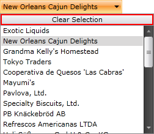

# Clear Selection Button

This article demonstrates how to enable the clear selection button and change its content.

## Using ClearSelectionButtonVisibility and ClearSelectionButtonContent

The __RadComboBox__ offers an additional button displayed in the drop-down part, which is responsible for clearing the selection. By default this button is __not visible__. However you could make it visible by using the __ClearSelectionButtonVisibility__ property. Also you have the ability to set the content of the button clearing the selection to anything you want.


```XAML
	<telerik:RadComboBox ClearSelectionButtonVisibility="Visible" ClearSelectionButtonContent="Clear Selection"/>
```



## See Also

 * [Filtering]()

 * [Edit Modes]()

 * [AutoComplete]()
