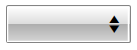

# Drop-Down Button Icon

The __DropDownButtonIconContent__ and the __DropDownButtonIconContentTemplate__ properties allow you to customize the drop-down button icon of the __RadComboBox__ control.

* __DropDownButtonIconContent__: Gets or sets the content of the show dialog button.

* __DropDownButtonIconContentTemplate__: Gets or sets the content template of the show dialog button.


## Using RadGlyphs

The __DropDownButtonIconContent__ and __DropDownButtonIconContentTemplate__ properties are fully compatible with our [RadGlyph]() control. The following example shows how to set a RadGlyph as a drop-down button icon. 

__Example 1: Setting a RadGlyph as Drop-Down Button Icon__
```XAML
        <telerik:RadComboBox DropDownButtonIconContent="&#xe010;">
            <telerik:RadComboBox.DropDownButtonIconTemplate>
                <DataTemplate>
                    <telerik:RadGlyph Glyph="{Binding}" />
                </DataTemplate>
            </telerik:RadComboBox.DropDownButtonIconTemplate>
            <telerik:RadComboBoxItem Content="Item 1" />
            <telerik:RadComboBoxItem Content="Item 2" />
        </telerik:RadComboBox>
```


## Using Images

The __DropDownButtonIconContent__ and __DropDownButtonIconContentTemplate__ properties are fully compatible with the Image control. The following example shows how to set an Image as a drop-down button icon. 

__Example 1: Setting a Image as Drop-Down Button Icon__
```XAML
        <telerik:RadComboBox DropDownButtonIconContent="myImage.png">
            <telerik:RadComboBox.DropDownButtonIconTemplate>
                <DataTemplate>
                    <Image Source="{Binding}" />
                </DataTemplate>
            </telerik:RadComboBox.DropDownButtonIconTemplate>
            <telerik:RadComboBoxItem Content="Item 1" />
            <telerik:RadComboBoxItem Content="Item 2" />
        </telerik:RadComboBox>
```


#### Figure 1: RadComboBox with customized dropdown icon


## See Also
 * [Selection Box Template]()
