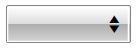

# Drop-Down Button Icon

The __DropDownButtonIconContent__ and the __DropDownButtonIconContentTemplate__ properties allow you to customize the drop-down button icon of the __RadComboBox__ control.

* __DropDownButtonIconContent__: Gets or sets the content of the show dialog button.

* __DropDownButtonIconContentTemplate__: Gets or sets the content template of the show dialog button.


## Using RadGlyphs

The __DropDownButtonIconContent__ and __DropDownButtonIconContentTemplate__ properties are fully compatible with our [RadGlyph]() control. The following example shows how to set a RadGlyph as a drop-down button icon. 

__Example 1: Setting a RadGlyph as Drop-Down Button Icon__
<snippet id='radcombobox-features-dropdown-icon-example_1_setting_a_radglyph_as_drop_down_button_icon-xaml' />


## Using Images

The __DropDownButtonIconContent__ and __DropDownButtonIconContentTemplate__ properties are fully compatible with the Image control. The following example shows how to set an Image as a drop-down button icon. 

__Example 1: Setting a Image as Drop-Down Button Icon__
<snippet id='radcombobox-features-dropdown-icon-example_1_setting_a_image_as_drop_down_button_icon-xaml' />



#### Figure 1: RadComboBox with customized dropdown icon

## See Also
 * [Selection Box Template]()
