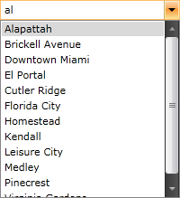
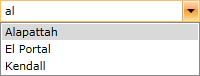
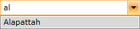

# Filtering

The advanced filtering mechanism of the __RadComboBox__ control allows the users to refine their search results as they type in the input area. The RadComboBox filtering is done according to the __TextSearchMode__ property of the RadComboBox. You can read some more about it in the [Text Search](#textsearchmode) article.

>For implementing custom filtering behavior you can take a look at the [Filtering Behavior]() help article.

The next code snippet shows a regular __RadComboBox__ with static data (defined in XAML).


```XAML
	<telerik:RadComboBox IsEditable="True" x:Name="radComboBox">
	    <telerik:RadComboBoxItem Content="Alapattah" />
	    <telerik:RadComboBoxItem Content="Brickell Avenue" />
	    <telerik:RadComboBoxItem Content="Downtown Miami" />
	    <telerik:RadComboBoxItem Content="El Portal" />
	    <telerik:RadComboBoxItem Content="Cutler Ridge" />
	    <telerik:RadComboBoxItem Content="Florida City" />
	    <telerik:RadComboBoxItem Content="Homestead" />
	    <telerik:RadComboBoxItem Content="Kendall" />
	    <telerik:RadComboBoxItem Content="Leisure City" />
	    <telerik:RadComboBoxItem Content="Medley" />
	    <telerik:RadComboBoxItem Content="Pinecrest" />
	    <telerik:RadComboBoxItem Content="Virginia Gardens" />
	</telerik:RadComboBox>
```

To control the text filtering you can set the __IsFilteringEnabled__ property. By default the __IsFilteringEnabled__ is set to False. You can see on the snapshot below that in this case the items in the drop-down are not filtered.



Now go back in the initial __RadComboBox__ declaration and set the __TextSearchMode__ property to __Contains__. To enable the text filtering you will also have to set the __IsFilteringEnabled__ property to __True__.


```XAML
	<telerik:RadComboBox IsEditable="True" x:Name="radComboBox" TextSearchMode="Contains" IsFilteringEnabled="True">
	....
	</telerik:RadComboBox>
```

Start your demo and write "al" in the __input box__. Now only items containing the "al" text will be displayed.



>important Please, notice that if there aren't any filtered items and you move the focus out of __RadComboBox__ the entered search text will be cleared. In order to prevent the text from clearing you need to set the __UpdateTextOnLostFocus__ property which was introduced with the SP1 Q2 2015 version of UI for WPFSilverlight to __False__.

>The text filtering feature of __RadComboBox__ works only while the drop-down is open (it filters the visible items in the drop-down). You can also set the __OpenDropDownOnFocus__ property to __True__ which automatically opens the drop-drop when the controls is focused.

The final scenario is when you have a __TextSearchMode__ set to __TextSearchMode.StartsWith__.
        


```XAML
	<telerik:RadComboBox IsEditable="True" x:Name="radComboBox" TextSearchMode="StartsWith" IsFilteringEnabled="True">
	....
	</telerik:RadComboBox>
```

Start your demo and write "al" in the __input box__. Now only items, which text starts with the "al" text, will be shown in the drop-down list.



>important When RadComboBox is virtualized the filtering is not supported.

## See Also

 * [Edit Modes]()

 * [AutoComplete]()
 
 * [Filtering Behavior]()
