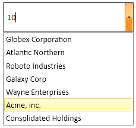
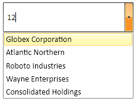

# Filtering Behavior

With the Q1 2015 release version of UI for WPFSilverlight, __RadComboBox__ provides a brand new __FilteringBehavior__ feature. Now, by using it you could easily implement your own custom logic for the Filtering mechanism of __RadComboBox__. This article will demonstrate how to implement such custom __FilteringBehavior__.

## Getting Started 

In order to enable the text filtering the __IsFilteringEnabled__ property needs to be set to “True” and the drop-down needs to be open. By setting the __OpenDropDownOnFocus__ to “True” the drop-down will open automatically when the control gets focused.

## Implementing Custom ComboBox Filtering Behavior

In order to implement the desired custom Filtering behavior for __RadComboBox__ you need to create a class that derives from the __ComboBoxFilteringBehavior__ class. This class consist of the following methods: 

* __FindMatchingIndexes()__ – returns a collection of integer objects representing the indexes of the filtered items using the typed inside __RadComboBox’s__ Input Area text.

* __FindFullMatchIndex()__ – returns the index of the item that fully matches the typed text and that item will be highlighted.

And property:

* __ComboBox__ – it is a property that gets __RadComboBox__ owner of the behavior. 

The following example will demonstrate how to implement a custom __FilteringBehavior__ that will filter the items from the ItemSource of __RadComboBox__ depending on their string length. If there is an item that completely matches the typed length - it will be highlighted.

Firstly you need to create a custom class that inherits the default __ComboBoxFilteringBehavior__:

<snippet id='radcombobox-features-filteringbehavior-block_1-cs' />

#### __VB__

<snippet id='radcombobox-features-filteringbehavior-block_2-vb' />

Next thing you have to do is to override the __FindMatchingIndexes()__ method that should return a collection of integer objects representing the indexes of the items whose length is smaller than the typed one. The charLength field is used in this concrete scenario to preserve the currently typed length:

<snippet id='radcombobox-features-filteringbehavior-block_3-cs' />

#### __VB__

<snippet id='radcombobox-features-filteringbehavior-block_4-vb' />

The __FindFullMatchIndex()__ method also needs to be overridden. It should return the index of the first item that fully matches the typed length and that item will be highlighted. However, if there is no match, the method should return -1 – thus the first item will be highlighted:

<snippet id='radcombobox-features-filteringbehavior-block_5-cs' />

#### __VB__

<snippet id='radcombobox-features-filteringbehavior-block_6-vb' />

Finally all you need to do is to set the newly created behavior to the FilteringBehavior of RadComboBox:

<snippet id='radcombobox-features-filteringbehavior-block_7-xaml' />

The following figures demonstrate the final result:
__Figure 1:__ The items whose length is bigger or equal to 10 are filtered and the item that fully matches is highlighted:

__Figure 2:__ Again the items are filtered and because there isn’t an item that exactly matches the entered length the __FindFullMatchIndex()__ returns -1 and the first item is highlighted:

>tip Find a runnable project of the previous example in the [WPF Samples GitHub repository](https://github.com/telerik/xaml-sdk/tree/master/ComboBox/CustomFiltering).

## See Also

* [Filtering]()
