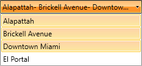
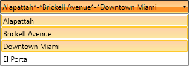
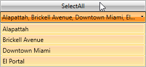
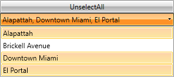
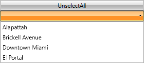
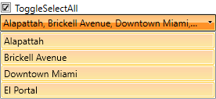
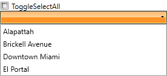
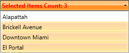

# Multiple Selection

With the R3 2016 release version of UI for WPF, multiple items can be selected from __RadComboBox__. To enable this functionality, you have to set the  __AllowMultipleSelection__  property to __True__. This article will provide some detailed information about the available properties, commands and other features that are available when multiple selection is allowed.

## Properties

This section will provide information about the following properties connected with the multiple selection functionality of __RadComboBox__:

* AllowMultipleSelection

* MultipleSelectionSeparator

* MultipleSelectionSeparatorStringFormat

* SelectedItems

### AllowMultipleSelection

Using the __AllowMultipleSelection__ property you can enable or disable the multiple selection functionality of __RadComboBox__. The default value of this property is __False__. To enable the multiple selection, set the __AllowMultipleSelection__ property to __True__ as shown in __Example 1__.

__Example 1: Allowing multiple selection__

```XAML
	<telerik:RadComboBox x:Name="radComboBox" AllowMultipleSelection="True"/>
```

### MultipleSelectionSeparator

When multiple items are selected in __RadComboBox__ they are separated from each other with a specific separator: the default separator is a comma. To change that separator, use the __MultipleSelectionSeparator__ property. This property is of type char, so any character could be set as a separator.  

__Example 2__ demonstrates how to change the default separator to a dash.

__Example 2: Changing multiple selection separator__

```XAML
	<telerik:RadComboBox AllowMultipleSelection="True" MultipleSelectionSeparator="-">
		<telerik:RadComboBoxItem Content="Alapattah" />
		<telerik:RadComboBoxItem Content="Brickell Avenue" />
		<telerik:RadComboBoxItem Content="Downtown Miami" />
		<telerik:RadComboBoxItem Content="El Portal" />
	</telerik:RadComboBox>
```

#### __Figure 1: Selected items separated by dash set in Example 2__


>If __RadComboBox__ is __Editable__ and the __IsTextSearchEnabled__ is __True__ pressing the separator while typing inside the input area of the control will autocomplete the item to its end.

### MultipleSelectionSeparatorStringFormat

You can use the __MultipleSelectionSeparatorStringFormat__ string property for formatting the representation of the char that separates the selected items. By using it, the current format of the char separator could easily be changed.

>important If the provided __MultipleSelectionSeparatorStringFormat__ is not a valid format, a __FormatException__ will be thrown.

__Example 3__ demonstrates how to set the __MultipleSelectionSeparatorStringFormat__ property.

__Example 3: Changing multiple selection separator StringFormat__

```XAML
	<telerik:RadComboBox AllowMultipleSelection="True" MultipleSelectionSeparator="-"
						 MultipleSelectionSeparatorStringFormat="{}&ast;{0}&ast;">
		<telerik:RadComboBoxItem Content="Alapattah" />
		<telerik:RadComboBoxItem Content="Brickell Avenue" />
		<telerik:RadComboBoxItem Content="Downtown Miami" />
		<telerik:RadComboBoxItem Content="El Portal" />
	</telerik:RadComboBox>
```

#### __Figure 2: Selected items separated by the MultipleSelectionSeparatorStringFormat set in Example 3__


>If __RadComboBox__ is __Editable__, the __MultipleSelectionSeparatorStringFormat__ will be applied only when the focus is not inside the input area of the control. If the input area is focused, only the __MultipleSelectionSeparator__ will be applied and visualized.

### SelectedItems

Using the __SelectedItems__ property, you could get a collection of all the items that are currently selected - the property is read-only. This property is provided by the [__MultiSelector__](https://msdn.microsoft.com/en-us/library/system.windows.controls.primitives.multiselector.selecteditems(v=vs.110).aspx) class that is inherited by __RadComboBox__. 

> To learn how to bind the SelectedItems collection to a property in your ViewModel, check out the [SelectedItemsBinding](https://github.com/telerik/xaml-sdk/tree/master/ComboBox/SelectedItemsBinding) SDK example.

When multiple selection is allowed the __SelectedItem__, __SelectedValue__ and __SelectedIndex__ properties are being set as explained below:

* __SelectedItem__: The first item in the current selection that you could get or set. If there is no selection the returned value is null.

* __SelectedValue__: It gets or sets the value of the __SelectedItem__ that is obtained using the __SelectedValuePath__.

* __SelectedIndex__: This is the index of the first item of the current selection. If the selection is empty, negative one (-1) is returned.

## Commands

With multiple selection the following commands could be executed:

* [SelectAll](#selectall)

* [UnselectAll](#unselectall)

* [ToggleSelectAll](#toggleselectall)

### SelectAll

The __SelectAll__ command is part of the static class __RadComboBoxCommands__. After executing it, all items in __RadComboBox__ will be selected. 

In __Example 4__ a __Button__ is linked to the __RadComboBoxCommands.SelectAll__ command - after execution all items in __RadComboBox__ get selected:

__Example 4: SelectAll command__

```XAML
	<telerik:RadButton Content="SelectAll" Command="{x:Static telerik:RadComboBoxCommands.SelectAll}"
                    CommandTarget="{Binding ElementName=radComboBox}"/>
	<telerik:RadComboBox x:Name="radComboBox" AllowMultipleSelection="True">
		<telerik:RadComboBoxItem Content="Alapattah" />
		<telerik:RadComboBoxItem Content="Brickell Avenue" />
		<telerik:RadComboBoxItem Content="Downtown Miami" />
		<telerik:RadComboBoxItem Content="El Portal" />
	</telerik:RadComboBox>
```

#### __Figure 3: RadCombobBox after executing SelectAll command__


### UnselectAll

The __UnselectAll__ command deselects all currently selected items - the command is part of the __RadComboBoxCommands__ static class.

__Example 5__ demonstrates how __UnselectAll__ command could be attached to the __Command__ property of a __Button__.

__Example 5: UnselectAll command__

```XAML
	<telerik:RadButton Content="UnselectAll" Command="{x:Static telerik:RadComboBoxCommands.UnselectAll}"
					   CommandTarget="{Binding ElementName=radComboBox}"/>
	<telerik:RadComboBox x:Name="radComboBox" AllowMultipleSelection="True">
		<telerik:RadComboBoxItem Content="Alapattah" />
		<telerik:RadComboBoxItem Content="Brickell Avenue" />
		<telerik:RadComboBoxItem Content="Downtown Miami" />
		<telerik:RadComboBoxItem Content="El Portal" />
	</telerik:RadComboBox>
```

#### __Figure 4: Before executing UnselectAll command__


#### __Figure 5: After executing UnselectAll command__


### ToggleSelectAll

Using the __ToggleSelectAll__ command, you could switch between selection and deselection of the items - it selects/deselects all of the items in the multiple selection __RadComboBox__ depending on the command parameter.

__Example 6__ demonstrates how __ToggleSelectAll__ command could be attached and executed through a __CheckBox__.

__Example 6: ToggleSelectAll command__

```XAML
	<CheckBox Content="ToggleSelectAll" Command="{x:Static telerik:RadComboBoxCommands.ToggleSelectAll}"
              CommandParameter="{Binding RelativeSource={RelativeSource Self}, Path=IsChecked}"
              CommandTarget="{Binding ElementName=radComboBox}"/>
	<telerik:RadComboBox x:Name="radComboBox" AllowMultipleSelection="True">
		<telerik:RadComboBoxItem Content="Alapattah" />
		<telerik:RadComboBoxItem Content="Brickell Avenue" />
		<telerik:RadComboBoxItem Content="Downtown Miami" />
		<telerik:RadComboBoxItem Content="El Portal" />
	</telerik:RadComboBox>
```

#### __Figure 6: After checking the CheckBox with ToggleSelectAll command__


#### __Figure 7: After unchecking the CheckBox with ToggleSelectAll command__


## MultipleSelectionBoxTemplate

The __MultipleSelectionBoxTemplate__ gives you the ability to define a separate template for the selected items of a __Non-Editable RadComboBox__ when multiple selection is allowed.

>important The __MultipleSelectionBoxTemplate__ is used only in a __Non-Editable RadComboBox__.

The following steps demonstrate how to apply the __MultipleSelectionBoxTemplate__ to a __RadComboBox__.

You can create a custom __DataTemplate__ as shown in __Example 7__.

__Example 7: Custom DataTemplate__

```XAML
	<UserControl.Resources>
		<DataTemplate x:Key="MultipleSelectionBoxTemplate">
			<TextBlock Text="{Binding ElementName=radComboBox, Path=SelectedItems.Count, StringFormat='Selected Items Count: {0}'}" Foreground="Red" FontWeight="Bold" />
		</DataTemplate>
	</UserControl.Resources>
```

The created __DataTemplate__ should be set to the __MultipleSelectionBoxTemplate__ property of __RadComboBox__ as demonstrated in __Example 8__.

__Example 8: Set the MultipleSelectionBoxTemplate__

```XAML
	<telerik:RadComboBox x:Name="radComboBox" AllowMultipleSelection="True"
                     MultipleSelectionBoxTemplate="{StaticResource MultipleSelectionBoxTemplate}">
		<telerik:RadComboBoxItem Content="Alapattah" />
		<telerik:RadComboBoxItem Content="Brickell Avenue" />
		<telerik:RadComboBoxItem Content="Downtown Miami" />
		<telerik:RadComboBoxItem Content="El Portal" />
	</telerik:RadComboBox>
```

#### __Figure 8: RadComboBox after applying MultipleSelectionBoxTemplate__


## Keyboard support

>important __CanKeyboardNavigationSelectItems__ has no affect when multiple selection is used.

This section describes the specific keyboard shortcuts used by __RadComboBox__ when multiple selection is allowed.

* Space:  Selects the current highlighted item when __RadComboBox__ is __Non-Editable__.

* Enter:  Selects the current highlighted item both when __RadComboBox__ is __Editable__ or __Non-Editable__.

* Back: Deselects the current highlighted item when __RadComboBox__ is __Non-Editable__.

## See Also

 * [Selection]()

 * [Edit Modes]()

 * [Clear Selection Button]()
