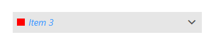
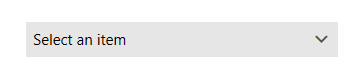

# Selection Box Template

The selection box template allows you to define a DataTemplate for the selected item, thus customizing the [Selection Box]() part of RadComboBox. 

>important This feature is available only with Non-Editable RadComboBox. This is when the IsEditable property of the control is set to False (default value). To customize the [Input Area]() part of an editable RadComboBox, use the [TextBoxStyle]() property.

To set the custom DataTemplate, set the __SelectionBoxTemplate__ property of RadComboBox. The following example shows how to set up a combobox and define a selection box template.

__Example 1: Setting up the model__
```C#
	public class DataItem
    {
        public string Name { get; set; }
    }
```
```VB.NET
	Public Class DataItem
		Public Property Name As String
	End Class
```

__Example 2: Setting up the data__
```C#
	public MainWindow()
	{         
		InitializeComponent();

		var source = new ObservableCollection<DataItem>()
		{
			new DataItem() { Name = "Item 1" },
			new DataItem() { Name = "Item 2" },
			new DataItem() { Name = "Item 3" },
		};
		this.DataContext = source;            
	}
```
```VB.NET
	Public Sub New()
		InitializeComponent()
		Dim source = New ObservableCollection(Of DataItem)() From {
			New DataItem() With {
				.Name = "Item 1"
			},
			New DataItem() With {
				.Name = "Item 2"
			},
			New DataItem() With {
				.Name = "Item 3"
			}
		}
		Me.DataContext = source
	End Sub
```

__Example 3: Setting the SelectionBoxTemplate__
```XAML
	<telerik:RadComboBox ItemsSource="{Binding}" DisplayMemberPath="Name">
		<telerik:RadComboBox.SelectionBoxTemplate>
			<DataTemplate>
				<Grid>
					<Rectangle Width="10" Height="10" Fill="Red" HorizontalAlignment="Left" />
					<TextBlock Text="{Binding Name}" FontStyle="Italic" Foreground="#3399FF" Margin="15 0 0 0"/>
				</Grid>
			</DataTemplate>
		</telerik:RadComboBox.SelectionBoxTemplate>
	</telerik:RadComboBox>
```




## Multiple Selection Box Template

To customize the Selection Box part of RadComboBox when multiple selection is enabled, set the __MultipleSelectionBoxTemplate__ property, instead of SelectionBoxTemplate. Read more about this in the [Multiple Selection](#multipleselectionboxtemplate) article.


## Empty Selection Box Template

To customize the Selection Box when there is no selected item, set the __EmptySelectionBoxTemplate__

__Example 4: Setting the EmptySelectionBoxTemplate__
```XAML
	<telerik:RadComboBox ItemsSource="{Binding}" DisplayMemberPath="Name">
		<telerik:RadComboBox.EmptySelectionBoxTemplate>
			<DataTemplate>
				<TextBlock Text="Select an item" />
			</DataTemplate>
		</telerik:RadComboBox.EmptySelectionBoxTemplate>
	</telerik:RadComboBox>
```



>important The SelectionBoxTemplate, EmptySelectionBoxTemplate and MultipleSelectionBoxTemplate properties are applied only when the ItemsSource property of RadComboBox is set.

## See Also  
 * [Binding to Object]() 
 * [Using DataTemplate in Code]() 
