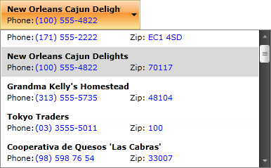
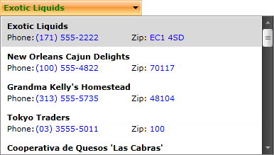

# SelectionBoxTemplate

## 

The __SelectionBoxTemplate__gives you the ability to define a separate template for the selected item. The purpose of this tutorial is to show you how to create and apply __SelectionBoxTemplate__.

>Before proceeding further with this tutorial, be sure that you are familiar with how to bind a __RadComboBox__ to a collection of business objects. For more information take a look at the [Binding to Object]() topic. __This tutorial will use exactly the same example as in the aforementioned topic.__

If you have a __RadComboBox__ which is populated to a collection of business objects, then all items (including the item in the selection box) will look identically.

#### __XAML__

{{region radcombobox-populating-with-data-selectionbox_0}}
	<telerik:RadComboBox x:Name="radComboBox" ItemsSource="{Binding Source={StaticResource DataSource}, Path=Agency}" ItemTemplate="{StaticResource ComboBoxCustomTemplate}"/>
	{{endregion}}

__RadComboBox__ gives you the ability to define a separate template for the selected item. In order to do that, you have to perform two simple steps:

* Create a custom __DataTemplate__

#### __XAML__

{{region radcombobox-populating-with-data-selectionbox_1}}
	<UserControl.Resources>
	    <DataTemplate x:Key="SelectionBoxTemplate">
	        <TextBlock Text="{Binding Name}" Foreground="Green" FontWeight="Bold"/>
	    </DataTemplate>
	</UserControl.Resources>
	{{endregion}}

* Set the declared __DataTemplate__ to the __RadComboBox__'s __SelectionBoxTemplate__ property.

#### __XAML__

{{region radcombobox-populating-with-data-selectionbox_2}}
	<telerik:RadComboBox x:Name="radComboBox" SelectionBoxTemplate="{StaticResource SelectionBoxTemplate}"/>
	{{endregion}}

The result is shown on the image below. Note how the template of the selected item differs from the items in the drop-down.

# See Also

 * [Binding to WCF Service]()

 * [Binding to Object]()

 * [Binding to ADO.NET Data Service]()
