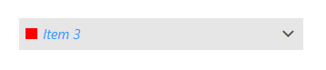
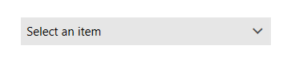

# Selection Box Template

The selection box template allows you to define a DataTemplate for the selected item, thus customizing the [Selection Box]() part of RadComboBox. 

>important This feature is available only with Non-Editable RadComboBox. This is when the IsEditable property of the control is set to False (default value). To customize the [Input Area]() part of an editable RadComboBox, use the [TextBoxStyle]() property.

To set the custom DataTemplate, set the __SelectionBoxTemplate__ property of RadComboBox. The following example shows how to set up a combobox and define a selection box template.

__Example 1: Setting up the model__
<snippet id='radcombobox-features-populating-with-data-selectionbox-example_1_setting_up_the_model-cs' />

<snippet id='radcombobox-features-populating-with-data-selectionbox-example_1_setting_up_the_model-vb' />

__Example 2: Setting up the data__
<snippet id='radcombobox-features-populating-with-data-selectionbox-example_2_setting_up_the_data-cs' />

<snippet id='radcombobox-features-populating-with-data-selectionbox-example_2_setting_up_the_data-vb' />

__Example 3: Setting the SelectionBoxTemplate__
<snippet id='radcombobox-features-populating-with-data-selectionbox-example_3_setting_the_selectionboxtemplate-xaml' />


## Multiple Selection Box Template

To customize the Selection Box part of RadComboBox when multiple selection is enabled, set the __MultipleSelectionBoxTemplate__ property, instead of SelectionBoxTemplate. Read more about this in the [Multiple Selection](#multipleselectionboxtemplate) article.


## Empty Selection Box Template

To customize the Selection Box when there is no selected item, set the __EmptySelectionBoxTemplate__

__Example 4: Setting the EmptySelectionBoxTemplate__
<snippet id='radcombobox-features-populating-with-data-selectionbox-example_4_setting_the_emptyselectionboxtemplate-xaml' />

>important The SelectionBoxTemplate, EmptySelectionBoxTemplate and MultipleSelectionBoxTemplate properties are applied only when the ItemsSource property of RadComboBox is set.

## See Also  
 * [Binding to Object]() 
 * [Using DataTemplate in Code]() 
