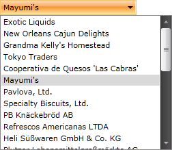

# Selection

The purpose of this tutorial is to show you the basic properties exposed by the __RadComboBox__ for working with __selection__. This topic includes the following sections:

* [Using the SelectedItem](#using-the-selecteditem)

* [Using SelectedValue and SelectedValuePath](#using-selectedvalue-and-selectedvaluepath)

* [Using the SelectedIndex](#using-the-selectedindex)

* [Using the Text property](#using-the-text-property)

## Using the SelectedItem

The purpose of the __SelectedItem__ property is to get or set the currently selected item of the __RadComboBox__. There are two common cases when accessing the __SelectedItem__ property run-time.

* When your __RadComboBox__ is with static data (declared in XAML), the __SelectedItem__ property is of type __RadComboBoxItem__.

#### __C#__

```C#
	RadComboBoxItem selectedItem = radComboBox.SelectedItem as RadComboBoxItem;
```

#### __VB.NET__

```VB.NET
	Dim selectedItem As RadComboBoxItem = TryCast(radComboBox.SelectedItem, RadComboBoxItem)
```

* When your __RadComboBox__ is [data bound to a collection of custom objects](), the __SelectedItem__ is of the type of the custom object.

#### __C#__

```C#
	Agency agency = radComboBox.SelectedItem as Agency;
	```


#### __VB.NET__

```VB.NET
	Dim agency As Agency = TryCast(radComboBox.SelectedItem, Agency)
```

## Using SelectedValue and SelectedValuePath

The __SelectedValue__ property is used when you have linked your __RadComboBox__ to a data source, and you want to return a value other than the one which is displayed. The __SelectedValuePath__ property provides a way to specify a __SelectedValue__ for the __SelectedItem__ in a __RadComboBox__. There are two essential things that you should remember here:

* The __SelectedItem__ property represents an object in the __Items__ collection and the combo box displays the value of a single property of the selected item.

* The __SelectedValuePath__ property specifies the path to the property that is used to determine the value of the __SelectedValue__ property.

The following example demonstrates the usage of the __SelectedItem__, __SelectedValue__ and __SelectedValuePath__ properties.

Imagine that you have a business object named __Agency__ with two members (properties): __Name__ and __Phone__. And a __RadComboBox__ object which is [data bound]() to a list of __Agency__ objects

#### __C#__

```C#
	public class Agency
	{
	    public string Name
	    {
	        get;
	        set;
	    }
	    public string Phone
	    {
	        get;
	        set;
	    }
	}
```

#### __VB.NET__

```VB.NET
	Public Class Agency
	Private _Name As String
	    Public Property Name() As String
	        Get
	            Return _Name
	        End Get
	        Set(ByVal value As String)
	            _Name = value
	        End Set
	    End Property
	Private _Phone As String
	    Public Property Phone() As String
	        Get
	            Return _Phone
	        End Get
	        Set(ByVal value As String)
	            _Phone = value
	        End Set
	    End Property
	End Class
```

#### __XAML__

```XAML
	<telerik:RadComboBox x:Name="radComboBox"
	    ItemsSource="{Binding Source={StaticResource DataSource}, Path=Agency}"
	    DisplayMemberPath="Name"
	    SelectedValuePath="Phone"/>
```



When you select an agency name from the combo box, the __SelectedItem__ property returns the __Agency__ data item that corresponds to the selected __Name__. However, because the __SelectedValuePath__ of this __RadComboBox__ is set to agency phone, the __SelectedValue__ is set to the __Phone__ property of the __Agency__ business object.

## Using the SelectedIndex

Use the __SelectedIndex__ property to get or set the index of the selected item. For example, by using the __SelectedIndex__ property, you could specify which the default selected item is.

#### __XAML__

```XAML
	<telerik:RadComboBox x:Name="radComboBox" SelectedIndex="3"/>
```

## Using the Text Property

Use the __RadComboBox__'s __Text__ property, whenever you want to get or set the text of the currently selected item. This is the currently displayed text in the input box.
        

#### __C#__

```C#
	string text = radComboBox.Text;
```

#### __VB.NET__

```VB.NET
	Dim text As String = radComboBox.Text
```

## See Also

 * [Filtering]()

 * [Edit Modes]()

 * [AutoComplete]()

 * [Clear Selection Button]()
