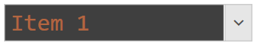

# TextBoxStyle

The __TextBoxStyle__ property allows you to customize the [input area]() of RadComboBox. 

> The input area is shown only when the control is in [edit mode](). This happens when its IsEditable property is set to True.

__Example 1: Setting TextBoxStyle__
```XAML
	<telerik:RadComboBox IsEditable="True" SelectedIndex="0">
		<telerik:RadComboBox.Items>
			<telerik:RadComboBoxItem Content="Item 1" />
			<telerik:RadComboBoxItem Content="Item 2" />
			<telerik:RadComboBoxItem Content="Item 3" />
		</telerik:RadComboBox.Items>
		<telerik:RadComboBox.TextBoxStyle>
			<!-- If you use NoXaml dlls and implicit styles, set the following property on the Style element - BasedOn="{StaticResource ComboBoxTextBoxStyle}" -->
			<Style TargetType="TextBox">
				<Setter Property="Background" Value="#3F3F3F" />
				<Setter Property="Foreground" Value="#FF8041" />
				<Setter Property="FontSize" Value="24" />
				<Setter Property="FontFamily" Value="Consolas" />
			</Style>
		</telerik:RadComboBox.TextBoxStyle>
	</telerik:RadComboBox>
```

#### Figure 1: Input area with changed colors and font


## See Also  
 * [Implicit Styles]() 
 * [SelectionBoxTemplate]()
 * [Binding to Object]()