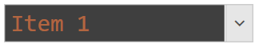

# TextBoxStyle

The __TextBoxStyle__ property allows you to customize the [input area]() of RadComboBox. 

> The input area is shown only when the control is in [edit mode](). This happens when its IsEditable property is set to True.

__Example 1: Setting TextBoxStyle__
<snippet id='radcombobox-features-textboxstyle-example_1_setting_textboxstyle-xaml' />

#### Figure 1: Input area with changed colors and font

## See Also  
 * [Implicit Styles]() 
 * [SelectionBoxTemplate]()
 * [Binding to Object]()