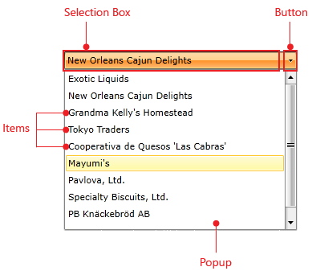
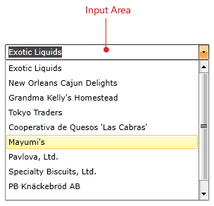

# Visual Structure

This topic defines terms and concepts used in the scope of __RadComboBox__ that you have to get familiar with before you continue reading this help. Below you can see snapshots and explanations of the main states and visual elements of the standard __RadComboBox__ control.

The __RadComboBox__ is a user interface control that presents users with a list of options. The contents can be shown and hidden as the control expands and collapses. In its default state, the list is collapsed, displaying only one choice, like on the snapshot below.

The user clicks a button to see the complete list of options. The following graphic shows the appearance of a combo box in pressed state (expanded DropDownList).

The following table lists the elements that make up a combo box:

* __Items__ - __RadComboBoxItem__ collection that represents the content.

* __Selection Box__ - represents the selected item.

* __Button__ - shows or hides the combo box items. This element is always visible.

* __Popup__ - holds the items of the __RadComboBox__ control. This element is initially collapsed.

When the __RadComboBox__ is in [edit mode]() there is one additional element - the __Input Area__. This is the place where the user enters some text.

## See Also

 * [Getting Started]()
