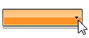
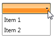
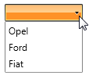
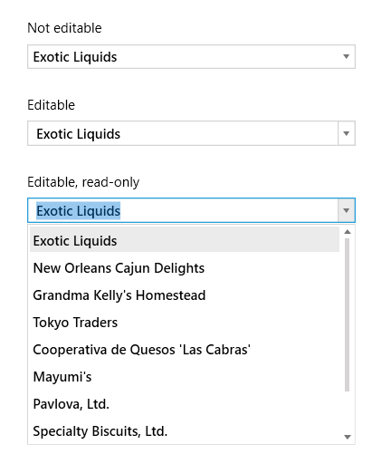

# Getting Started with {{ site.framework_name }} ComboBox

This tutorial will walk you through the creation of a sample application that contains __RadComboBox__. 

## Adding Telerik Assemblies Using NuGet

To use __RadComboBox__ when working with NuGet packages, install the `Telerik.Windows.Controls.Input.for.Wpf.Xaml` package. The [package name may vary]() slightly based on the Telerik dlls set - [Xaml or NoXaml]()

Read more about NuGet installation in the [Installing UI for WPF from NuGet Package]() article.

>tip With the 2025 Q1 release, the Telerik UI for WPF has a new licensing mechanism. You can learn more about it [here]().

## Adding Assembly References Manually

If you are not using NuGet packages, you can add a reference to the following assemblies:

* __Telerik.Licensing.Runtime__
* __Telerik.Windows.Controls__
* __Telerik.Windows.Controls.Input__

## Adding RadComboBox to the Project

Before proceeding with adding __RadComboBox__ to your project, make sure the required assembly references are added to the project. 

You can add __RadComboBox__ manually by writing the XAML code in __Example 1__. You can also add the control by dragging it from the Visual Studio Toolbox and dropping it over the XAML view.


__Example 1: Adding RadComboBox in XAML__

```XAML
	<telerik:RadComboBox Width="100" />
```


>In order to use __RadComboBox__ in XAML you have to add the namespace declaration shown in __Example 2__:
>__Example 2: Declaring Telerik Namespace__
>```XAML
>    xmlns:telerik="http://schemas.telerik.com/2008/xaml/presentation"
>```

If you run the application you will see an empty ComboBox as demonstrated in __Figure 1__. 

#### __Figure 1: The empty ComboBox generated by the code in Example 1__


## Populating with Data

In order to populate the __RadComboBox__ control with data in XAML, you should add a few __RadComboBoxItems__ to it and set their Content property as in __Example 3__.

__Example 3: Adding RadComboBoxItems in XAML__

```XAML
	<telerik:RadComboBox Width="100">
        <telerik:RadComboBoxItem Content="Item 1" />
        <telerik:RadComboBoxItem Content="Item 2" />
    </telerik:RadComboBox>
```

Running the application will result in a populated __RadComboBox__ as shown in __Figure 2__.

__Figure 2: RadComboBox with static items__


Adding static __RadComboBoxItems__ in XAML is good in scenarios when you know in advance the data in the combo box. However, in most cases, you have to bind your __RadComboBox__ to a collection of business objects. For the purposes of this example, create a new class named Car and add several properties to it as shown in __Example 4__.

__Example 4: Simple business class__

```C#  
	public class Car
	{
		public string Make { get; set; }
		public string Model { get; set; }

		public Car(string make, string model)
		{
			this.Make = make;
			this.Model = model;
		}
	} 
```
```VB.NET  
	Public Class Car
		Public Property Make() As String
			Get
				Return m_Make
			End Get
			Set(value As String)
				m_Make = Value
			End Set
		End Property
		Private m_Make As String

		Public Property Model() As String
			Get
				Return m_Model
			End Get
			Set(value As String)
				m_Model = Value
			End Set
		End Property
		Private m_Model As String

		Public Sub New(make As String, model As String)
			Me.Make = make
			Me.Model = model
		End Sub
	End Class
```

Next, you should create the view model containing a collection of Car objects. 

__Example 5: View model containing ObservableCollection of sample data__
```C#
	public class MyViewModel
	{
		private ObservableCollection<Car> cars;

		public ObservableCollection<Car> Cars
		{
			get
			{
				if (this.cars == null)
				{
					this.cars = this.CreateCars();
				}
				return this.cars;
            }
        }

        private ObservableCollection<Car> CreateCars()
        {
            ObservableCollection<Car> cars = new ObservableCollection<Car>() 
            { 
                new Car("Opel", "Vectra"),
                new Car("Ford", "Focus"),
                new Car("Fiat", "Bravo")
            };      
            return cars;
        }
    }
```
```VB.NET
	Public Class MyViewModel
    
		Private m_cars As ObservableCollection(Of Car)

		Public ReadOnly Property Cars() As ObservableCollection(Of Car)
			Get
				If Me.m_cars Is Nothing Then
					Me.m_cars = Me.CreateCars()
				End If
				Return Me.m_cars
			End Get
		End Property

		Private Function CreateCars() As ObservableCollection(Of Car)
			Dim cars As New ObservableCollection(Of Car)() From {
				New Car("Opel", "Vectra"),
				New Car("Ford", "Focus"),
				New Car("Fiat", "Bravo")
			}
			Return cars
		End Function
	End Class
```

Now that you have prepared the needed sample data, it is time to bind __RadComboBox__ to it. For that purpose, you should set the __RadComboBox's ItemsSource__ property to the collection of cars. Additionally, you should set __DisplayMemberPath__ property to mark which property of the business object will be used as its visual representation inside __RadComboBox__.

__Example 6__ demonstrates how you can bind the ItemsSource collection in XAML. The _local_ namespace in the example corresponds to the namespace where __MyViewModel__ resides. 

__Example 6: Bind RadComboBox__

```XAML
    <Grid.Resources>
        <local:MyViewModel x:Key="MyViewModel" />
    </Grid.Resources>
    <telerik:RadComboBox Width="100" DataContext="{StaticResource MyViewModel}" ItemsSource="{Binding Cars}" 
		DisplayMemberPath="Make" />
```

Running the application at this stage will result in a populated __RadComboBox__ like in __Figure 3__.

__Figure 3: RadComboBox bound to collection of Cars__



## Working with AutoComplete

__AutoComplete__ is a feature provided by many browsers, programs and controls. It involves the program predicting a word or phrase that the user wants to type without the user actually typing it in completely. __RadComboBox__ has full autocomplete support - while you type into the input area, the combo box returns the relative match for the currently typed text. [Read more]()

## Working with Edit Modes

The __RadComboBox__ can be editable, allowing the user to type in its text box, or non-editable, where the text box is hidden. In addition, you could make the text box read only in order to keep the editable look but prevent the user from typing. The __RadComboBox__'s API exposes several properties, allowing you to configure these modes. [Read more]()

## Opening and Closing DropDown Manually

To open or close the dropdown content of RadComboBox manually, set its __IsDropDownOpen__ property.

__Example 7: Open dropdown manually__
```XAML
	<telerik:RadComboBox IsDropDownOpen="True" />
```

## Setting DropDown Size

RadComboBox allows you to set the width and the max height of the dropdown content. To do this, set the __DropDownWidth__ and __MaxDropDownHeight__ properties of RadComboBox.

__Example 8: Set dropdown content size__
```XAML
	<telerik:RadComboBox MaxDropDownHeight="200" DropDownWidth="150" />
```

## Setting a Theme

The controls from our suite support different themes. You can see how to apply a theme different than the default one in the [Setting a Theme]() help article.

>important Changing the theme using implicit styles will affect all controls that have styles defined in the merged resource dictionaries. This is applicable only for the controls in the scope in which the resources are merged. 

To change the theme, you can follow the steps below:

* Choose between the themes and add reference to the corresponding theme assembly (ex: **Telerik.Windows.Themes.Windows8.dll**). You can see the different themes applied in the **Theming** examples from our [WPF Controls Examples](https://demos.telerik.com/wpf/)[Silverlight Controls Examples](https://demos.telerik.com/silverlight/#ComboBox/Theming) application.

* Merge the ResourceDictionaries with the namespace required for the controls that you are using from the theme assembly. For the __RadComboBox__, you will need to merge the following resources:

	* __Telerik.Windows.Controls__
	* __Telerik.Windows.Controls.Input__

__Example 9__ demonstrates how to merge the ResourceDictionaries so that they are applied globally for the entire application.

__Example 9: Merge the ResourceDictionaries__  
```XAML
	<Application.Resources>
		<ResourceDictionary>
			<ResourceDictionary.MergedDictionaries>
				<ResourceDictionary Source="/Telerik.Windows.Themes.Windows8;component/Themes/System.Windows.xaml"/>
				<ResourceDictionary Source="/Telerik.Windows.Themes.Windows8;component/Themes/Telerik.Windows.Controls.xaml"/>
				<ResourceDictionary Source="/Telerik.Windows.Themes.Windows8;component/Themes/Telerik.Windows.Controls.Input.xaml"/>
			</ResourceDictionary.MergedDictionaries>
		</ResourceDictionary>
	</Application.Resources>
```

>Alternatively, you can use the theme of the control via the [StyleManager](https://docs.telerik.com/devtools/wpf/styling-and-appearance/stylemanager/common-styling-apperance-setting-theme-wpf)[StyleManager](https://docs.telerik.com/devtools/silverlight/styling-and-appearance/stylemanager/common-styling-apperance-setting-theme).

__Figure 4__ shows a __RadComboBox__ with the **Windows8** theme applied.
	
#### __Figure 4: RadComboBox with the Windows8 theme__



## Telerik UI for WPF Learning Resources

* [Telerik UI for WPF ComboBox Component](https://www.telerik.com/products/wpf/combobox.aspx)
* [Getting Started with Telerik UI for WPF Components]()
* [Telerik UI for WPF Installation]()
* [Telerik UI for WPF and WinForms Integration]()
* [Telerik UI for WPF Visual Studio Templates]()
* [Setting a Theme with Telerik UI for WPF]()
* [Telerik UI for WPF Virtual Classroom (Training Courses for Registered Users)](https://learn.telerik.com/learn/course/external/view/elearning/16/telerik-ui-for-wpf) 
* [Telerik UI for WPF License Agreement](https://www.telerik.com/purchase/license-agreement/wpf-dlw-s)


## See Also  
 * [AutoComplete]() 
 * [Edit Modes]()
