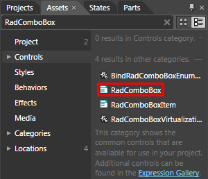
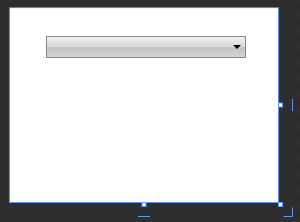
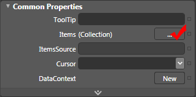
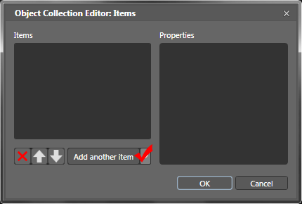
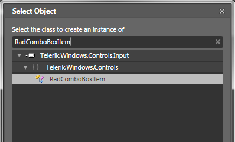
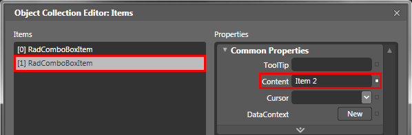
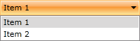

# Getting Started

__RadComboBox__ is an advanced SilverlightWPF control providing full Blend support. From within the visual environment of Blend, you can easily perform various tasks such as editing control properties, modifying themes, creating and modifying templates and more.

This tutorial will walk you through the creation of a __RadComboBox__ and will show you how to:

* [Add RadComboBox using Expression Blend](#add-radcombobox)

* [Add ComboBox items using Expression Blend](#add-combobox-items-using-expression-blend)

* [Binding RadComboBox to a collection of business objects](#binding-radcombobox-to-a-collection-of-business-objects)

* [Styles and Templates](#styles-and-templates)

* [Working with AutoComplete]()

* [Working with edit modes]()

>Before reading this tutorial you should get familiar with the [Visual Structure]() of the standard __RadComboBox__ control.

For the purpose of this tutorial, you will need to create an empty SilverlightWPF Application project and open it in Blend.

>In order to use __RadComboBox__ control in your projects you have to add references to the following assemblies:
1. __Telerik.Windows.Controls.Input.dll__
2. __Telerik.Windows.Controls.dll__

## Add RadComboBox

* Open the __Asset Library__ (*Window->Assets*) in Expression Blend and start writing the name of the __RadComboBox__ in the search box.
 

* Drag a __RadComboBox__ on the artboard.

#### __XAML__

{{region radcombobox-getting-started_0}}
	<UserControl
		.... 
	    xmlns:telerik="http://schemas.telerik.com/2008/xaml/presentation">
	    <Grid x:Name="LayoutRoot" Background="White">
	        <StackPanel>
	            <telerik:RadComboBox />
	        </StackPanel>
	    </Grid>
	</UserControl>
{{endregion}}

There are two things you should pay attention to in the above code snipped. The first is the declaration of the __Telerik.Windows.Controls__ namespace from __Telerik.Windows.Controls.Input__ assembly and the second is the declaration of the __RadComboBox__ control itself. If you run your application now you will see an empty __RadComboBox__ that contains no items.

## Add ComboBox Items Using Expression Blend

>The class that represents the combo box item is __Telerik.Windows.Controls.RadComboBoxItem__.

* Select your control in Expression Blend.

* In the __Properties Pane__, find and edit the __Items__ property.

* The "Object Collection Editor" dialog will open.

* Add two items of type __RadComboBoxItem__.

* Set their __Content__ properties respectively to "Item 1" and "Item 2".

* Run your demo application. The result from the operations above is shown on the next image - two __RadComboBox__ items are added.

And the result XAML is shown on the image below.

#### __XAML__

{{region radcombobox-getting-started_1}}
	<telerik:RadComboBox>
	    <telerik:RadComboBoxItem Content="Item 1"/>
	    <telerik:RadComboBoxItem Content="Item 2"/>
	</telerik:RadComboBox>
{{endregion}}

## Binding RadComboBox to a Collection of Business Objects

Adding static __RadComboBoxItems__ in XAML is good in scenarios when you know in advance the data in the combo box. However, in most of the cases you have to bind your __RadComboBox__ to a collection of business objects. Check out the following topics which describe in great details the various data sources for the __RadComboBox__.

* [DataBinding Support Overview]() - describes the various data sources for the __RadComboBox__ and shows you many tips and tricks. Read this topics in order to achieve basic knowledge about how the binding mechanism works at the __RadComboBox__.

* [Binding to Object]() - shows you how to bind the __RadComboBox__ to a collection of business objects (in-memory data).

* [Binding to WCF Service]() - shows you how to load __RadComboBox__ data from a WCF Service.

* [Binding to ADO.NET Data Service]() - shows you how to load __RadComboBox__ data from an ADO.NET Data Service.

 
* [Binding to RIA Service]() - shows you how to load __RadComboBox__ data from a RIA Service.
 

* [Binding to XML]() - shows you how to load __RadComboBox__ data from a XML storage.

## Styles and Templates

Read the [Styles and Templates]() section which is entirely dedicated to styling and templating the __RadComboBox__ control.

## Working with AutoComplete

__AutoComplete__ is a feature provided by many browsers, programs and controls. It involves the program predicting a word or phrase that the user wants to type without the user actually typing it in completely. __RadComboBox__ has full autocomplete support - while you type into the input area, the combo box returns the relative match for the currently typed text. [Read more]()

## Working with Edit Modes

The __RadComboBox__ can be editable, allowing the user to type in its text box, or non-editable, where the text box is hidden. In addition, you could make the text box read-only, in order to keep the editable look, and in the same time to prevent the user from typing. The __RadComboBox__'s API exposes several properties, allowing you to configure these modes. [Read more]()

# See Also

 * [RadComboBox - Overview]()

 * [Visual Structure]()
