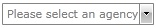
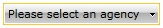
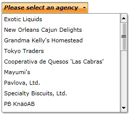

# Create a Watermark

>Before proceeding further with this tutorial, be sure that you are familiar with how to bind a __RadComboBox__ to a collection of business objects. For more information take a look at the [Binding to Object]() topic. __This tutorial will use exactly the same example as in the aforemendoned topic.__

## EmptyText property

If you have a RadComboBox which is populated to a collection of business objects, then to set the __EmptyText__ property all we need to do is to define the ComboBox in xaml:

#### __XAML__

{{region radcombobox-Create_a_Watermark_0}}
	<telerik:RadComboBox ItemsSource="{Binding Source={StaticResource DataSource}, Path=Agency}" DisplayMemberPath="Name" IsEditable="True" EmptyText="Please select an agency" />
	{{endregion}}

The result is shown on the image below.

         
      

If the __IsEditable__ property is __false__ the result would be like this:

         
      

>tipIf the __IsEditable__ property of the ComboBox is set to __True__ and the control is on focus the __EmptyText__ is not displayed.

## EmptySelectionBoxTemplate

The __EmptySelectionBoxTemplate__ gives you the ability to define a separate template when there is no selected item. The purpose of this tutorial is to show you how to create and apply EmptySelectionBoxTemplate.

If we use the aforementioned RadComboBox, it gives you the ability to define a separate template for the empty selection box. In order to do that, you will have to perform two simple steps:

* Create a custom __DataTemplate__

#### __XAML__

{{region radcombobox-Create_a_Watermark_1}}
	<UserControl.Resources>
	  <DataTemplate x:Key="EmptyTemplate">
	      <TextBlock FontWeight="Bold" FontFamily="Comic Sans" FontStyle="Italic" Text="Please select an agency" />
	  </DataTemplate>
	{{endregion}}

* Set the declared __DataTemplate__ to the RadComboBox's __EmptySelectionBoxTemplate__ property. 

#### __XAML__

{{region radcombobox-Create_a_Watermark_2}}
	<telerik:RadComboBox ItemsSource="{Binding Source={StaticResource DataSource}, Path=Agency}" DisplayMemberPath="Name" EmptySelectionBoxTemplate="{StaticResource EmptyTemplate}" IsEditable="False" />
	{{endregion}}

The result is shown on the image below. Note how there is a text displayed without an item is being selected.

         
      

>tipThe __EmptySelectionBoxTemplate__ property only works if the RadComboBox is in non-editable mode, i.e its __IsEditable__ property is set to __False__. Otherwise, it is applied the __EmptyText__ property.

