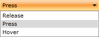

# Bind a RadComboBox to Enum Values

The purpose of this topic is to show you how to build a __RadComboBox__ containing all values of a specific Enum. This is a fairly easy task and can be done in only few steps.

* The best solution here is to create a view model for the Enum:

#### __C#__

{{region radcombobox-howto-bind-enum-values_0}}
	public class EnumViewModel
	{
	    private Type enumType;
	
	    public IEnumerable Values
	    {
	        get;
	        private set;
	    }
	
	    [TypeConverter( typeof( TypeTypeConverter ) )]
	    public Type EnumType
	    {
	        get
	        {
	            return this.enumType;
	        }
	        set
	        {
	            this.enumType = value;
	            this.InitValues();
	        }
	    }
	
	    private void InitValues()
	    {
	        this.Values = this.EnumType.GetFields( System.Reflection.BindingFlags.Public | System.Reflection.BindingFlags.Static )
	                        .Select<FieldInfo, object>( ( FieldInfo x ) => x.GetValue( this.EnumType ) );
	    }
	}
{{endregion}}

#### __VB.NET__

{{region radcombobox-howto-bind-enum-values_1}}
	Public Class EnumViewModel
	    Private m_enumType As Type
	
	Private _Values As IEnumerable
	    Public Property Values() As IEnumerable
	        Get
	            Return _Values
	        End Get
	        Private Set(ByVal value As IEnumerable)
	            _Values = value
	        End Set
	    End Property
	
	    <TypeConverter(GetType(TypeTypeConverter))> _
	    Public Property EnumType() As Type
	        Get
	            Return Me.m_enumType
	        End Get
	        Set(ByVal value As Type)
	            Me.m_enumType = value
	            Me.InitValues()
	        End Set
	    End Property
	
	    Private Sub InitValues()
	        Me.Values = Me.EnumType.GetFields(System.Reflection.BindingFlags.[Public] Or System.Reflection.BindingFlags.[Static]).[Select](Of FieldInfo, Object)(Function(ByVal x As FieldInfo) x.GetValue(Me.EnumType))
	    End Sub
	End Class
{{endregion}}

The trick here is the __TypeConverter__ attribute on the __EnumType__ property, that allows you to declare the __EnumModel__ in XAML:

#### __XAML__

{{region radcombobox-howto-bind-enum-values_2}}
	<UserControl.Resources>
	    <example:EnumViewModel x:Name="DataSource" EnumType="System.Windows.Controls.ClickMode"/>
	</UserControl.Resources>
{{endregion}}

Here is the structure of the __TypeTypeConverter__ class which derives from __TypeConverter__.

#### __C#__

{{region radcombobox-howto-bind-enum-values_3}}
	public class TypeTypeConverter : TypeConverter
	{
	    public override bool CanConvertFrom( ITypeDescriptorContext context, Type sourceType )
	    {
	        return sourceType.IsAssignableFrom( typeof( string ) );
	    }
	
	    public override object ConvertFrom( ITypeDescriptorContext context, System.Globalization.CultureInfo culture, object value )
	    {
	        // Try to load the type from the current assembly (EnumValuesInCombo.dll)
	        Type t = Type.GetType( ( string )value, false );
	        // If the type is from a different known assembly, try to load it from there
	        if ( t == null )
	        {
	            // Try to load the type from Telerik.Windows.Controls.dll
	            t = this.GetTypeFromAssembly( value.ToString(), typeof( Telerik.Windows.Controls.ItemsControl ) );
	        }
	        if ( t == null )
	        {
	            // Try to load the type from System.Windows.dll
	            t = this.GetTypeFromAssembly( value.ToString(), typeof( System.Windows.Controls.ItemsControl ) );
	        }
	        // You can also try with other known assemblies.
	        //if (t == null)
	        //{
	        //    t = GetTypeFromAssembly(value.ToString(), typeof(a type that is in the assembly, containing the enum));
	        //}
	        return t;
	    }
	
	    private Type GetTypeFromAssembly( string typeName, Type knownType )
	    {
	        string assemblyName = knownType.AssemblyQualifiedName;
	        return Type.GetType( assemblyName.Replace( knownType.FullName, typeName ), false );
	    }
	}
{{endregion}}

#### __VB.NET__

{{region radcombobox-howto-bind-enum-values_4}}
	Public Class TypeTypeConverter
	    Inherits TypeConverter
	    Public Overloads Overrides Function CanConvertFrom(ByVal context As ITypeDescriptorContext, ByVal sourceType As Type) As Boolean
	        Return sourceType.IsAssignableFrom(GetType(String))
	    End Function
	
	    Public Overloads Overrides Function ConvertFrom(ByVal context As ITypeDescriptorContext, ByVal culture As System.Globalization.CultureInfo, ByVal value As Object) As Object
	        ' Try to load the type from the current assembly (EnumValuesInCombo.dll)
	        Dim t As Type = Type.[GetType](DirectCast(value, String), False)
	
	        ' If the type is from a different known assembly, try to load it from there
	        If t Is Nothing Then
	            ' Try to load the type from Telerik.Windows.Controls.dll
	            t = Me.GetTypeFromAssembly(value.ToString(), GetType(Telerik.Windows.Controls.ItemsControl))
	        End If
	        If t Is Nothing Then
	            ' Try to load the type from System.Windows.dll
	            t = Me.GetTypeFromAssembly(value.ToString(), GetType(System.Windows.Controls.ItemsControl))
	        End If
	        ' You can also try with other known assemblies.
	        'if (t == null)
	        '{
	        '    t = GetTypeFromAssembly(value.ToString(), typeof(a type that is in the assembly, containing the enum));
	        '}
	        Return t
	    End Function
	
	    Private Function GetTypeFromAssembly(ByVal typeName As String, ByVal knownType As Type) As Type
	        Dim assemblyName As String = knownType.AssemblyQualifiedName
	        Return Type.[GetType](assemblyName.Replace(knownType.FullName, typeName), False)
	    End Function
	End Class
{{endregion}}

Take a closer look at the tricky __ConvertFrom()__ method. It does several things:

* It tries to load the type from the current assembly.

* If the type is from a different known assembly, try to load it from there. For example, the method will try to load the enumeration either from __Telerik.Windows.Controls.dll__ or from __System.Windows.dll__.

* You can also add code, which tries to load the type from other known assemblies.

There are some limitations in this approach, though – you should modify the __TypeTypeConverter__ class so that it can "recognize" the assemblies that might contain the enumerations, defined in XAML. Of course, if you create the __EnumModel__ in the code-behind you will be able to provide any __Enum Type__ you want – in this case the modifications in the __TypeTypeConverter__ class __won't be necessary__.

* The second step is to find your __RadComboBox__ declaration and to set the __EnumModel__ to the __ItemsSource__ property.

#### __XAML__

{{region radcombobox-howto-bind-enum-values_5}}
	<UserControl.Resources>
	    <example:EnumViewModel x:Name="DataSource" EnumType="System.Windows.Controls.ClickMode"/>
	</UserControl.Resources>
	....
	<telerik:RadComboBox x:Name="radComboBox"
	    ItemsSource="{Binding Source={StaticResource DataSource}, Path=Values}">
	</telerik:RadComboBox>
{{endregion}}

* The final step is to set the __DisplayMemberPath__ attribute with __empty string value__. It has to be present, in order for the __RadComboBox__ to be able to properly display its selected item. If you remove it, the control will display the __Enum’s integer value__ in its selection box, instead of its text representation.

#### __XAML__

{{region radcombobox-howto-bind-enum-values_6}}
	<UserControl.Resources>
	    <example:EnumViewModel x:Name="DataSource" EnumType="System.Windows.Controls.ClickMode"/>
	</UserControl.Resources>
	....
	<telerik:RadComboBox x:Name="radComboBox"
	    ItemsSource="{Binding Source={StaticResource DataSource}, Path=Values}" DisplayMemberPath="">
	</telerik:RadComboBox>
{{endregion}}

The result can be seen on the image below. All members of the __System.Windows.Controls.ClickMode__ enumeration are loaded in the __RadComboBox__.

# See Also

 * [AutoComplete]()
