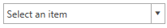
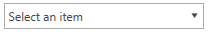
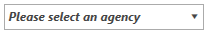

# EmptyText 

The __EmptyText__ property allows you to specify a string that will be shown when there is no selection. 

__Example 1: Setting the EmptyText property__

```XAML
	<telerik:RadComboBox Width="200"
						 ItemsSource="12345"
						 EmptyText="Select an item">
	</telerik:RadComboBox>
```

#### __Figure 1: RadComboBox with IsEditable property set to True and EmptyText in the Office2016 theme__


#### __Figure 2: RadComboBox with IsEditable property set to False(default) and EmptyText in the Office2016 theme__



>tipIf the __IsEditable__ property of the RadComboBox is set to __True__ and the control has focus the __EmptyText__ is not displayed.

## EmptySelectionBoxTemplate

The __EmptySelectionBoxTemplate__ gives you the ability to define a separate DataTemplate to be shown when there is no selected item. __Example 2__ demonstrates how to create and apply an __EmptySelectionBoxTemplate__.

__Example 2: Set the EmptySelectionBoxTemplate property__

```XAML
	<StackPanel>
        <StackPanel.Resources>
            <DataTemplate x:Key="EmptyTemplate">
                <TextBlock FontWeight="Bold" FontFamily="Comic Sans" FontStyle="Italic" Text="Please select an agency" />
            </DataTemplate>
        </StackPanel.Resources>
        <telerik:RadComboBox Width="200"
                             ItemsSource="12345"
                             EmptySelectionBoxTemplate="{StaticResource EmptyTemplate}">
        </telerik:RadComboBox>
    </StackPanel>
```

#### __Figure 2: RadComboBox with EmptySelectionBoxTemplate in the Office2016 theme__


>tipThe __EmptySelectionBoxTemplate__ property only works if the RadComboBox is in non-editable mode, i.e its __IsEditable__ property is set to __False__. Otherwise, the __EmptyText__ will be applied.
