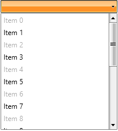

# Enable\Disable RadComboBoxItems

The purpose of this tutorial is to show you how to enable and disable __RadComboBoxItems__. The following sections are included:

* [Enable\disable RadComboBox with static data](#enabledisable-radcombobox-with-static-data)

* [Enable\disable items using ItemContainerStyle](#enabledisable-items-using-itemcontainerstyle)

* [Enable\disable items using ItemContainerStyleSelector](#enabledisable-items-using-itemcontainerstyleselector)

* [Using MVVM approach and ContainerBindingCollection](#using-mvvm-approach-and-containerbindingcollection)

* [Using style binding](#using-style-binding)

## Enable\Disable RadComboBox with Static Data

In the simplest scenario you will have a __RadComboBox__ populated with static data in XAML.

#### __XAML__

{{region radcombobox-howto-enable-disable-radcombobox-items_0}}
	<telerik:RadComboBox x:Name="radComboBox" Width="200">
	    <telerik:RadComboBoxItem Content="Alapattah"/>
	    <telerik:RadComboBoxItem Content="Brickell Avenue" />
	    <telerik:RadComboBoxItem Content="Downtown Miami" />
	</telerik:RadComboBox>
{{endregion}}

The __RadComboBox__ and __RadComboBoxItem__ classes expose a property named __IsEnabled__. Set this property to __False__, when you want to disable either the whole __RadComboBox__ or specific __RadComboBoxItems__. The next code-snippet shows you how to do that.

#### __XAML__

{{region radcombobox-howto-enable-disable-radcombobox-items_1}}
	<telerik:RadComboBox x:Name="radComboBox" Width="200">
	    <telerik:RadComboBoxItem Content="Alapattah" IsEnabled="False"/>
	    <telerik:RadComboBoxItem Content="Brickell Avenue" />
	    <telerik:RadComboBoxItem Content="Downtown Miami" IsEnabled="False"/>
	</telerik:RadComboBox>
{{endregion}}

## Enable\Disable Items Using ItemContainerStyle

Using __RadComboBox__ with static data is the simplest scenario. However, in most of the cases you will have a __RadComboBox__ [populated with a collection of business objects](). In this case you have no other options except for using either the __ItemContainerStyle__ or the __ItemContainerStyleSelector__.

The next example shows you how to set the __ItemContainerStyle__ of a __RadComboBox__.

#### __XAML__

{{region radcombobox-howto-enable-disable-radcombobox-items_2}}
	<UserControl.Resources>
	    
	</UserControl.Resources>
	 ...
	<telerik:RadComboBox x:Name="radComboBox"
	    ItemsSource="{Binding Source={StaticResource DataSource}, Path=Items}"
	    DisplayMemberPath="Text"
	    ItemContainerStyle="{StaticResource ItemContainerStyle}"/>
{{endregion}}

Note that in this case all __RadComboBoxItems__ will be disabled. However, you have the ability to determine which items to be disabled based on your custom logic. [Check out](#enabledisable-items-using-itemcontainerstyleselector) the next section to see the solution.

## Enable\Disable Items Using ItemContainerStyleSelector

The __StyleSelector__ provides a way to apply styles based on custom logic.

>For more information about the __StyleSelectors__ take a look at the __DataBinding__ topics in the __Common__ help section. 

The next example demonstrates you how to achieve this.

#### __XAML__

{{region radcombobox-howto-enable-disable-radcombobox-items_3}}
	<UserControl.Resources>
	    
	
	    
	
	    <example:EnableDisableSelector x:Key="StyleSelector" EnableStyle="{StaticResource EnableStyle}"
	        DisableStyle="{StaticResource DisableStyle}"/>
	</UserControl.Resources>
	 ...
	<telerik:RadComboBox x:Name="radComboBox"
	    ItemsSource="{Binding Source={StaticResource DataSource}, Path=Items}"
	    DisplayMemberPath="Text"
	    ItemContainerStyleSelector="{StaticResource StyleSelector}"/>
{{endregion}}

And the result is that every odd item is disabled.

## Using MVVM Approach and ContainerBindingCollection


Using __ItemContainerStyle__ is a good solution, however, it is not the best. Imagine that your business object has a boolean property named __IsEnabled__. Even more flexible solution is to directly bind the __RadComboBoxItem__'s __IsEnabled__ property to the __IsEnabled__ property exposed by your domain object. You can do this through the __ContainerBindingCollection__ class exposed by the Telerik UI for Silverlights' API.


#### __XAML__

{{region radcombobox-howto-enable-disable-radcombobox-items_4}}
	<UserControl.Resources>
	    <telerik:ContainerBindingCollection x:Name="BindingsCollection">
	        <telerik:ContainerBinding PropertyName="IsEnabled" Binding="{Binding IsEnabled, Mode=TwoWay}" />
	    </telerik:ContainerBindingCollection>
	
	    <DataTemplate x:Key="CustomItemTemplate"
	         telerik:ContainerBinding.ContainerBindings="{StaticResource BindingsCollection}">
	        <TextBlock Text="{Binding Text}"/>
	    </DataTemplate>
	</UserControl.Resources>
	 ...
	<telerik:RadComboBox x:Name="radComboBox"
	    ItemsSource="{Binding Source={StaticResource DataSource}, Path=Items}"
	    ItemTemplate="{StaticResource CustomItemTemplate}"/>
{{endregion}}


In this case every even item is disabled and the logic about that is enclosed in the model.



## Using Style Binding


Using __ItemContainerStyle__ is a good solution, however, it is not the best. Imagine that your business object has a boolean property named __IsEnabled__. Even more flexible solution is to directly bind the __RadComboBoxItem__'s __IsEnabled__ property to the __IsEnabled__ property exposed by your domain object. You can do this through __style binding__ like in the example below:


#### __XAML__

{{region radcombobox-howto-enable-disable-radcombobox-items_5}}
	<UserControl.Resources>
	    
	</UserControl.Resources>
	 ...
	<telerik:RadComboBox x:Name="radComboBox"
	    ItemsSource="{Binding Source={StaticResource DataSource}, Path=Items}"
	    ItemTemplate="{StaticResource CustomItemTemplate}"
	    ItemContainerStyle="{StaticResource ItemContainerStyle}"/>
{{endregion}}


Two things should be mentioned here. First, note how the __IsEnabled__ property is bound in the __Style__. Second, the declared __Style__ is set as a __ItemContainerStyle__ of the __RadComboBox__. The result is shown on the image below.



## See Also

 * [RadComboBox Virtualization]()

 * [Setting up AutoComplete]()
