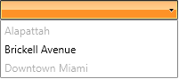
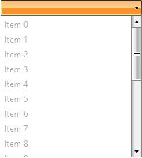
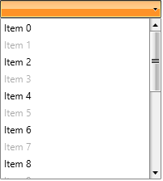
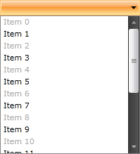

# Enable\Disable RadComboBoxItems

The purpose of this tutorial is to show you how to enable and disable __RadComboBoxItems__. The following sections are included:

* [Enable\disable RadComboBox with static data](#enabledisable-radcombobox-with-static-data)

* [Enable\disable items using ItemContainerStyle](#enabledisable-items-using-itemcontainerstyle)

* [Enable\disable items using ItemContainerStyleSelector](#enabledisable-items-using-itemcontainerstyleselector)

* [Using style binding](#using-style-binding)

## Enable\Disable RadComboBox with Static Data

In the simplest scenario you will have a __RadComboBox__ populated with static data in XAML.

__Example 1: Populate with static data__

```XAML
	<telerik:RadComboBox x:Name="radComboBox" Width="200">
	    <telerik:RadComboBoxItem Content="Alapattah"/>
	    <telerik:RadComboBoxItem Content="Brickell Avenue" />
	    <telerik:RadComboBoxItem Content="Downtown Miami" />
	</telerik:RadComboBox>
```

The __RadComboBox__ and __RadComboBoxItem__ classes expose a property named __IsEnabled__. Set this property to __False__, when you want to disable either the whole __RadComboBox__ or specific __RadComboBoxItems__. The next code-snippet shows you how to do that.

__Example 2: Disabling specific RadComboBoxItems using the IsEnabled property__

```XAML
	<telerik:RadComboBox x:Name="radComboBox" Width="200">
	    <telerik:RadComboBoxItem Content="Alapattah" IsEnabled="False"/>
	    <telerik:RadComboBoxItem Content="Brickell Avenue" />
	    <telerik:RadComboBoxItem Content="Downtown Miami" IsEnabled="False"/>
	</telerik:RadComboBox>
```

#### __Figure 1: Result of Example 2__


## Enable\Disable Items Using ItemContainerStyle

Using __RadComboBox__ with static data is the simplest scenario. However, in most of the cases you will have a __RadComboBox__ [populated with a collection of business objects](). In this case you have no other options except for using either the __ItemContainerStyle__ or the __ItemContainerStyleSelector__.

__Example 3: Create a collection of objects__

```C#
	public class Item : ViewModelBase
    {
        public int Id { get; set; }
        public string Text { get; set; }
    }
```

__Example 4: Create the ViewModel__

```C#
	public class MainViewModel : ViewModelBase
    {
        private ObservableCollection<Item> items;

        public ObservableCollection<Item> Items
        {
            get
            {
                if (this.items == null)
                {
                    this.items = new ObservableCollection<Item>();
                    for (int i = 0; i < 20; i++)
                    {
                        this.items.Add(new Item() { Id = i, Text = "Item " + i });
                    }
                }
                return this.items;
            }
        }
    }
```

__Example 5: Set the ItemContainerStyle of a RadComboBox__

```XAML
	<Window.DataContext>
        <local:MainViewModel/>
    </Window.DataContext>
	<UserControl.Resources>
	    <Style x:Key="ItemContainerStyle" TargetType="telerik:RadComboBoxItem">
	        <Setter Property="IsEnabled" Value="False"/>
	    </Style>
	</UserControl.Resources>

	<telerik:RadComboBox x:Name="radComboBox"
		Width="200"
	    ItemsSource="{Binding Items}"
	    DisplayMemberPath="Text"
	    ItemContainerStyle="{StaticResource ItemContainerStyle}"/>
```

Note that in this case all __RadComboBoxItems__ will be disabled. However, you have the ability to determine which items to be disabled based on your custom logic. [Check out](#enabledisable-items-using-itemcontainerstyleselector) the next section to see the solution.

#### __Figure 2: Result of Example 5__


## Enable\Disable Items Using ItemContainerStyleSelector

The __StyleSelector__ provides a way to apply styles based on custom logic.

The next example demonstrates you how to achieve this.

__Example 6: Create a custom logic class__

```XAML
	public class EnableDisableSelector : StyleSelector
    {
        public Style EnableStyle { get; set; }
        public Style DisableStyle { get; set; }

        public override Style SelectStyle(object item, DependencyObject container)
        {
            if ((item as Item).Id % 2 == 1)
                return this.DisableStyle;
            else
                return this.EnableStyle;
        }
    }
```

__Example 7: Apply styles based on custom logic__

```XAML
	<UserControl.Resources>
	    <Style x:Key="EnableStyle" TargetType="telerik:RadComboBoxItem">
	        <Setter Property="IsEnabled" Value="True"/>
	    </Style>
	
	    <Style x:Key="DisableStyle" TargetType="telerik:RadComboBoxItem">
	        <Setter Property="IsEnabled" Value="False"/>
	    </Style>
	
	    <example:EnableDisableSelector x:Key="StyleSelector" EnableStyle="{StaticResource EnableStyle}"
	        DisableStyle="{StaticResource DisableStyle}"/>
	</UserControl.Resources>

	<telerik:RadComboBox x:Name="radComboBox"
		Width="200"
	    ItemsSource="{Binding Items}"
	    DisplayMemberPath="Text"
	    ItemContainerStyleSelector="{StaticResource StyleSelector}"/>
```

#### __Figure 3: The result is that every odd item is disabled__


## Using Style Binding


Using __ItemContainerStyle__ is a good solution, however, it is not the best. Imagine that your business object has a boolean property named __IsEnabled__. Even more flexible solution is to directly bind the __RadComboBoxItem__'s __IsEnabled__ property to the __IsEnabled__ property exposed by your domain object. You can do this through __style binding__.


__Example 8: Use of style binding__

```XAML
	<UserControl.Resources>
	    <Style x:Key="ItemContainerStyle" TargetType="{x:Type telerik:RadComboBoxItem}">
	        <Setter Property="IsEnabled" Value="{Binding IsEnabled}"/>
	    </Style>
	</UserControl.Resources>

	<telerik:RadComboBox x:Name="radComboBox"
		Width="200"
	    ItemsSource="{Binding Items}"
	    ItemTemplate="{StaticResource CustomItemTemplate}"
	    ItemContainerStyle="{StaticResource ItemContainerStyle}"/>
```


Two things should be mentioned here. First, note how the __IsEnabled__ property is bound in the __Style__. Second, the declared __Style__ is set as a __ItemContainerStyle__ of the __RadComboBox__. The result is shown on the image below.

#### __Picture 4: Result of Example 5__



## See Also  
 * [Missing Controls in the UI]()
 * [RadComboBox Virtualization]() 
 * [Setting up AutoComplete]()
