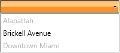
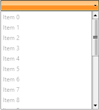
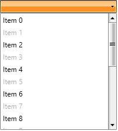
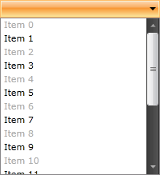

# Enable\Disable RadComboBoxItems

The purpose of this tutorial is to show you how to enable and disable __RadComboBoxItems__.

## Enable\Disable RadComboBox with Static Data

In the simplest scenario you will have a __RadComboBox__ populated with static data in XAML.

__Example 1: Populate with static data__

<snippet id='radcombobox-howto-enable-disable-radcombobox-items-example_1_populate_with_static_data-xaml' />

The __RadComboBox__ and __RadComboBoxItem__ classes expose a property named __IsEnabled__. Set this property to __False__, when you want to disable either the whole __RadComboBox__ or specific __RadComboBoxItems__. The next code-snippet shows you how to do that.

__Example 2: Disabling specific RadComboBoxItems using the IsEnabled property__

<snippet id='radcombobox-howto-enable-disable-radcombobox-items-example_2_disabling_specific_radcomboboxitems_using_the_isenabled_property-xaml' />

#### __Figure 1: Result of Example 2__

## Enable\Disable Items Using ItemContainerStyle

Using __RadComboBox__ with static data is the simplest scenario. However, in most of the cases you will have a __RadComboBox__ [populated with a collection of business objects](). In this case you have no other options except for using either the __ItemContainerStyle__ or the __ItemContainerStyleSelector__.

__Example 3: Create a collection of objects__

<snippet id='radcombobox-howto-enable-disable-radcombobox-items-example_3_create_a_collection_of_objects-cs' />

__Example 4: Create the ViewModel__

<snippet id='radcombobox-howto-enable-disable-radcombobox-items-example_4_create_the_viewmodel-cs' />

__Example 5: Set the ItemContainerStyle of a RadComboBox__

<snippet id='radcombobox-howto-enable-disable-radcombobox-items-example_5_set_the_itemcontainerstyle_of_a_radcombobox-xaml' />

Note that in this case all __RadComboBoxItems__ will be disabled. However, you have the ability to determine which items to be disabled based on your custom logic. [Check out](#enabledisable-items-using-itemcontainerstyleselector) the next section to see the solution.

#### __Figure 2: Result of Example 5__

## Enable\Disable Items Using ItemContainerStyleSelector

The __StyleSelector__ provides a way to apply styles based on custom logic.

The next example demonstrates you how to achieve this.

__Example 6: Create a custom logic class__

<snippet id='radcombobox-howto-enable-disable-radcombobox-items-example_6_create_a_custom_logic_class-xaml' />

__Example 7: Apply styles based on custom logic__

<snippet id='radcombobox-howto-enable-disable-radcombobox-items-example_7_apply_styles_based_on_custom_logic-xaml' />

#### __Figure 3: The result is that every odd item is disabled__

## Using Style Binding


Using __ItemContainerStyle__ is a good solution, however, it is not the best. Imagine that your business object has a boolean property named __IsEnabled__. Even more flexible solution is to directly bind the __RadComboBoxItem__'s __IsEnabled__ property to the __IsEnabled__ property exposed by your domain object. You can do this through __style binding__.


__Example 8: Use of style binding__

<snippet id='radcombobox-howto-enable-disable-radcombobox-items-example_8_use_of_style_binding-xaml' />


Two things should be mentioned here. First, note how the __IsEnabled__ property is bound in the __Style__. Second, the declared __Style__ is set as a __ItemContainerStyle__ of the __RadComboBox__. The result is shown on the image below.

#### __Picture 4: Result of Example 5__



## See Also  
 * [Missing Controls in the UI]()
 * [RadComboBox Virtualization]() 
 * [Setting up AutoComplete]()
