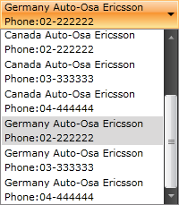

# Get a Grid Like Dropdown

The purpose of this tutorial is to show you how to create a custom __ItemTemplate__ to display multiple "columns" of data in the drop-down for each item. 

>Note, that this tutorial won't show you how to create a grid like drop-down with column __Headers__. __RadComboBox__ does not support this out of the box. You should modify the control template to add heading for the columns. However, this is not very flexible, because you will have to provide a different control template (with different headings) for each combo box instance that has different columns in its drop-down. This feature will be included in some of the next control's release dates.

The final result from this tutorial should look like the snapshot below.


>Before proceeding further with this tutorial, be sure that you are familiar with how to [bind a RadComboBox to a collection of objects]().

* For the purpose of this tutorial you need to create two additional classes named __Dealer__ and __DealerViewModel__. Their structure is shown on the code-snippets below.


```C#
	public class Dealer
	{
	    public Dealer( string name, string description, string phone )
	    {
	        this.Name = name;
	        this.Description = description;
	        this.Phone = phone;
	    }
	    public string Name
	    {
	        get;
	        set;
	    }
	    public string Description
	    {
	        get;
	        set;
	    }
	    public string Phone
	    {
	        get;
	        set;
	    }
	}
```


```VB.NET
	Public Class Dealer
	    Public Sub New(ByVal name As String, ByVal description As String, ByVal phone As String)
	        Me.Name = name
	        Me.Description = description
	        Me.Phone = phone
	    End Sub
	Private _Name As String
	    Public Property Name() As String
	        Get
	            Return _Name
	        End Get
	        Set(ByVal value As String)
	            _Name = value
	        End Set
	    End Property
	Private _Description As String
	    Public Property Description() As String
	        Get
	            Return _Description
	        End Get
	        Set(ByVal value As String)
	            _Description = value
	        End Set
	    End Property
	Private _Phone As String
	    Public Property Phone() As String
	        Get
	            Return _Phone
	        End Get
	        Set(ByVal value As String)
	            _Phone = value
	        End Set
	    End Property
	End Class
```

The __Dealer__ class is extremely simple. It has only properties which describe it - __Name__, __Country__, __Phone__.


```C#
	public class DealerViewModel
	{
	    private ObservableCollection<Dealer> dealers;
	    public ObservableCollection<Dealer> Dealers
	    {
	        get
	        {
	            if ( dealers == null )
	                this.CraeteDealers();
	            return dealers;
	        }
	    }
	    private void CraeteDealers()
	    {
	        this.dealers = new ObservableCollection<Dealer>();
	        this.dealers.Add( new Dealer( "USA Auto-Osa Ericsson", "USA", "02-222222" ) );
	        this.dealers.Add( new Dealer( "USA Auto-Osa Ericsson", "USA", "03-333333" ) );
	        this.dealers.Add( new Dealer( "USA Auto-Osa Ericsson", "USA", "04-444444" ) );
	        this.dealers.Add( new Dealer( "Canada Auto-Osa Ericsson", "Canada", "02-222222" ) );
	        this.dealers.Add( new Dealer( "Canada Auto-Osa Ericsson", "Canada", "03-333333" ) );
	        this.dealers.Add( new Dealer( "Canada Auto-Osa Ericsson", "Canada", "04-444444" ) );
	        this.dealers.Add( new Dealer( "Germany Auto-Osa Ericsson", "Germany", "02-222222" ) );
	        this.dealers.Add( new Dealer( "Germany Auto-Osa Ericsson", "Germany", "03-333333" ) );
	        this.dealers.Add( new Dealer( "Germany Auto-Osa Ericsson", "Germany", "04-444444" ) );
	    }
	}
```


```VB.NET
	Public Class DealerViewModel
	    Private m_dealers As ObservableCollection(Of Dealer)
	    Public ReadOnly Property Dealers() As ObservableCollection(Of Dealer)
	        Get
	            If m_dealers Is Nothing Then
	                Me.CraeteDealers()
	            End If
	            Return m_dealers
	        End Get
	    End Property
	    Private Sub CraeteDealers()
	        Me.m_dealers = New ObservableCollection(Of Dealer)()
	        Me.m_dealers.Add(New Dealer("USA Auto-Osa Ericsson", "USA", "02-222222"))
	        Me.m_dealers.Add(New Dealer("USA Auto-Osa Ericsson", "USA", "03-333333"))
	        Me.m_dealers.Add(New Dealer("USA Auto-Osa Ericsson", "USA", "04-444444"))
	        Me.m_dealers.Add(New Dealer("Canada Auto-Osa Ericsson", "Canada", "02-222222"))
	        Me.m_dealers.Add(New Dealer("Canada Auto-Osa Ericsson", "Canada", "03-333333"))
	        Me.m_dealers.Add(New Dealer("Canada Auto-Osa Ericsson", "Canada", "04-444444"))
	        Me.m_dealers.Add(New Dealer("Germany Auto-Osa Ericsson", "Germany", "02-222222"))
	        Me.m_dealers.Add(New Dealer("Germany Auto-Osa Ericsson", "Germany", "03-333333"))
	        Me.m_dealers.Add(New Dealer("Germany Auto-Osa Ericsson", "Germany", "04-444444"))
	    End Sub
	End Class
```

The class __DealerViewModel__ is doing nothing special except for initializing on demand a collection of __Dealer__ objects. There is a helper method, doing this work.

* The next step is to declare the __DealerViewModel__ as a data source in your XAML resources and to set it to the __RadComboBox__'s __ItemsSource__ property.


```XAML
	<UserControl.Resources>
	    <example:DealerViewModel x:Key="DataSource"/>
	</UserControl.Resources>
	
	<Grid x:Name="LayoutRoot" Background="White">
	    <StackPanel Margin="10">
	
	        <telerik:RadComboBox x:Name="radComboBox" Width="200"
	            ItemsSource="{Binding Source={StaticResource DataSource}, Path=Dealers}"/>
	
	    </StackPanel>
	</Grid>
```

* The final step is to declare a custom __DataTemplate__ which defines the grid like drop-down of the __RadComboBox__. Set the just declared __DataTemplate__ to the __RadComboBox__'s __ItemsSource__ property.


```XAML
	<UserControl.Resources>
	    <example:DealerViewModel x:Key="DataSource"/>	
	    <DataTemplate x:Key="GridLikeDataTemplate">
	        <StackPanel>
	            <TextBlock Text="{Binding Name}" />
	            <StackPanel Orientation="Horizontal">
	                <TextBlock Text="Phone:" />
	                <TextBlock Text="{Binding Phone}" />
	            </StackPanel>
	        </StackPanel>
	    </DataTemplate>	
	</UserControl.Resources>
	
	<Grid x:Name="LayoutRoot" Background="White">
	    <StackPanel Margin="10">	
	        <telerik:RadComboBox x:Name="radComboBox" Width="200"
	            ItemsSource="{Binding Source={StaticResource DataSource}, Path=Dealers}"
	            ItemTemplate="{StaticResource GridLikeDataTemplate}"/>	
	    </StackPanel>
	</Grid>
```

The final result is shown again on the next image.



## See Also

 * [RadComboBox Virtualization]()

 * [Creating ItemTemplate and SelectionBoxTemplate]()
