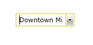

# How to align to the left the text of the ComboBoxItem when it is too long

## 

If the text in a __RadComboBoxItem__is longer than the width of the ComboBox itself and the ComboBox is in editable mode, when you focus __RadComboBox__it selects all of its text and the cursor is at the end of the word for easy edition. 

         
      

To make it left aligned and remove the selection you can set the __SelectAllTextEvent__property of the ComboBox to __None__.

>The described approach is only available if the selection is done via mouse click or keyboard navigation. If an item is selected by the __AutoComplete__ functionality of the control the text will not be aligned to the left.
              

         
      

# See Also

 * [Setting up AutoComplete]()

 * [Set MaxLength Property of the Input Area]()
