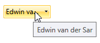

# Show Tooltip On Trimmed Text

If the text of a RadComboBox exceeds the width of its parent, the content will be trimmed. As of R3 2017 SP1, you can show a tooltip for the trimmed text by setting the **ComboBoxToolTipHelper.ShowToolTipOnTrimmedText** attached property to **True**. The result is demonstrated in **Figure 1**.

#### Figure 1: RadComboBox with tooltip for trimmed text



> The property affects only a non-editable RadComboBox when its tooltip is set either through the **Tooltip** or the **ToolTipService.ToolTip** properties and the text of the control is trimmed.

__Example 1: Set the ShowToolTipOnTrimmedText property__

```XAML
	<telerik:RadComboBox telerik:ComboBoxToolTipHelper.ShowToolTipOnTrimmedText="True"
						ToolTipService.ToolTip="{Binding Text, RelativeSource={RelativeSource Self}}"
						ItemsSource="{Binding Players}"
						VerticalAlignment="Center"
						Width="80" />
```

>A working version of this example is also available in the [SDK Samples Browser](https://demos.telerik.com/xaml-sdkbrowser/), titled **Show Tooltip On Trimmed Text**. Its full source code can be found [on GitHub](https://github.com/telerik/xaml-sdk/tree/master/ComboBox/ShowToolTipOnTrimmedText).

## See Also

* [AutoComplete]()
* [Edit Modes]()
* [Multiple Selection]()