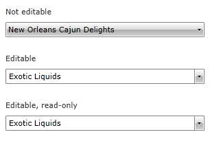
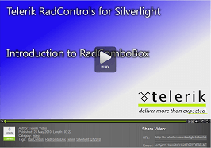

# Overview

## 

Thank you for choosing Telerik __RadComboBox__!
        

The Telerik UI for SilverlightWPF __RadComboBox__ (__Figure 1__) is not just another drop-down list control.
          The control has a number of advanced features like several edit modes, autocomplete, filtering, a rich event and programming model, as well as full customization capabilities.
        

__Figure 1__: __RadComboBox__ in different modes.
          

The list below describes several of the top-of-the-line features of the Telerik UI for SilverlightWPF __RadComboBox__ control:
        

* __Editable mode__ - You can make the __RadComboBox__ editable, allowing the user to type in its text box, or non-editable, where the text box is hidden. In addition, you could make the text box read-only, in order to keep the editable look, but prevent the user from typing. [Read more]()

* __Autocomplete__ - In editable mode,  the __RadComboBox__ can autocomplete the text that the user is typing with the text of the first matching item. In non-editable mode, the first matching item is highlighted while the user is typing. [Read more]()

* __Filtering__ - The user can filter the __RadComboBox__ items in order to easily find what he/she is searching for. You can configure __RadComboBox__ to filter the items that start with the specified text, or the items that contain the specified text. [Read more]()

* __Rich programming model__ - The rich programming model of the __RadComboBox__ control allows you to entirely manipulate the control from the code behind. For example you can add/remove or enable/disable items in the __RadComboBox__ control. [Read more]()

* __Silverlight/WPF code compatibility__ - The __RadComboBox__ shares a single codebase with its WPFSilverlight counterpart. This means that you can achieve close to 100% code reuse for your __RadComboBox__ logic if you have parallel Silverlight/WPF development.
          

* __Expression Blend support__ - All __RadControls__ for SilverlightWPF can be easily customized using Expression Blend.
          

* __Keyboard support__ - __RadComboBox__ has full support for keyboard navigation. The __RadComboBox__ supports several keyboard shortcuts for performing most common tasks. [Read more]()

* __Codeless test automation for RadComboBox__ - You can record, execute and debug functional tests for __RadControls__ without leaving the familiar Visual Studio environment. Telerik [Test Studio](http://www.telerik.com/products/web-testing-tools/webui-test-studio-features.aspx) is an advanced click and play web application testing tool specialized for automating both AJAX and Silverlight applications. Telerik Test Studio ships with special translators for Telerik UI for ASP.NET AJAX and Telerik UI for Silverlight.
          
<table> <tr><td>

[Link...](http://tv.telerik.com/silverlight/video/introduction-radcombobox-silverlight)</td><td>
                In this video, we will look at some of the features and functionality in Telerik RadComboBox for Silverlight and how you can start using it in your rich internet applications today.(Runtime: 03:22)
              </td></tr></table>

Check out the online demo at:
          [http://demos.telerik.com/silverlight/#ComboBox/FirstLook](http://demos.telerik.com/silverlight/#ComboBox/FirstLook/)[http://demos.telerik.com/wpf/](http://demos.telerik.com/wpf/).
        

# See Also

 * [Visual Structure]()

 * [Getting Started]()

 * [Edit Modes]()

 * [AutoComplete]()

 * [Filtering]()

 * [Keyboard Support]()
