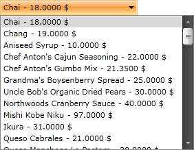

# Binding to ADO.NET Data Service

The purpose of this tutorial is to show you how to populate a `RadComboBox` with data from an ADO.NET Data Service in two ways:

* [Using plain methods call in the code-behind](#using-plain-methods-call-in-the-code-behind)
* [Using MVVM approach](#using-mvvm-approach)

>This tutorial uses the [Northwind database](https://github.com/Microsoft/sql-server-samples/tree/master/samples/databases/northwind-pubs).

Before proceeding further with this tutorial you need to create a new application and a `RadComboBox` declaration in your XAML.

#### __XAML__  
{{region radcombobox-populating-with-data-binding-adonet_0}}
	<telerik:RadComboBox x:Name="radComboBox"/>
{{endregion}}

## Using Plain Methods Call in the Code-Behind

1. Add a reference to your ADO.NET Data Service. 

2. Switch to the code-behind and add a reference to the `NorthwindEntities` object.

	#### __C#__  
	{{region radcombobox-populating-with-data-binding-adonet_1}}
		NorthwindEntities dbContext = new NorthwindEntities( new Uri( "Enter your service address here") );
	{{endregion}}

	#### __VB.NET__  
	{{region radcombobox-populating-with-data-binding-adonet_2}}
		Dim dbContext As New NorthwindEntities(New Uri("Enter your service address here"))
	{{endregion}}

	>tip For more information about how to add a reference to an ADO.NET Data Service and how to create a new instance of the exposed entity, take a look at the [Consuming ADO.NET Data Service]() topic.

3. The ComboBoxs control will be populated with all __Products__ from the __Northwind__ database. In the drop-down list the `ProductName` and the `UnitPrice` properties will be displayed. Add the following code which will make the initial load of the objects.

	#### __C#__  
	{{region radcombobox-populating-with-data-binding-adonet_3}}
		private void BeginRequest()
		{
			DataServiceQuery<Products> query = dbContext.CreateQuery<Products>( "Products" );
			query.BeginExecute( RequestCompleted, query );
		}
		
		private void RequestCompleted( IAsyncResult asyncResult )
		{
			DataServiceQuery<Products> query = asyncResult.AsyncState as DataServiceQuery<Products>;
			var products = query.EndExecute( asyncResult ).ToList();
			this.radComboBox.ItemsSource = products;
		}
	{{endregion}}

	#### __VB.NET__  
	{{region radcombobox-populating-with-data-binding-adonet_4}}
		Private Sub BeginRequest()
			Dim query As DataServiceQuery(Of Products) = dbContext.CreateQuery(Of Products)("Products")
			query.BeginExecute(RequestCompleted, query)
		End Sub
		
		Private Sub RequestCompleted(ByVal asyncResult As IAsyncResult)
			Dim query As DataServiceQuery(Of Products) = TryCast(asyncResult.AsyncState, DataServiceQuery(Of Products))
			Dim products = query.EndExecute(asyncResult).ToList()
			Me.radComboBox.ItemsSource = products
		End Sub
	{{endregion}}

	#### __C#__  
	{{region radcombobox-populating-with-data-binding-adonet_5}}
		this.radComboBox.ItemsSource = dbContext.Products.Execute();
	{{endregion}}

	#### __VB.NET__  
	{{region radcombobox-populating-with-data-binding-adonet_6}}
		Me.radComboBox.ItemsSource = dbContext.Products.Execute()
	{{endregion}}

4. You need to declare a custom __DataTemplate__ to determine how the items in the drop-down will look like. Add the following __DataTemplate__ declaration in your XAML resources.

	#### __XAML__  
	{{region radcombobox-populating-with-data-binding-adonet_7}}
		<UserControl.Resources>
			<DataTemplate x:Key="CustomItemTemplate">
				<StackPanel Orientation="Horizontal">
					<TextBlock Text="{Binding ProductName}"/>
					<TextBlock Text=" - "/>
					<TextBlock Text="{Binding UnitPrice}"/>
					<TextBlock Text=" $"/>
				</StackPanel>
			</DataTemplate>
		</UserControl.Resources>
	{{endregion}}

5. Find your __RadComboBox__ declaration and set the just declared __DataTemplate__ to its __ItemTemplate__ property.

	#### __XAML__  
	{{region radcombobox-populating-with-data-binding-adonet_8}}
		<telerik:RadComboBox x:Name="radComboBox" ItemTemplate="{StaticResource CustomItemTemplate}"/>
	{{endregion}}

__The end result with the data fetched from the service__  

## Using MVVM Approach

This section will show you how to populate your `RadComboBox` control in a MVVM manner. The ComboBox will be bound to a data source object, that has a property `Products`. When the control is loaded all products from the __Products__ table in the Northwind database are loaded asynchronously.

1. Create a new class named `NorthwindDataSource`.

	#### __C#__  
	{{region radcombobox-populating-with-data-binding-adonet_9}}
		public class NorthwindDataSource
		{
		}
	{{endregion}}

	#### __VB.NET__  
	{{region radcombobox-populating-with-data-binding-adonet_10}}
		Public Class NorthwindDataSource
		End Class
	{{endregion}}

2. Add a reference to your ADO.NET Data Service.

3. In the `NorthwindDataSource` class add a reference to an `ObservableCollection` of `Product`.

4. In the `NorthwindDataSource` class add a reference to the `NorthwindEntities` object:

	#### __C#__  
	{{region radcombobox-populating-with-data-binding-adonet_11}}
		public class NorthwindDataSource
		{
			private static NorthwindEntities northwindEntity;
		
			public NorthwindDataSource()
			{
				northwindEntity = new NorthwindEntities( new Uri( "Enter your service address here") );
				this.Products = new ObservableCollection<Products>();
			}
		
			public ObservableCollection<Products> Products
			{
				get;
				set;
			}
		}
	{{endregion}}

	#### __VB.NET__  
	{{region radcombobox-populating-with-data-binding-adonet_12}}
		Public Class NorthwindDataSource
			Private Shared northwindEntity As NorthwindEntities
		
			Public Sub New()
				northwindEntity = New NorthwindEntities(New Uri("Enter your service address here"))
				Me.Products = New ObservableCollection(Of Products)()
			End Sub
		
		Private _Products As ObservableCollection(Of Products)
			Public Property Products() As ObservableCollection(Of Products)
				Get
					Return _Products
				End Get
				Set(ByVal value As ObservableCollection(Of Products))
					_Products = value
				End Set
			End Property
		End Class
	{{endregion}}

5. Add the following code in the constructor of the `NorthwindDataSource`. It will make the initial load of all __Products__ from the database:

	#### __C#__  
	{{region radcombobox-populating-with-data-binding-adonet_13}}
		northwindEntity.Products.BeginExecute(
		   ( IAsyncResult result ) => EntitiesLoaded<Products>( result, this.Products ),
		   northwindEntity.Products );
	{{endregion}}

	#### __VB.NET__  
	{{region radcombobox-populating-with-data-binding-adonet_14}}
		northwindEntity.Products.BeginExecute(Function(ByVal result As IAsyncResult) EntitiesLoaded(Of Products)(result, Me.Products), northwindEntity.Products)
	{{endregion}}

	
	And here is the code for the __EntitiesLoaded__ method:
	

	#### __C#__  
	{{region radcombobox-populating-with-data-binding-adonet_15}}
		private static void EntitiesLoaded<T>( IAsyncResult result, Collection<T> entities )
		{
		   DataServiceQuery<T> query = result.AsyncState as DataServiceQuery<T>;
		   foreach ( T entity in query.EndExecute( result ) )
		   {
			   entities.Add( entity );
		   }
		}
	{{endregion}}

	#### __VB.NET__  
	{{region radcombobox-populating-with-data-binding-adonet_16}}
		Private Shared Sub EntitiesLoaded(Of T)(ByVal result As IAsyncResult, ByVal entities As Collection(Of T))
			Dim query As DataServiceQuery(Of T) = TryCast(result.AsyncState, DataServiceQuery(Of T))
			For Each entity As T In query.EndExecute(result)
				entities.Add(entity)
			Next
		End Sub
	{{endregion}}

	#### __C#__  
	{{region radcombobox-populating-with-data-binding-adonet_17}}
		foreach ( Products p in northwindEntity.Products.Execute() )
		{
			this.Products.Add( p );
		}
	{{endregion}}

	#### __VB.NET__  
	{{region radcombobox-populating-with-data-binding-adonet_18}}
		For Each p As Products In northwindEntity.Products.Execute()
			Me.Products.Add(p)
		Next
	{{endregion}}

6. Declare the `NorthwindDataSource` object as a resource in your application.

	#### __XAML__  
	{{region radcombobox-populating-with-data-binding-adonet_19}}
		<UserControl.Resources>
			<example:NorthwindDataSource x:Key="DataSource"/>   
		</UserControl.Resources>
	{{endregion}}

7. Declare a custom `DataTemplate` to determine how the items in the drop-down will look like. 

	#### __XAML__  
	{{region radcombobox-populating-with-data-binding-adonet_20}}
		<UserControl.Resources>
			<DataTemplate x:Key="CustomItemTemplate">
				<StackPanel Orientation="Horizontal">
					<TextBlock Text="{Binding ProductName}"/>
					<TextBlock Text=" - "/>
					<TextBlock Text="{Binding UnitPrice}"/>
					<TextBlock Text=" $"/>
				</StackPanel>
			</DataTemplate>
		
			<example:NorthwindDataSource x:Key="DataSource"/>
		</UserControl.Resources>
	{{endregion}}

8. Update your `RadComboBox` declaration - set the `ItemsSource` and `ItemTemplate` properties.

	#### __XAML__  
	{{region radcombobox-populating-with-data-binding-adonet_21}}
		<telerik:RadComboBox x:Name="radComboBox"
			ItemsSource="{Binding Source={StaticResource DataSource}, Path=Products}"
			ItemTemplate="{StaticResource CustomItemTemplate}"/>
	{{endregion}}

__The end result with the data fetched from the service__  

## See Also  
* [Binding to Object]()
* [Binding to WCF Service]()
