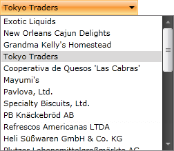
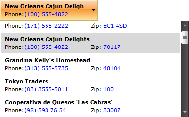

# Binding to Collection

This tutorial will guide you through the process of binding a `RadComboBox` to a collection of business objects. It also demonstrates two ways of customizing the visualization of the bound items:

* [Setting the DisplayMemberPath Property](#set-the-displaymemberpath-property)
* [Defining a Custom ItemTemplate](#define-a-custom-itemtemplate)

To bind the ComboBox to a collection of business objects, you should set its `ItemsSource` property. If you want the changes to the collection and the properties of the data items to be automatically reflected in the UI, the collection needs to implement the `INotifyCollectionChanged` interface (such collection is ObservableCollection&lt;T&gt;) and your business objects have to implement the `INotifyPropertyChanged` interface.

The following example shows how to implement the models structure and use it in the ComboBox control.

#### __[C#] Creating the data item's model__  
{{region cs-radcombobox-populating-with-data-binding-to-object_1}}
	public class Agency
	{
	    public Agency()
	    {
	    }
		
	    public Agency( string name, string phone, string zip )
	    {
	        this.Name = name;
	        this.Phone = phone;
	        this.Zip = zip;
	    }
		
	    public string Name { get; set; }
		
	    public string Phone { get; set; }

	    public string Zip { get; set; }
	}
{{endregion}}

#### __[VB.NET] Creating the data item's model__  
{{region vb-radcombobox-populating-with-data-binding-to-object_2}}
	Public Class Agency
	    Public Sub New()
	    End Sub
	    Public Sub New(ByVal name As String, ByVal phone As String, ByVal zip As String)
	        Me.Name = name
	        Me.Phone = phone
	        Me.Zip = zip
	    End Sub
	Private _Name As String
	    Public Property Name() As String
	        Get
	            Return _Name
	        End Get
	        Set(ByVal value As String)
	            _Name = value
	        End Set
	    End Property
	Private _Phone As String
	    Public Property Phone() As String
	        Get
	            Return _Phone
	        End Get
	        Set(ByVal value As String)
	            _Phone = value
	        End Set
	    End Property
	Private _Zip As String
	    Public Property Zip() As String
	        Get
	            Return _Zip
	        End Get
	        Set(ByVal value As String)
	            _Zip = value
	        End Set
	    End Property
	End Class
{{endregion}}

#### __[C#] Creating the main view model__
{{region cs-radcombobox-populating-with-data-binding-to-object_3}}
	public class AgencyViewModel
	{
	    private ObservableCollection<Agency> agencies;
	
	    public ObservableCollection<Agency> Agency
	    {
	        get
	        {
	            if (agencies == null)
	            {
	                agencies = new ObservableCollection<Agency>();	
	                agencies.Add( new Agency( "Exotic Liquids", "(171) 555-2222", "EC1 4SD" ) );
	                agencies.Add( new Agency( "New Orleans Cajun Delights", "(100) 555-4822", "70117" ) );
	                agencies.Add( new Agency( "Grandma Kelly's Homestead", "(313) 555-5735", "48104" ) );
	                agencies.Add( new Agency( "Tokyo Traders", "(03) 3555-5011", "100" ) );
	                agencies.Add( new Agency( "Cooperativa de Quesos 'Las Cabras'", "(98) 598 76 54", "33007" ) );
	                agencies.Add( new Agency( "Mayumi's", "(06) 431-7877", "545" ) );
	                agencies.Add( new Agency( "Pavlova, Ltd.", "(03) 444-2343", "3058" ) );
	                agencies.Add( new Agency( "Specialty Biscuits, Ltd.", "(161) 555-4448", "M14 GSD" ) );
	                agencies.Add( new Agency( "PB Knäckebröd AB", "031-987 65 43", "S-345 67" ) );
	                agencies.Add( new Agency( "Refrescos Americanas LTDA", "(11) 555 4640", "5442" ) );
	                agencies.Add( new Agency( "Heli Süßwaren GmbH & Co. KG", "(New Item) (010) 9984510", "10785" ) );
	                agencies.Add( new Agency( "Plutzer Lebensmittelgroßmärkte AG", "(New Item) (069) 992755", "60439" ) );
	                agencies.Add( new Agency( "Nord-Ost-Fisch Handelsgesellschaft mbH", "(New Item) (04721) 8713", "27478" ) );
	                agencies.Add( new Agency( "Formaggi Fortini s.r.l.", "(New Item) (0544) 60323", "48100" ) );
	                agencies.Add( new Agency( "Norske Meierier", "(New Item) (0)2-953010", "1320" ) );
	                agencies.Add( new Agency( "Bigfoot Breweries", "(New Item) (503) 555-9931", "97101" ) );
	                agencies.Add( new Agency( "Svensk Sjöföda AB", "(New Item) 08-123 45 67", "S-123 45" ) );
	                agencies.Add( new Agency( "Aux joyeux ecclésiastiques", "(New Item) (1) 03.83.00.68", "75004" ) );
	                agencies.Add( new Agency( "New England Seafood Cannery", "(New Item) (617) 555-3267", "2134" ) );
	                agencies.Add( new Agency( "Leka Trading", "(New Item) 555-8787", "512" ) );
	                agencies.Add( new Agency( "Lyngbysild", "(New Item) 43844108", "2800" ) );
	                agencies.Add( new Agency( "Zaanse Snoepfabriek", "(New Item) (12345) 1212", "9999 ZZ" ) );
	                agencies.Add( new Agency( "Karkki Oy", "(New Item) (953) 10956", "53120" ) );
	                agencies.Add( new Agency( "G'day, Mate", "(New Item) (02) 555-5914", "2042" ) );
	                agencies.Add( new Agency( "Ma Maison", "(New Item) (514) 555-9022", "H1J 1C3" ) );
	                agencies.Add( new Agency( "Pasta Buttini s.r.l.", "(New Item) (089) 6547665", "84100" ) );
	                agencies.Add( new Agency( "Escargots Nouveaux", "(New Item) 85.57.00.07", "71300" ) );
	                agencies.Add( new Agency( "Gai pâturage", "(New Item) 38.76.98.06", "74000" ) );
	                agencies.Add( new Agency( "Forêts d'érables", "(New Item) (514) 555-2955", "J2S 7S8" ) );
	            }	
	            return agencies;
	        }
	    }
	}
{{endregion}}

#### __[VB.NET] Creating the main view model__  
{{region vb-radcombobox-populating-with-data-binding-to-object_4}}
	Public Class AgencyViewModel
	    Private agencies As ObservableCollection(Of Agency)
	
	    Public ReadOnly Property Agency() As ObservableCollection(Of Agency)
	        Get
	            If agencies Is Nothing Then	
	                agencies = New ObservableCollection(Of Agency)()	
	                agencies.Add(New Agency("Exotic Liquids", "(171) 555-2222", "EC1 4SD"))
	                agencies.Add(New Agency("New Orleans Cajun Delights", "(100) 555-4822", "70117"))
	                agencies.Add(New Agency("Grandma Kelly's Homestead", "(313) 555-5735", "48104"))
	                agencies.Add(New Agency("Tokyo Traders", "(03) 3555-5011", "100"))
	                agencies.Add(New Agency("Cooperativa de Quesos 'Las Cabras'", "(98) 598 76 54", "33007"))
	                agencies.Add(New Agency("Mayumi's", "(06) 431-7877", "545"))
	                agencies.Add(New Agency("Pavlova, Ltd.", "(03) 444-2343", "3058"))
	                agencies.Add(New Agency("Specialty Biscuits, Ltd.", "(161) 555-4448", "M14 GSD"))
	                agencies.Add(New Agency("PB Knäckebröd AB", "031-987 65 43", "S-345 67"))
	                agencies.Add(New Agency("Refrescos Americanas LTDA", "(11) 555 4640", "5442"))
	                agencies.Add(New Agency("Heli Süßwaren GmbH & Co. KG", "(New Item) (010) 9984510", "10785"))
	                agencies.Add(New Agency("Plutzer Lebensmittelgroßmärkte AG", "(New Item) (069) 992755", "60439"))
	                agencies.Add(New Agency("Nord-Ost-Fisch Handelsgesellschaft mbH", "(New Item) (04721) 8713", "27478"))
	                agencies.Add(New Agency("Formaggi Fortini s.r.l.", "(New Item) (0544) 60323", "48100"))
	                agencies.Add(New Agency("Norske Meierier", "(New Item) (0)2-953010", "1320"))
	                agencies.Add(New Agency("Bigfoot Breweries", "(New Item) (503) 555-9931", "97101"))
	                agencies.Add(New Agency("Svensk Sjöföda AB", "(New Item) 08-123 45 67", "S-123 45"))
	                agencies.Add(New Agency("Aux joyeux ecclésiastiques", "(New Item) (1) 03.83.00.68", "75004"))
	                agencies.Add(New Agency("New England Seafood Cannery", "(New Item) (617) 555-3267", "2134"))
	                agencies.Add(New Agency("Leka Trading", "(New Item) 555-8787", "512"))
	                agencies.Add(New Agency("Lyngbysild", "(New Item) 43844108", "2800"))
	                agencies.Add(New Agency("Zaanse Snoepfabriek", "(New Item) (12345) 1212", "9999 ZZ"))
	                agencies.Add(New Agency("Karkki Oy", "(New Item) (953) 10956", "53120"))
	                agencies.Add(New Agency("G'day, Mate", "(New Item) (02) 555-5914", "2042"))
	                agencies.Add(New Agency("Ma Maison", "(New Item) (514) 555-9022", "H1J 1C3"))
	                agencies.Add(New Agency("Pasta Buttini s.r.l.", "(New Item) (089) 6547665", "84100"))
	                agencies.Add(New Agency("Escargots Nouveaux", "(New Item) 85.57.00.07", "71300"))
	                agencies.Add(New Agency("Gai pâturage", "(New Item) 38.76.98.06", "74000"))
	                agencies.Add(New Agency("Forêts d'érables", "(New Item) (514) 555-2955", "J2S 7S8"))
	            End If	
	            Return agencies
	        End Get
	    End Property
	End Class
{{endregion}}

#### __[XAML] Initializing the view model as a resource__  
{{region xaml-radcombobox-populating-with-data-binding-to-object_5}}
	<UserControl.Resources>
	    <example:AgencyViewModel x:Key="DataSource"/>
	</UserControl.Resources>
{{endregion}}

#### __[XAML] Setting RadComboBox's ItemsSource__  
{{region xaml-radcombobox-populating-with-data-binding-to-object_6}}
	<telerik:RadComboBox Width="200" x:Name="radComboBox" ItemsSource="{Binding Source={StaticResource DataSource}, Path=Agency}"/>
{{endregion}}

## Option 1: Set the DisplayMemberPath Property

By default, the content of the items will be set to the value returned by the `ToString()` method of the underlying business objects. As this is rarely the desired behavior, `RadComboBox` exposes a `DisplayMemberPath` property. Its purpose is to specify a property of the source object to serve as the visual representation of the ComboBox item.

The following example demonstrates how to set the `DisplayMemberPath` property to point to the `Name` property of the `Agency` objects.

#### __[XAML] Set DisplayMemberPath property__  
{{region xaml-radcombobox-populating-with-data-binding-to-object_9}}
	<telerik:RadComboBox x:Name="radComboBox" DisplayMemberPath="Name" Width="200" ItemsSource="{Binding Source={StaticResource DataSource}, Path=Agency}" />
{{endregion}}

__RadComboBox displaying agency names__  

## Option 2: Define a Custom ItemTemplate

The `DisplayMemberPath` works well if the value you want to display is contained in a single property of the business objects. If you want to visualize more information, you can define a custom `DataTemplate` and set it as the `RadComboBox` `ItemTemplate` property. The process of doing so is demonstrated below.

#### __[XAML] Define the custom DataTemplate__   
{{region xaml-radcombobox-populating-with-data-binding-to-object_7}}
	<UserControl.Resources>
	    <example:AgencyViewModel x:Key="DataSource"/>
	
	    <DataTemplate x:Key="ComboBoxCustomTemplate">
	        <Grid Margin="5,5,5,5" Width="350">
	            <Grid.ColumnDefinitions>
	                <ColumnDefinition />
	                <ColumnDefinition />
	            </Grid.ColumnDefinitions>
	            <Grid.RowDefinitions>
	                <RowDefinition />
	                <RowDefinition />
	            </Grid.RowDefinitions>
	            <TextBlock FontWeight="Bold" Grid.ColumnSpan="2" Text="{Binding Name}" />
	            <TextBlock Grid.Row="1" Text="Phone:" />
	            <TextBlock Grid.Row="1" Foreground="Blue" Margin="40,0,0,0"
	                        Text="{Binding Phone}" />
	            <TextBlock Grid.Row="1" Grid.Column="1" Text="Zip:" />
	            <TextBlock Grid.Row="1" Foreground="Blue" Grid.Column="1" Margin="26,0,0,0"
	                        Text="{Binding Zip}" />
	        </Grid>
	    </DataTemplate>
	</UserControl.Resources>
{{endregion}}

#### __[XAML] Setting the RadComboBox's ItemTemplate property__  
{{region xaml-radcombobox-populating-with-data-binding-to-object_8}}
	<telerik:RadComboBox x:Name="radComboBox" ItemTemplate="{StaticResource ComboBoxCustomTemplate}" Width="200" ItemsSource="{Binding Source={StaticResource DataSource}, Path=Agency}" />
{{endregion}}

__RadComboBox displaying a custom template__  

## See Also
 * [Binding to WCF Service]()
 * [Binding to ADO.NET Data Service]()
 * [Binding to XML]()
