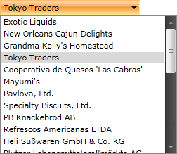
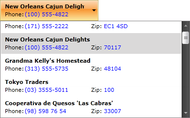

# Binding to Collection

This tutorial will guide you through the process of binding a `RadComboBox` to a collection of business objects. It also demonstrates two ways of customizing the visualization of the bound items.

To bind the ComboBox to a collection of business objects, you should set its `ItemsSource` property. If you want the changes to the collection and the properties of the data items to be automatically reflected in the UI, the collection needs to implement the `INotifyCollectionChanged` interface (such collection is ObservableCollection&lt;T&gt;) and your business objects have to implement the `INotifyPropertyChanged` interface.

The following example shows how to implement the models structure and use it in the ComboBox control.

__Creating the data item's model__  
<snippet id='radcombobox-populating-with-data-binding-to-object-creating_the_data_item_s_model-cs' />

<snippet id='radcombobox-populating-with-data-binding-to-object-creating_the_data_item_s_model-vb' />

__Creating the main view model__
<snippet id='radcombobox-populating-with-data-binding-to-object-creating_the_main_view_model-cs' />

<snippet id='radcombobox-populating-with-data-binding-to-object-creating_the_main_view_model-vb' />

__Initializing the view model as a resource__  
<snippet id='radcombobox-populating-with-data-binding-to-object-initializing_the_view_model_as_a_resource-xaml' />

__Setting RadComboBox's ItemsSource__  
<snippet id='radcombobox-populating-with-data-binding-to-object-setting_radcombobox_s_itemssource-xaml' />

## Option 1: Set the DisplayMemberPath Property

By default, the content of the items will be set to the value returned by the `ToString()` method of the underlying business objects. As this is rarely the desired behavior, `RadComboBox` exposes a `DisplayMemberPath` property. Its purpose is to specify a property of the source object to serve as the visual representation of the ComboBox item.

The following example demonstrates how to set the `DisplayMemberPath` property to point to the `Name` property of the `Agency` objects.

__Set DisplayMemberPath property__  
<snippet id='radcombobox-populating-with-data-binding-to-object-set_displaymemberpath_property-xaml' />

__RadComboBox displaying agency names__  

## Option 2: Define a Custom ItemTemplate

The `DisplayMemberPath` works well if the value you want to display is contained in a single property of the business objects. If you want to visualize more information, you can define a custom `DataTemplate` and set it as the `RadComboBox` `ItemTemplate` property. The process of doing so is demonstrated below.

__Define the custom DataTemplate__   
<snippet id='radcombobox-populating-with-data-binding-to-object-define_the_custom_datatemplate-xaml' />

__Setting the RadComboBox's ItemTemplate property__  
<snippet id='radcombobox-populating-with-data-binding-to-object-setting_the_radcombobox_s_itemtemplate_property-xaml' />

__RadComboBox displaying a custom template__  

## See Also
 * [Binding to WCF Service]()
 * [Binding to ADO.NET Data Service]()
 * [Binding to XML]()
