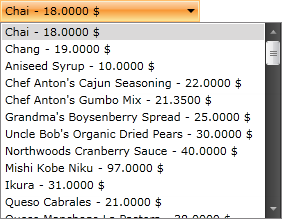

# Binding to WCF Service

The purpose of this tutorial is to show you how to populate a __RadComboBox__ with a data from a __WCF Service__ in two ways:

* [Using plain methods call in the code-behind](#using-plain-methods-call-in-the-code-behind)

* [Using MVVM approach](#using-mvvm-approach)

>This tutorial uses the [Northwind database](https://github.com/Microsoft/sql-server-samples/tree/master/samples/databases/northwind-pubs).

Before proceeding further with this tutorial, you need to create a new application and a __RadComboBox__ declaration in your XAML.

#### __XAML__  
{{region radcombobox-populating-with-data-binding-to-wcf_0}}
	<telerik:RadComboBox x:Name="radComboBox"/>
{{endregion}}

## Using Plain Methods Call in the Code-Behind

1. Add a reference to your WCF Service.

2. Switch to the code-behind and create a new instance of your WCF Service client.

	#### __C#__  
	{{region radcombobox-populating-with-data-binding-to-wcf_1}}
		ComboBoxWcfServiceClient serviceClient = new ComboBoxWcfServiceClient();
	{{endregion}}

	#### __VB.NET__  
	{{region radcombobox-populating-with-data-binding-to-wcf_2}}
		Dim serviceClient As New ComboBoxWcfServiceClient()
	{{endregion}}

	>tip For more information about how to add a reference to a WCF Service and how to create a new instance of a WCF Service client, take a look at the [Consuming WCF Service]() topic.

3. The __ComboBox__ control will be populated with all __Products__ from the __Northwind__ database. In the drop-down list the __ProductName__ and the __UnitPrice__ properties will be displayed. Add the following code which will make the initial load of the objects.

	#### __C#__  
	{{region radcombobox-populating-with-data-binding-to-wcf_3}}
		private void BeginRequest()
		{
			serviceClient.GetProductsCompleted += new EventHandler<GetProductsCompletedEventArgs>( serviceClient_GetProductsCompleted );
			serviceClient.GetProductsAsync();
		}
		private void serviceClient_GetProductsCompleted( object sender, GetProductsCompletedEventArgs e )
		{
			radComboBox.ItemsSource = e.Result;
		}
	{{endregion}}

	#### __VB.NET__  
	{{region radcombobox-populating-with-data-binding-to-wcf_4}}
		Private Sub BeginRequest()
			AddHandler serviceClient.GetProductsCompleted, AddressOf serviceClient_GetProductsCompleted
			serviceClient.GetProductsAsync()
		End Sub
		Private Sub serviceClient_GetProductsCompleted(ByVal sender As Object, ByVal e As GetProductsCompletedEventArgs)
			radComboBox.ItemsSource = e.Result
		End Sub
	{{endregion}}

	#### __C#__  
	{{region radcombobox-populating-with-data-binding-to-wcf_5}}
		private void BeginRequest()
		{
			this.radComboBox.ItemsSource = serviceClient.GetProducts();
		}
	{{endregion}}

	#### __VB.NET__  
	{{region radcombobox-populating-with-data-binding-to-wcf_6}}
		Private Sub BeginRequest()
			Me.radComboBox.ItemsSource = serviceClient.GetProducts()
		End Sub
	{{endregion}}

4. You need to declare a custom __DataTemplate__ to determine how the items in the drop-down will look like. Add the following __DataTemplate__ declaration in your XAML resources.

	#### __XAML__  
	{{region radcombobox-populating-with-data-binding-to-wcf_7}}
		<UserControl.Resources>
			<DataTemplate x:Key="CustomItemTemplate">
				<StackPanel Orientation="Horizontal">
					<TextBlock Text="{Binding ProductName}"/>
					<TextBlock Text=" - "/>
					<TextBlock Text="{Binding UnitPrice}"/>
					<TextBlock Text=" $"/>
				</StackPanel>
			</DataTemplate>
		</UserControl.Resources>
	{{endregion}}

5. Find your __RadComboBox__ declaration and set the declared __DataTemplate__ to its __ItemTemplate__ property.

	#### __XAML__  
	{{region radcombobox-populating-with-data-binding-to-wcf_8}}
		<telerik:RadComboBox x:Name="radComboBox" ItemTemplate="{StaticResource CustomItemTemplate}"/>
	{{endregion}}

__The end result with the data fetched from the service__  

## Using MVVM Approach

This section will show you how to populate your __RadComboBox__ control in a MVVM manner. The __RadComboBox__ will be bound to a data source object, that has a property __Products__. When the control is loaded, all products from the __Products__ table in the Northwind database are loaded asynchronously.

1. Create a new class named __NorthwindDataSource__.

	#### __C#__  
	{{region radcombobox-populating-with-data-binding-to-wcf_9}}
		public class NorthwindDataSource
		{
		}
	{{endregion}}

	#### __VB.NET__  
	{{region radcombobox-populating-with-data-binding-to-wcf_10}}
		Public Class NorthwindDataSource
		End Class
	{{endregion}}

2. Add a reference to your WCF Service

3. In the __NorthwindDataSource__ class add a reference to an __ObservableCollection__ of __Products__.

4. In the __NorthwindDataSource__ class add a reference to your WCF Service client:

	#### __C#__  
	{{region radcombobox-populating-with-data-binding-to-wcf_11}}
		public class NorthwindDataSource
		{
			private ComboBoxWcfServiceClient serviceClient;
		
			public NorthwindDataSource()
			{
				this.Products = new ObservableCollection<Products>();
				this.serviceClient = new ComboBoxWcfServiceClient();
			}
		
			public ObservableCollection<Products> Products
			{
				get;
				protected set;
			}
		}
	{{endregion}}

	#### __VB.NET__  
	{{region radcombobox-populating-with-data-binding-to-wcf_12}}
		Public Class NorthwindDataSource
			Private serviceClient As ComboBoxWcfServiceClient
		
			Public Sub New()
				Me.Products = New ObservableCollection(Of Products)()
				Me.serviceClient = New ComboBoxWcfServiceClient()
			End Sub
		
		Private _Products As ObservableCollection(Of Products)
			Public Property Products() As ObservableCollection(Of Products)
				Get
					Return _Products
				End Get
				Protected Set(ByVal value As ObservableCollection(Of Products))
					_Products = value
				End Set
			End Property
		End Class
	{{endregion}}

	>tip For more information about how to add a reference to a WCF Service and how to create a new instance of a WCF Service client, take a look at the [Consuming WCF Service]() topic.

5. Add the following code in the __constructor__ of the __NorthwindDataSource__. It will make the initial load of all __Products__ from the database:

	#### __C#__  
	{{region radcombobox-populating-with-data-binding-to-wcf_13}}
		this.serviceClient.GetProductsCompleted += new EventHandler<GetProductsCompletedEventArgs>( serviceClient_GetProductsCompleted );
		this.serviceClient.GetProductsAsync();
	{{endregion}}

	#### __VB.NET__  
	{{region radcombobox-populating-with-data-binding-to-wcf_14}}
		AddHandler Me.serviceClient.GetProductsCompleted, AddressOf serviceClient_GetProductsCompleted
		Me.serviceClient.GetProductsAsync()
	{{endregion}}

	
	And here is the code handling the __GetProductsCompleted__ event:
	

	#### __C#__  
	{{region radcombobox-populating-with-data-binding-to-wcf_15}}
		private void serviceClient_GetProductsCompleted( object sender, GetProductsCompletedEventArgs e )
		{
			foreach ( Products p in e.Result )
			{
				this.Products.Add( p );
			}
		}
	{{endregion}}

	#### __VB.NET__  
	{{region radcombobox-populating-with-data-binding-to-wcf_16}}
		Private Sub serviceClient_GetProductsCompleted(ByVal sender As Object, ByVal e As GetProductsCompletedEventArgs)
			For Each p As Products In e.Result
				Me.Products.Add(p)
			Next
		End Sub
	{{endregion}}

	#### __C#__  
	{{region radcombobox-populating-with-data-binding-to-wcf_17}}
		foreach ( Products p in serviceClient.GetProducts() )
		{
			this.Products.Add( p );
		}
	{{endregion}}

	#### __VB.NET__  
	{{region radcombobox-populating-with-data-binding-to-wcf_18}}
		For Each p As Products In serviceClient.GetProducts()
			Me.Products.Add(p)
		Next
	{{endregion}}

6. Declare the __NorthwindDataSource__ object as a resource in your application.

	#### __XAML__  
	{{region radcombobox-populating-with-data-binding-to-wcf_19}}
		<UserControl.Resources>
			<example:NorthwindDataSource x:Key="DataSource"/>   
		</UserControl.Resources>
	{{endregion}}

7. Declare a custom __DataTemplate__ to determine how the items in the drop-down will look like. Add the following __DataTemplate__ declaration in your XAML resources.

	#### __XAML__  
	{{region radcombobox-populating-with-data-binding-to-wcf_20}}
		<UserControl.Resources>
			<DataTemplate x:Key="CustomItemTemplate">
				<StackPanel Orientation="Horizontal">
					<TextBlock Text="{Binding ProductName}"/>
					<TextBlock Text=" - "/>
					<TextBlock Text="{Binding UnitPrice}"/>
					<TextBlock Text=" $"/>
				</StackPanel>
			</DataTemplate>
		
			<example:NorthwindDataSource x:Key="DataSource"/>
		</UserControl.Resources>
	{{endregion}}

8. Update your __RadComboBox__ declaration - set the __ItemsSource__ and __ItemTemplate__ properties.

	#### __XAML__  
	{{region radcombobox-populating-with-data-binding-to-wcf_21}}
		<telerik:RadComboBox x:Name="radComboBox"
			ItemsSource="{Binding Source={StaticResource DataSource}, Path=Products}"
			ItemTemplate="{StaticResource CustomItemTemplate}"/>
	{{endregion}}

__The end result produced by the code above__  

## See Also  
 * [Binding to ADO.NET Data Service]()
 * [Binding to Object]()
