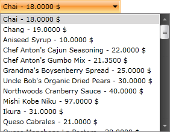

# Binding to WCF Service

The purpose of this tutorial is to show you how to populate a __RadComboBox__ with a data from a __WCF Service__ in two ways:

* [Using plain methods call in the code-behind](#using-plain-methods-call-in-the-code-behind)

* [Using MVVM approach](#using-mvvm-approach)

>This tutorial uses the [Northwind database](https://github.com/Microsoft/sql-server-samples/tree/master/samples/databases/northwind-pubs).

Before proceeding further with this tutorial, you need to create a new application and a __RadComboBox__ declaration in your XAML.

  
<snippet id='radcombobox-populating-with-data-binding-to-wcf-block_1-xaml' />

## Using Plain Methods Call in the Code-Behind

1. Add a reference to your WCF Service.

2. Switch to the code-behind and create a new instance of your WCF Service client.
	  
	<snippet id='radcombobox-populating-with-data-binding-to-wcf-block_2-cs' />

	<snippet id='radcombobox-populating-with-data-binding-to-wcf-block_2-vb' />

3. The __ComboBox__ control will be populated with all __Products__ from the __Northwind__ database. In the drop-down list the __ProductName__ and the __UnitPrice__ properties will be displayed. Add the following code which will make the initial load of the objects.

	<snippet id='radcombobox-populating-with-data-binding-to-wcf-block_3-cs' />

	<snippet id='radcombobox-populating-with-data-binding-to-wcf-block_3-vb' />

	<snippet id='radcombobox-populating-with-data-binding-to-wcf-block_4-cs' />

	<snippet id='radcombobox-populating-with-data-binding-to-wcf-block_4-vb' />

4. You need to declare a custom __DataTemplate__ to determine how the items in the drop-down will look like. Add the following __DataTemplate__ declaration in your XAML resources.

	<snippet id='radcombobox-populating-with-data-binding-to-wcf-block_5-xaml' />

5. Find your __RadComboBox__ declaration and set the declared __DataTemplate__ to its __ItemTemplate__ property.

	<snippet id='radcombobox-populating-with-data-binding-to-wcf-block_6-xaml' />

__The end result with the data fetched from the service__  

## Using MVVM Approach

This section will show you how to populate your __RadComboBox__ control in a MVVM manner. The __RadComboBox__ will be bound to a data source object, that has a property __Products__. When the control is loaded, all products from the __Products__ table in the Northwind database are loaded asynchronously.

1. Create a new class named __NorthwindDataSource__.

	<snippet id='radcombobox-populating-with-data-binding-to-wcf-the_end_result_with_the_data_fetched_from_the_service-cs' />

	<snippet id='radcombobox-populating-with-data-binding-to-wcf-the_end_result_with_the_data_fetched_from_the_service-vb' />

2. Add a reference to your WCF Service

3. In the __NorthwindDataSource__ class add a reference to an __ObservableCollection__ of __Products__.

4. In the __NorthwindDataSource__ class add a reference to your WCF Service client:

	<snippet id='radcombobox-populating-with-data-binding-to-wcf-the_end_result_with_the_data_fetched_from_the_service-cs' />

	<snippet id='radcombobox-populating-with-data-binding-to-wcf-the_end_result_with_the_data_fetched_from_the_service-vb' />

	>tip For more information about how to add a reference to a WCF Service and how to create a new instance of a WCF Service client, take a look at the [Consuming WCF Service]() topic.

5. Add the following code in the __constructor__ of the __NorthwindDataSource__. It will make the initial load of all __Products__ from the database:

	<snippet id='radcombobox-populating-with-data-binding-to-wcf-the_end_result_with_the_data_fetched_from_the_service-cs' />

	<snippet id='radcombobox-populating-with-data-binding-to-wcf-the_end_result_with_the_data_fetched_from_the_service-vb' />

	<snippet id='radcombobox-populating-with-data-binding-to-wcf-the_end_result_with_the_data_fetched_from_the_service-cs' />

	<snippet id='radcombobox-populating-with-data-binding-to-wcf-the_end_result_with_the_data_fetched_from_the_service-vb' />

	<snippet id='radcombobox-populating-with-data-binding-to-wcf-the_end_result_with_the_data_fetched_from_the_service-cs' />

	<snippet id='radcombobox-populating-with-data-binding-to-wcf-the_end_result_with_the_data_fetched_from_the_service-vb' />

6. Declare the __NorthwindDataSource__ object as a resource in your application.

	<snippet id='radcombobox-populating-with-data-binding-to-wcf-the_end_result_with_the_data_fetched_from_the_service-xaml' />

7. Declare a custom __DataTemplate__ to determine how the items in the drop-down will look like. Add the following __DataTemplate__ declaration in your XAML resources.

	<snippet id='radcombobox-populating-with-data-binding-to-wcf-the_end_result_with_the_data_fetched_from_the_service-xaml' />

8. Update your __RadComboBox__ declaration - set the __ItemsSource__ and __ItemTemplate__ properties.

	<snippet id='radcombobox-populating-with-data-binding-to-wcf-the_end_result_with_the_data_fetched_from_the_service-xaml' />

__The end result produced by the code above__  

## See Also  
 * [Binding to ADO.NET Data Service]()
 * [Binding to Object]()
