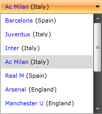

# Binding to XML

The purpose of this tutorial is to show you how to bind `RadComboBox` to data defined in a XML file. The operations you need to perform are to convert the XML to a collection of business objects and then bind that collection using the `ItemsSource` property of the ComboBox.

__The final result__  



1. Define the data source as XML content.

	__Defining the XML data source__  
	```XML
		<?xml version="1.0" encoding="utf-8" ?>
		<Items>
			<XmlNodeItem Team="Barcelona" Country="Spain"/>
			<XmlNodeItem Team="Juventus" Country="Italy"/>
			<XmlNodeItem Team="Inter" Country="Italy"/>
			<XmlNodeItem Team="Ac Milan" Country="Italy"/>
			<XmlNodeItem Team="Real M" Country="Spain"/>
			<XmlNodeItem Team="Arsenal" Country="England"/>
			<XmlNodeItem Team="Manchester U" Country="England"/>
			<XmlNodeItem Team="Bayern" Country="Germany"/>
			<XmlNodeItem Team="Porto" Country="Portugal"/>
			<XmlNodeItem Team="Liverpool" Country="England"/>
			<XmlNodeItem Team="Ajax" Country="Holland"/>
			<XmlNodeItem Team="Olimpic M" Country="France"/>
		</Items>
	```

2. Add a new `RadComboBox` declaration in your XAML.

	```XAML
		<telerik:RadComboBox x:Name="radComboBox" Width="200"/>
	```

3. Create a new class named `XmlNodeItem`. This class is pretty simple and it represents a separate node from the XML document. Its properties are `Team` and `Country`. Both of the properties are of type `string`.

	```C#
		public class XmlNodeItem
		{
			[XmlAttribute( AttributeName = "Team" )]
			public string Team { get; set; }
		
			[XmlAttribute( AttributeName = "Country" )]
			public string Country { get; set; }
		}
	```
	```VB.NET
		Public Class XmlNodeItem
		Private _Team As String
			<XmlAttribute(AttributeName = "Team")> _
			Public Property Team() As String
				Get
					Return _Team
				End Get
				Set(ByVal value As String)
					_Team = value
				End Set
				End Property
		
				Private _Country As String
				<XmlAttribute(AttributeName = "Country")> _
				Public Property Country() As String
					Get
						Return _Country
					End Get
					Set(ByVal value As String)
						_Country = value
					End Set
				End Property
			End Class
	```

4. Create a new class named `XmlNodeItemList`, which derives from `ObservableCollection` of `XmlNodeItem`. This is a collection that will be created from the XML file. 

	```C#
		[XmlRoot( ElementName = "Items" )]
		public class XmlNodeItemList : ObservableCollection<XmlNodeItem>
		{
			public void AddRange( IEnumerable<XmlNodeItem> range )
			{
				foreach ( XmlNodeItem node in range )
				{
					this.Add( node );
				}
			}
		}
	```
	```VB.NET
			<XmlRoot(ElementName = "Items")> _
			Public Class XmlNodeItemList
				Inherits ObservableCollection(Of XmlNodeItem)
				Public Sub AddRange(ByVal range As IEnumerable(Of XmlNodeItem))
					For Each node As XmlNodeItem In range
						Me.Add(node)
					Next
				End Sub
			End Class
	```

5. Create a new class named `RadComboBoxXmlDataSource`, which derives from `XmlNodeItemList`. The class takes a path to the XML file and deserializes the data in the private method `RetrieveData()`.

	```C#
		public class RadComboBoxXmlDataSource : XmlNodeItemList
		{
			private string source;
		
			public string Source
			{
				get
				{
					return this.source;
				}
				set
				{
					this.source = value;
					AddRange(this.RetrieveData(Application.GetResourceStream(new Uri(value, UriKind.Relative)).Stream));
				}
			}
		
			private XmlNodeItemList RetrieveData( Stream xmlStream )
			{
				XmlSerializer serializer = new XmlSerializer( typeof( XmlNodeItemList ) );
				StreamReader reader = new StreamReader( xmlStream );
				XmlNodeItemList list = ( XmlNodeItemList )serializer.Deserialize( reader );
				return list;
			}
		}
	```
	```VB.NET
			Public Class RadComboBoxXmlDataSource
				Inherits XmlNodeItemList
				Private m_source As String
		
				Public Property Source() As String
					Get
						Return Me.m_source
					End Get
					Set(ByVal value As String)
						Me.m_source = value
						AddRange(RetrieveData(Application.GetResourceStream(New Uri(value, UriKind.Relative)).Stream))
					End Set
				End Property
		
				Private Function RetrieveData(ByVal xmlStream As Stream) As XmlNodeItemList
					Dim serializer As New XmlSerializer(GetType(XmlNodeItemList))
					Dim reader As New StreamReader(xmlStream)
					Dim list As XmlNodeItemList = DirectCast(serializer.Deserialize(reader), XmlNodeItemList)
					Return list
				End Function
			End Class
	```

6. The next step is to declare the `RadComboBoxXmlDataSource` as a resource in your application.

	```XAML
		<UserControl.Resources>
			<example:RadComboBoxDataSource x:Key="DataSource"  Source="RadComboBoxBindingToXml.xml"/>
		</UserControl.Resources>
	```

7. Update the `RadComboBox` declaration by setting the `ItemsSource` property.

	```XAML
		<telerik:RadComboBox x:Name="radComboBox" Width="200" ItemsSource="{Binding Source={StaticResource DataSource}}"/>
	```

8. Create a custom `DateTemplate` and set it to the `RadComboBox`'s `ItemTemplate` property. 

	```XAML
		<DataTemplate x:Key="ComboBoxCustomTemplate">
			<StackPanel Margin="5" Orientation="Horizontal">
				<TextBlock Text="{Binding Team}" Foreground="Blue"/>
				<TextBlock Text=" ("/>
				<TextBlock Text="{Binding Country}"/>
				<TextBlock Text=")"/>
			</StackPanel>
		</DataTemplate>
	```

9. Update the ComboBox declaration by setting the `ItemTemplate` property.

	```XAML
		<telerik:RadComboBox x:Name="radComboBox" Width="200" ItemsSource="{Binding Source={StaticResource DataSource}}" ItemTemplate="{StaticResource ComboBoxCustomTemplate}"/>
	```

__The final result__  


## See Also
 * [Filtering]()
 * [Edit Modes]()
