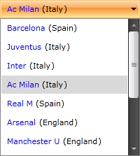

# Binding to XML

The purpose of this tutorial is to show you how to bind `RadComboBox` to data defined in a XML file. The operations you need to perform are to convert the XML to a collection of business objects and then bind that collection using the `ItemsSource` property of the ComboBox.

__The final result__  



1. Define the data source as XML content.

	__Defining the XML data source__  
	```XML
		<?xml version="1.0" encoding="utf-8" ?>
		<Items>
			<XmlNodeItem Team="Barcelona" Country="Spain"/>
			<XmlNodeItem Team="Juventus" Country="Italy"/>
			<XmlNodeItem Team="Inter" Country="Italy"/>
			<XmlNodeItem Team="Ac Milan" Country="Italy"/>
			<XmlNodeItem Team="Real M" Country="Spain"/>
			<XmlNodeItem Team="Arsenal" Country="England"/>
			<XmlNodeItem Team="Manchester U" Country="England"/>
			<XmlNodeItem Team="Bayern" Country="Germany"/>
			<XmlNodeItem Team="Porto" Country="Portugal"/>
			<XmlNodeItem Team="Liverpool" Country="England"/>
			<XmlNodeItem Team="Ajax" Country="Holland"/>
			<XmlNodeItem Team="Olimpic M" Country="France"/>
		</Items>
	```

2. Add a new `RadComboBox` declaration in your XAML.

	<snippet id='radcombobox-populating-with-data-binding-xml-defining_the_xml_data_source-xaml' />


3. Create a new class named `XmlNodeItem`. This class is pretty simple and it represents a separate node from the XML document. Its properties are `Team` and `Country`. Both of the properties are of type `string`.

	<snippet id='radcombobox-populating-with-data-binding-xml-defining_the_xml_data_source-cs' />

	<snippet id='radcombobox-populating-with-data-binding-xml-defining_the_xml_data_source-vb' />


4. Create a new class named `XmlNodeItemList`, which derives from `ObservableCollection` of `XmlNodeItem`. This is a collection that will be created from the XML file. 

	<snippet id='radcombobox-populating-with-data-binding-xml-defining_the_xml_data_source-cs' />

	<snippet id='radcombobox-populating-with-data-binding-xml-defining_the_xml_data_source-vb' />


5. Create a new class named `RadComboBoxXmlDataSource`, which derives from `XmlNodeItemList`. The class takes a path to the XML file and deserializes the data in the private method `RetrieveData()`.

	<snippet id='radcombobox-populating-with-data-binding-xml-defining_the_xml_data_source-cs' />

	<snippet id='radcombobox-populating-with-data-binding-xml-defining_the_xml_data_source-vb' />


6. The next step is to declare the `RadComboBoxXmlDataSource` as a resource in your application.

	<snippet id='radcombobox-populating-with-data-binding-xml-defining_the_xml_data_source-xaml' />


7. Update the `RadComboBox` declaration by setting the `ItemsSource` property.

	<snippet id='radcombobox-populating-with-data-binding-xml-defining_the_xml_data_source-xaml' />


8. Create a custom `DateTemplate` and set it to the `RadComboBox`'s `ItemTemplate` property. 

	<snippet id='radcombobox-populating-with-data-binding-xml-defining_the_xml_data_source-xaml' />


9. Update the ComboBox declaration by setting the `ItemTemplate` property.

	<snippet id='radcombobox-populating-with-data-binding-xml-defining_the_xml_data_source-xaml' />


__The final result__  


## See Also
 * [Filtering]()
 * [Edit Modes]()
