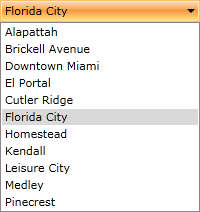

# Adding ComboBox Items Directly

This tutorial will walk you through the common task of populating `RadComboBox` with `RadComboBoxItems` declaratively. 

In order to add combobox items you need to use the `RadComboBox` `Items` property. The property is of `ItemCollection` and it contains the populated items. The following example shows how to add items in the ComboBox:

#### __[XAML]__  
{{region radcombobox-populating-with-data-declaratively-0}}
	<telerik:RadComboBox x:Name="radComboBox" Width="200">
		<telerik:RadComboBox.Items>
			<telerik:RadComboBoxItem Content="Alapattah" />
			<telerik:RadComboBoxItem Content="Brickell Avenue" />
			<telerik:RadComboBoxItem Content="Downtown Miami" />
			<telerik:RadComboBoxItem Content="El Portal" />
			<telerik:RadComboBoxItem Content="Cutler Ridge" />
			<telerik:RadComboBoxItem Content="Florida City" />
			<telerik:RadComboBoxItem Content="Homestead" />
			<telerik:RadComboBoxItem Content="Kendall" />
			<telerik:RadComboBoxItem Content="Leisure City" />
			<telerik:RadComboBoxItem Content="Medley" />
			<telerik:RadComboBoxItem Content="Pinecrest" />
		</telerik:RadComboBox.Items>
	</telerik:RadComboBox>
{{endregion}}

The `RadComboBoxItems` can be added also in the code-behind using the following syntax:

#### __[C#]__  
{{region radcombobox-populating-with-data-declaratively-0}}
	var comboBox = new RadComboBox();
	comboBox.Items.Add(new RadComboBoxItem() { Content = "Alapattah" });
	comboBox.Items.Add(new RadComboBoxItem() { Content = "Homestead" });
	comboBox.Items.Add(new RadComboBoxItem() { Content = "Medley" });
	comboBox.Items.Add(new RadComboBoxItem() { Content = "Kendall" });
	comboBox.Items.Add(new RadComboBoxItem() { Content = "Pinecrest" });
	
	this.hostPanel.Children.Add(comboBox);
{{endregion}}

## See Also  
 * [Binding to Object]()
 * [Binding to WCF Service]()
 * [Binding to ADO.NET Data Service]()