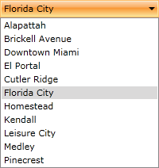

# Adding ComboBox Items Directly

This tutorial will walk you through the common task of populating `RadComboBox` with `RadComboBoxItems` declaratively. 

In order to add combobox items you need to use the `RadComboBox` `Items` property. The property is of `ItemCollection` and it contains the populated items. The following example shows how to add items in the ComboBox:

  
<snippet id='radcombobox-populating-with-data-declaratively-block_1-xaml' />

The `RadComboBoxItems` can be added also in the code-behind using the following syntax:

  
<snippet id='radcombobox-populating-with-data-declaratively-block_2-cs' />

## See Also  
 * [Binding to Object]()
 * [Binding to WCF Service]()
 * [Binding to ADO.NET Data Service]()