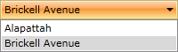

# In Code-Behind

This tutorial will walk you through the common tasks of [adding](#Adding_RadComboBoxItems) and [removing](#Removing_RadComboBoxItems)__RadComboBoxItems__ programmatically.

Here is a regular __RadComboBox__ declaration without items:

#### __XAML__

{{region radcombobox-populating-with-data-in-code-behind_0}}
	<telerik:RadComboBox x:Name="radComboBox" Width="200">
	</telerik:RadComboBox>
	{{endregion}}

## Adding RadComboBoxItems

In order to add new combo box items to a __RadComboBox__ control, you have to perform several simple steps:

* Create an instance of the __RadComboBoxItem__ class.

* Set its properties such as __Content__, __Foreground__, etc.

* Add it to the __RadComboBox__'s __Items__ collection.

#### __C#__

{{region radcombobox-populating-with-data-in-code-behind_1}}
	RadComboBoxItem comboBoxItem = new RadComboBoxItem();
	comboBoxItem.Content = "Alapattah";
	this.radComboBox.Items.Add( comboBoxItem );
	
	comboBoxItem = new RadComboBoxItem();
	comboBoxItem.Content = "Brickell Avenue";
	this.radComboBox.Items.Add( comboBoxItem );
	{{endregion}}

#### __VB.NET__

{{region radcombobox-populating-with-data-in-code-behind_2}}
	Dim comboBoxItem As New RadComboBoxItem()
	comboBoxItem.Content = "Alapattah"
	Me.radComboBox.Items.Add(comboBoxItem)
	
	comboBoxItem = New RadComboBoxItem()
	comboBoxItem.Content = "Brickell Avenue"
	Me.radComboBox.Items.Add(comboBoxItem)
	{{endregion}}

The result is shown on the image below:

         
      

>tipConsider declaring combo box items in XAML instead of adding them by code whenever it's possible. This includes situations when you know what items you need at design time.

## Removing RadComboBoxItems

In order to remove a specific __RadComboBoxItem__, you should remove it from the __RadComboBox__'s __Items__ collection.

#### __C#__

{{region radcombobox-populating-with-data-in-code-behind_3}}
	private void RemoveComboBoxItem( RadComboBoxItem itemToRemove )
	{
	    this.radComboBox.Items.Remove( itemToRemove );
	}
	{{endregion}}

#### __VB.NET__

{{region radcombobox-populating-with-data-in-code-behind_4}}
	Private Sub RemoveComboBoxItem(ByVal itemToRemove As RadComboBoxItem)
	    Me.radComboBox.Items.Remove(itemToRemove)
	End Sub
	{{endregion}}

# See Also

 * [Binding to Object]()

 * [Binding to WCF Service]()

 * [Binding to ADO.NET Data Service]()
