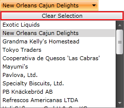
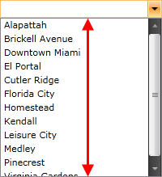

# Controlling Appearance

## 

There are many ways to customize the look and feel of your __RadComboBox__ control. This topic covers some of the most useful of these properties.
        

* 
            If you want to show the button clearing the selection of the __RadComboBox__, just set the __ClearSelectionButtonVisibility__property to __Visibility.Visible__.
            

                 
              

* 
            If you want to open the __RadComboBox__'s drop-down, set the __IsDropDown__ property to __True__.
          

* If you want to set the maximum height of the __RadComboBox__ drop-down, just specify its __MaxDropDownHeight__ property.
            

                   
                

* 
            If you want to specify whether the drop-down should be opened or not when the control gets the focus, just set the __OpenDropDownOnFocus__ property to __True__.
          

* 
            If you want to specify whether a __RadComboBox__ that is opened (displays a drop-down control) will remain open when a user clicks the __TextBox__, you should set the __StaysOpenOnEdit__ property to __True__.
          

# See Also

 * [Edit Modes]()

 * [AutoComplete]()

 * [DataBinding]()
